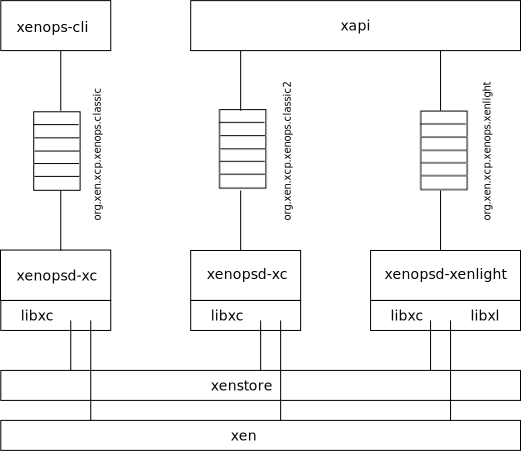

Architecture
============

Xenopsd instances run on a host and manage VMs on behalf of clients. This
picture shows 3 different Xenopsd instances: 2 named "xenopsd-xc" and 1 named
"xenopsd-xenlight".

Each instance is responsible for managing a disjoint set of VMs. Clients should
never ask more than one Xenopsd to manage the same VM.
Managing a VM means:
- start/shutdown/suspend/resume/migrate/reboot
- allow devices (disks, nics, PCI cards, vCPUs etc) to be manipulated
- provide updates to clients when things change (reboots, console becomes
  available, guest agent says something etc).
For a full list of features, consult the [features list](../features/README.md).

Each Xenopsd instance has a unique name on the host. A typical name is
- org.xen.xcp.xenops.classic
- org.xen.xcp.xenops.xenlight
A higher-level tool, such as [xapi](https://github.com/xapi-project/xen-api)
will associate VMs with individual Xenopsd names.

Running multiple Xenopsds is necessary because
- The virtual hardware supported by different technologies (libxc, libxl, qemu)
  is expected to be different. We can guarantee the virtual hardware is stable
  across a rolling upgrade by running the VM on the old Xenopsd and switch
  Xenopsds later over a VM reboot when the VM admin is happy with it. If the
  VM admin is unhappy then we can reboot back to the original Xenopsd again.
- The suspend/resume/migrate image formats will differ across technologies
  (again libxc vs libxl) and it will be more reliable to avoid switching
  technology over a migrate.
- In the future different security domains may have different Xenopsd instances
  providing even stronger isolation guarantees between domains than is possible
  today.

Communication with Xenopsd is handled through a Xapi-global library:
[xcp-idl](https://github.com/xapi-project/xcp-idl). This library supports
- message framing: by default using HTTP but a binary framing format is
  available
- message encoding: by default we use JSON but XML is also available
- RPCs over Unix domain sockets and persistent queues.
This library allows the communication details to be changed without having to
change all the Xapi clients and servers.

Xenopsd has a number of "backends" which perform the low-level VM operations
such as (on Xen) "create domain" "hotplug disk" "destroy domain". These backends
contain all the hypervisor-specific code including
- connecting to Xenstore
- opening the libxc /proc/xen/privcmd interface
- initialising libxl contexts

