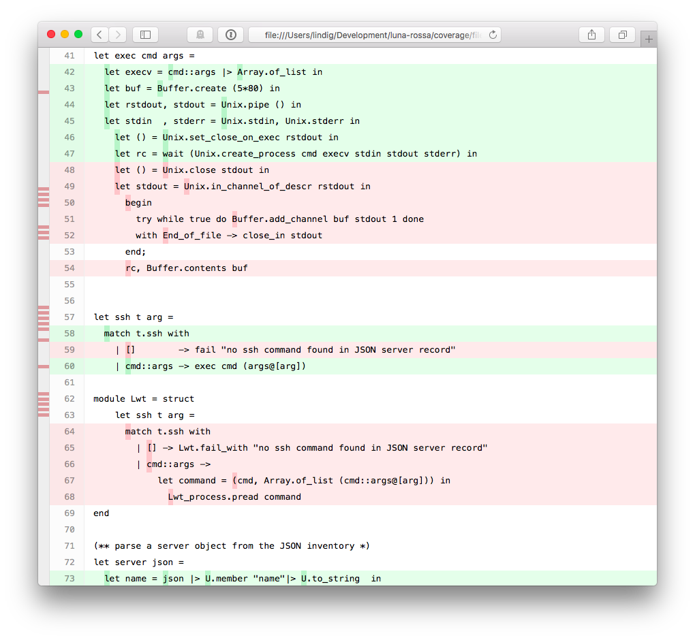

We would like to add optional coverage profiling to existing [OCaml]
projects in the context of [XenServer] and [XenAPI]. This article
presents how we do it. 

Binaries instrumented for coverage profiling in the XenServer project
need to run in an environment where several services act together as
they provide operating-system-level services.  This makes it a little
harder than profiling code that can be profiled and executed in
isolation.

## TL;DR

To build binaries with coverage profiling, do:

    ./configure --enable-coverage
    make 

Binaries will log coverage data to `/tmp/bisect*.out` from which a
coverage report can be generated in `coverage/`:

    bisect-ppx-report -I _build -html coverage /tmp/bisect*.out

## Profiling Framework Bisect-PPX

The open-source [BisectPPX] instrumentation framework uses extension
points (PPX) in the [OCaml] compiler to instrument code during
compilation. Instrumented code for a binary is then compiled as usual
and logs during execution data to in-memory data structures. Before an
instrumented binary terminates, it writes the logged data to a file.
This data can then be analysed with the `bisect-ppx-report` tool, to
produce a summary of annotated code that highlights what part of a
codebase was executed. 

[BisectPPX] has several desirable properties:

* a robust code base that is well tested
* it is easy to integrate into the compilation pipeline (see below)
* is specific to the [OCaml] language; an expression-oriented language
  like OCaml doesn't fit the traditional statement coverage well
* it is actively maintained
* is generates useful reports for interactive and non-interactive use
  that help to improve code coverage

Red parts indicate code that wasn't executed whereas green parts were.
Hovering over a dark green spot reveals how often that point was
executed.

The individual steps of instrumenting code with [BisectPPX] are greatly
abstracted by OCamlfind (OCaml's library manager) and OCamlbuild
(OCaml's compilation manager):

    # write code
    vim example.ml

    # build it with instrumentation from bisect_ppx
    ocamlbuild -use-ocamlfind -pkg bisect_ppx -pkg unix example.native
    
    # execute it - generates files ./bisect*.out
    ./example.native
    
    # generate report
    bisect-ppx-report -I _build -html coverage bisect000*
    
    # view coverage/index.html

    Summary:
     - 'binding' points: 2/2 (100.00%)
     - 'sequence' points: 10/10 (100.00%)
     - 'match/function' points: 5/8 (62.50%)
     - total: 17/20 (85.00%)

The fourth step generates a HTML report in `coverage/`. All it takes is
to declare to [OCamlbuild] that a module depends on `bisect_ppx` and it
will be instrumented during compilation. Behind the scenes `ocamlfind`
makes sure that the compiler uses a preprocessing step that instruments
the code.

## Signal Handling 

During execution the code instrumentation leads to the collection of
data. This code registers a function with `at_exit` that writes the data
to `bisect*.out` when `exit` is called. A binary can terminate without
calling `exit` and in that case the file would not be written. It is
therefore important to make sure that `exit` is called. If this does not
happen naturally, for example in the context of a daemon that is
terminated by receiving the `TERM` signal, a signal handler must be
installed:

    let stop signal =
      printf "caught signal %d\n" signal;
      exit 0

    Sys.set_signal Sys.sigterm (Sys.Signal_handle stop)

## Dumping coverage information at runtime

By default coverage data can only be dumped at exit, which is inconvenient if you have a test-suite
that needs to reuse a long running daemon, and starting/stopping it each time is not feasible.

In such cases we need an API to dump coverage at runtime, which *is* provided by `bisect_ppx >= 1.3.0`.
However each daemon will need to set up a way to listen to an event that triggers this coverage dump,
furthermore it is desirable to make runtime coverage dumping compiled in conditionally to be absolutely sure
that production builds do *not* use coverage preprocessed code.

Hence instead of duplicating all this build logic in each daemon (`xapi`, `xenopsd`, etc.) provide this
functionality in a common library `xapi-idl` that:

 * logs a message on startup so we know it is active
 * sets BISECT_FILE environment variable to dump coverage in the appropriate place
 * listens on `org.xen.xapi.coverage.<name>` message queue for runtime coverage dump commands:
    * sending `dump <Number>` will cause runtime coverage to be dumped to a file
   named `bisect-<name>-<random>.<Number>.out`
    * sending `reset` will cause the runtime coverage counters to be reset

Daemons that use `Xcp_service.configure2` (e.g. `xenopsd`) will benefit from this runtime trigger automatically,
provided they are themselves preprocessed with `bisect_ppx`.

Since we are interested in collecting coverage data for system-wide test-suite runs we need a way to trigger
dumping of coverage data centrally, and a good candidate for that is `xapi` as the top-level daemon.

It will call `Xcp_coverage.dispatcher_init ()`, which listens on `org.xen.xapi.coverage.dispatch` and
dispatches the coverage dump command to all message queues under `org.xen.xapi.coverage.*` except itself.

On production, and regular builds all of this is a no-op, ensured by using separate `lib/coverage/disabled.ml` and `lib/coverage/enabled.ml`
files which implement the same interface, and choosing which one to use at build time.

## Where Data is Written

By default, [BisectPPX] writes data in a binary's current working
directory as `bisectXXXX.out`. It doesn't overwrite existing files and
files from several runs can be combined during analysis. However, this
name and the location can be inconvenient when multiple programs share a
directory.

[BisectPPX]'s default can be overridden with the `BISECT_FILE`
environment variable. This can happen on the command line:

    BISECT_FILE=/tmp/example ./example.native

In the context of XenServer we could do this in startup scripts. 
However, we added a bit of code 

    val Coverage.init: string -> unit

that sets the environment variable from inside the program. The files
are written to a temporary directory (respecting `$TMP` or using `/tmp`)
and uses the `string`-typed argument to include it in the name. To be
effective, this function must be called before the programs exits. For
clarity it is called at the begin of program execution.

## Instrumenting an Oasis Project

While instrumentation is easy on the level of a small file or project it
is challenging in a bigger project. We decided to focus on projects that
are build with the [Oasis] build and packaging manager.  These have a
well-defined structure and compilation process that is controlled by a
central `_oasis` file. This file describes for each library and binary
its dependencies at a package level. From this, [Oasis] generates a
`configure` script and compilation rules for the [OCamlbuild] system.
[Oasis] is designed that the generated files can be shipped without
requiring [Oasis] itself being available.

Goals for instrumentation are:

* what files are instrumented should be obvious and easy to manage
* instrumentation must be optional, yet easy to activate
* avoid methods that require to keep several files in sync like multiple 
  `_oasis` files
* avoid separate Git branches for instrumented and non-instrumented
  code

In the ideal case, we could introduce a configuration switch 
`./configure --enable-coverage` that would prepare compilation for
coverage instrumentation. While [Oasis] supports the creation of such
switches, they cannot be used to control build dependencies like
compiling a file with or without package `bisec_ppx`. We have chosen a
different method:

A `Makefile` target `coverage` augments the `_tags` file to include the
rules in file `_tags.coverage` that cause files to be instrumented:

    make coverage # prepare
    make          # build

leads to the execution of this code during preparation:

    coverage: _tags _tags.coverage 
      test ! -f _tags.orig && mv _tags _tags.orig || true
      cat _tags.coverage _tags.orig > _tags

The file `_tags.coverage` contains two simple [OCamlbuild] rules that
could be tweaked to instrument only some files:

    <**/*.ml{,i,y}>: pkg_bisect_ppx
    <**/*.native>:   pkg_bisect_ppx

When `make coverage` is not called, these rules are not active and
hence, code is not instrumented for coverage. We believe that this 
solution to control instrumentation meets the goals from above. In
particular, what files are instrumented and when is controlled by very
few lines of declarative code that lives in the main repository of a
project.

## Project Layout

The crucial files in an [Oasis]-controlled project that is set up for
coverage analysis are:

    ./_oasis                      - make "profiling" a build depdency
    ./_tags.coverage              - what files get instrumented
    ./profiling/coverage.ml       - support file, sets env var
    ./Makefile                    - target 'coverage'

The `_oasis` file bundles the files under `profiling/` into an internal
library which executables then depend on:

		# Support files for profiling 
		Library profiling
			CompiledObject:     best
			Path:               profiling
			Install:            false
			Findlibname:        profiling
			Modules:            Coverage
			BuildDepends: 

		Executable set_domain_uuid
			CompiledObject:     best
			Path:               tools
			ByteOpt:            -warn-error +a-3
			NativeOpt:          -warn-error +a-3
			MainIs:             set_domain_uuid.ml
			Install:            false
			BuildDepends:
				xenctrl, 
				uuidm, 
				cmdliner,
				profiling			# <-- here

The `Makefile` target `coverage` primes the project for a profiling build:

		# make coverage - prepares for building with coverage analysis

		coverage: _tags _tags.coverage 
			test ! -f _tags.orig && mv _tags _tags.orig || true
			cat _tags.coverage _tags.orig > _tags

[OCamlbuild]: https://github.com/ocaml/ocamlbuild/blob/master/manual/manual.adoc
[BisectPPX]:  https://github.com/aantron/bisect_ppx
[OCaml]:      http://ocaml.org
[XenServer]:  https://github.com/xenserver
[XenAPI]:     https://github.com/xapi-project
[Oasis]:      http://oasis.forge.ocamlcore.org

<!-- vim: set ts=2 sw=2 et spell -->
