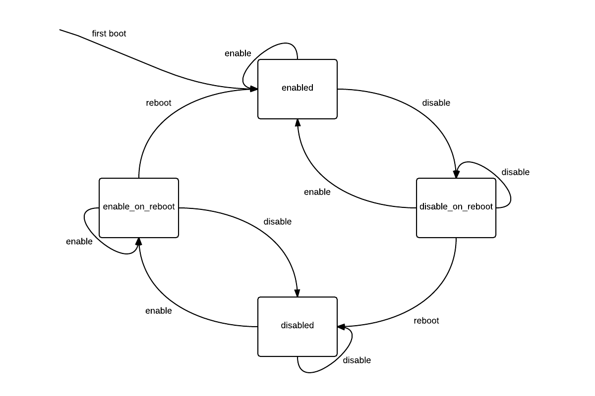

Introduction
------------

Passthrough of discrete GPUs has been
[available since XenServer 6.0]({{site.baseurl}}/xapi/design/gpu-passthrough.html).
With some extensions, we will also be able to support passthrough of integrated
GPUs.

- Whether an integrated GPU will be accessible to dom0 or available to
  passthrough to guests must be configurable via XenAPI.
- Passthrough of an integrated GPU requires an extra flag to be sent to qemu.

Host Configuration
------------------

New fields will be added (both read-only):

- `PGPU.dom0_access enum(enabled|disable_on_reboot|disabled|enable_on_reboot)`
- `host.display enum(enabled|disable_on_reboot|disabled|enable_on_reboot)`

as well as new API calls used to modify the state of these fields:

- `PGPU.enable_dom0_access`
- `PGPU.disable_dom0_access`
- `host.enable_display`
- `host.disable_display`

Each of these API calls will return the new state of the field e.g. calling
`host.disable_display` on a host with `display = enabled` will return
`disable_on_reboot`.

Disabling dom0 access will modify the xen commandline (using the xen-cmdline
tool) such that dom0 will not be able to access the GPU on next boot.

Calling host.disable_display will modify the xen and dom0 commandlines such
that neither will attempt to send console output to the system display device.

A state diagram for the fields `PGPU.dom0_access` and `host.display` is shown
below:

While it is possible for these two fields to be modified independently, a
client must disable both the host display and dom0 access to the system display
device before that device can be passed through to a guest.

Note that when a client enables or disables either of these fields, the change
can be cancelled until the host is rebooted.

Handling vga_arbiter
--------------------

Currently, xapi will not create a PGPU object for the PCI device with address
reported by `/dev/vga_arbiter`. This is to prevent a GPU in use by dom0 from
from being passed through to a guest. This behaviour will be changed - instead
of not creating a PGPU object at all, xapi will create a PGPU, but its
supported_VGPU_types field will be empty.

However, the PGPU's supported_VGPU_types will be populated as normal if:

1.  dom0 access to the GPU is disabled.
2.  The host's display is disabled.
3.  The vendor ID of the device is contained in a whitelist provided by xapi's
    config file.

A read-only field will be added:

- `PGPU.is_system_display_device bool`

This will be true for a PGPU iff `/dev/vga_arbiter` reports the PGPU as the
system display device for the host on which the PGPU is installed.

Interfacing with xenopsd
------------------------

When starting a VM attached to an integrated GPU, the VM config sent to xenopsd
will contain a video_card of type IGD_passthrough. This will override the type
determined from VM.platform:vga. xapi will consider a GPU to be integrated if
both:

1.  It resides on bus 0.
2.  The vendor ID of the device is contained in a whitelist provided by xapi's
    config file.

When xenopsd starts qemu for a VM with a video_card of type IGD_passthrough,
it will pass the flags "-std-vga" AND "-gfx_passthru".
