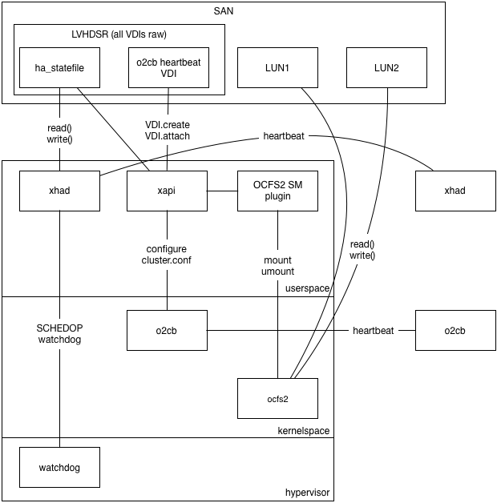
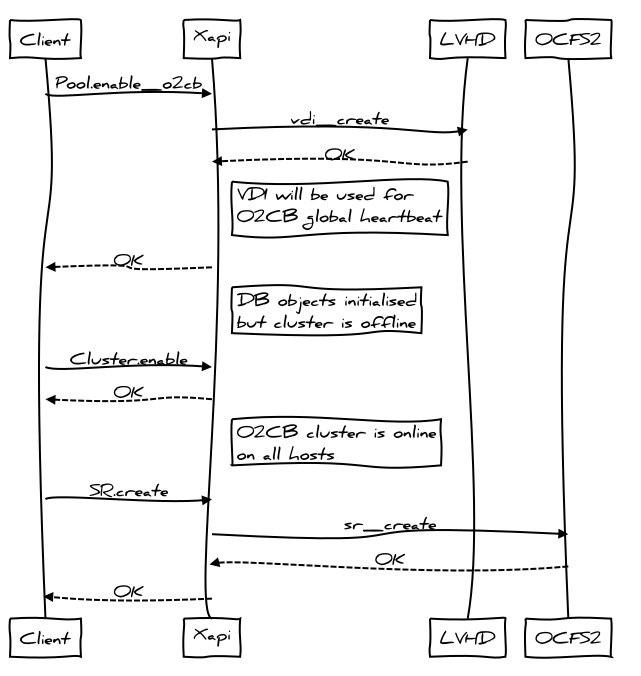
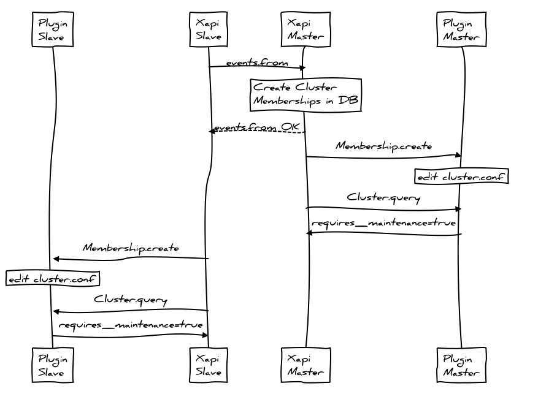
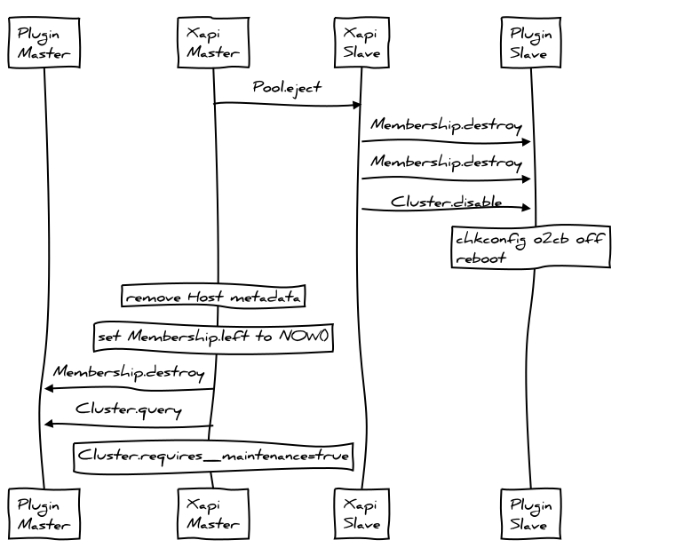

OCFS2 is a (host-)clustered filesystem which runs on top of a shared raw block
device. Hosts using OCFS2 form a cluster using a combination of network and
storage heartbeats and host fencing to avoid split-brain.

The following diagram shows the proposed architecture with `xapi`:

Please note the following:

- OCFS2 is configured to use global heartbeats rather than per-mount heartbeats
  because we quite often have many SRs and therefore many mountpoints
- The OCFS2 global heartbeat should be collocated on the same SR as the XenServer
  HA SR so that we depend on fewer SRs (the storage is a single point of failure
  for OCFS2)
- The OCFS2 global heartbeat should itself be a raw VDI within an LVHDSR.
- Every host can be in at-most-one OCFS2 cluster i.e. the host cluster membership
  is a per-host thing rather than a per-SR thing. Therefore `xapi` will be
  modified to configure the cluster and manage the cluster node numbers.
- Every SR will be a filesystem mount, managed by a SM plugin called "OCFS2".
- Xapi HA uses the `xhad` process which runs in userspace but in the realtime
  scheduling class so it has priority over all other userspace tasks. `xhad`
  sends heartbeats via the `ha_statefile` VDI and via UDP, and uses the
  Xen watchdog for host fencing.
- OCFS2 HA uses the `o2cb` kernel driver which sends heartbeats via the
  `o2cb_statefile` and via TCP, fencing the host by panicing domain 0.

Managing O2CB
=============

OCFS2 uses the O2CB "cluster stack" which is similar to our `xhad`. To configure
O2CB we need to

- assign each host an integer node number (from zero)
- on pool/cluster join: update the configuration on every node to include the
  new node. In OCFS2 this can be done online.
- on pool/cluster leave/eject: update the configuration on every node to exclude
  the old node. In OCFS2 this needs to be done offline.

In the current Xapi toolstack there is a single global implicit cluster called a "Pool"
which is used for: resource locking; "clustered" storage repositories and fault handling (in HA). In the long term we will allow these types of clusters to be
managed separately or all together, depending on the sophistication of the
admin and the complexity of their environment. We will take a small step in that
direction by keeping the OCFS2 O2CB cluster management code at "arms length"
from the Xapi Pool.join code.

In
[xcp-idl](https://github.com/xapi-project/xcp-idl)
we will define a new API category called "Cluster" (in addition to the
categories for
[Xen domains](https://github.com/xapi-project/xcp-idl/blob/37c676548a53b927ac411ab51f33892a7b891fda/xen/xenops_interface.ml#L102)
, [ballooning](https://github.com/xapi-project/xcp-idl/blob/37c676548a53b927ac411ab51f33892a7b891fda/memory/memory_interface.ml#L38)
, [stats](https://github.com/xapi-project/xcp-idl/blob/37c676548a53b927ac411ab51f33892a7b891fda/rrd/rrd_interface.ml#L76)
,
[networking](https://github.com/xapi-project/xcp-idl/blob/37c676548a53b927ac411ab51f33892a7b891fda/network/network_interface.ml#L106)
and
[storage](https://github.com/xapi-project/xcp-idl/blob/37c676548a53b927ac411ab51f33892a7b891fda/storage/storage_interface.ml#L51)
). These APIs will only be called by Xapi on localhost. In particular they will
not be called across-hosts and therefore do not have to be backward compatible.
These are "cluster plugin APIs".

We will define the following APIs:

- `Plugin:Membership.create`: add a host to a cluster. On exit the local host cluster software
  will know about the new host but it may need to be restarted before the
  change takes effect
  - in:`hostname:string`: the hostname of the management domain
  - in:`uuid:string`: a UUID identifying the host
  - in:`id:int`: the lowest available unique integer identifying the host
      where an integer will never be re-used unless it is guaranteed that
      all nodes have forgotten any previous state associated with it
  - in:`address:string list`: a list of addresses through which the host
      can be contacted
  - out: Task.id
- `Plugin:Membership.destroy`: removes a named host from the cluster. On exit the local
  host software will know about the change but it may need to be restarted
  before it can take effect  
  - in:`uuid:string`: the UUID of the host to remove
- `Plugin:Cluster.query`: queries the state of the cluster
  - out:`maintenance_required:bool`: true if there is some outstanding configuration
    change which cannot take effect until the cluster is restarted.
  - out:`hosts`: a list of all known hosts together with a state including:
    whether they are known to be alive or dead; or whether they are currently
    "excluded" because the cluster software needs to be restarted
- `Plugin:Cluster.start`: turn on the cluster software and let the local host join
- `Plugin:Cluster.stop`: turn off the cluster software

Xapi will be modified to:

- add table `Cluster` which will have columns
  - `name: string`: this is the name of the Cluster plugin (TODO: use same
    terminology as SM?)
  - `configuration: Map(String,String)`: this will contain any cluster-global
    information, overrides for default values etc.
  - `enabled: Bool`: this is true when the cluster "should" be running. It
    may require maintenance to synchronise changes across the hosts.
  - `maintenance_required: Bool`: this is true when the cluster needs to
    be placed into maintenance mode to resync its configuration
- add method `XenAPI:Cluster.enable` which sets `enabled=true` and waits for all
  hosts to report `Membership.enabled=true`.
- add method `XenAPI:Cluster.disable` which sets `enabled=false` and waits for all
  hosts to report `Membership.enabled=false`.
- add table `Membership` which will have columns
  - `id: int`: automatically generated lowest available unique integer
    starting from 0
  - `cluster: Ref(Cluster)`: the type of cluster. This will never be NULL.
  - `host: Ref(host)`: the host which is a member of the cluster. This may
    be NULL.
  - `left: Date`: if not 1/1/1970 this means the time at which the host
    left the cluster.
  - `maintenance_required: Bool`: this is true when the Host believes the
    cluster needs to be placed into maintenance mode.
- add field `Host.memberships: Set(Ref(Membership))`
- extend enum `vdi_type` to include `o2cb_statefile` as well as `ha_statefile`
- add method `Pool.enable_o2cb` with arguments
  - in: `heartbeat_sr: Ref(SR)`: the SR to use for global heartbeats
  - in: `configuration: Map(String,String)`: available for future configuration tweaks
  - Like `Pool.enable_ha` this will find or create the heartbeat VDI, create the
    `Cluster` entry and the `Membership` entries. All `Memberships` will have
    `maintenance_required=true` reflecting the fact that the desired cluster
    state is out-of-sync with the actual cluster state.
- add method `XenAPI:Membership.enable`
  - in: `self:Host`: the host to modify
  - in: `cluster:Cluster`: the cluster.
- add method `XenAPI:Membership.disable`
  - in: `self:Host`: the host to modify
  - in: `cluster:Cluster`: the cluster name.
- add a cluster monitor thread which
    - watches the `Host.memberships` field and calls `Plugin:Membership.create` and
      `Plugin:Membership.destroy` to keep the local cluster software up-to-date
      when any host in the pool changes its configuration
    - calls `Plugin:Cluster.query` after an `Plugin:Membership:create` or
      `Plugin:Membership.destroy` to see whether the
      SR needs maintenance
    - when all hosts have a last start time later than a `Membership`
      record's `left` date, deletes the `Membership`.
- modify `XenAPI:Pool.join` to resync with the master's `Host.memberships` list.
- modify `XenAPI:Pool.eject` to
  - call `Membership.disable` in the cluster plugin to stop the `o2cb` service
  - call `Membership.destroy` in the cluster plugin to remove every other host
    from the local configuration
  - remove the `Host` metadata from the pool
  - set `XenAPI:Membership.left` to `NOW()`
- modify `XenAPI:Host.forget` to
  - remove the `Host` metadata from the pool
  - set `XenAPI:Membership.left` to `NOW()`
  - set `XenAPI:Cluster.maintenance_required` to true

A Cluster plugin called "o2cb" will be added which

- on `Plugin:Membership.destroy`
  - comment out the relevant node id in cluster.conf
  - set the 'needs a restart' flag
- on `Plugin:Membership.create`
  - if the provided node id is too high: return an error. This means the
    cluster needs to be rebooted to free node ids.
  - if the node id is not too high: rewrite the cluster.conf using
    the "online" tool.
- on `Plugin:Cluster.start`: find the VDI with `type=o2cb_statefile`;
  add this to the "static-vdis" list; `chkconfig` the service on. We
  will use the global heartbeat mode of `o2cb`.
- on `Plugin:Cluster.stop`: stop the service; `chkconfig` the service off;
  remove the "static-vdis" entry; leave the VDI itself alone
- keeps track of the current 'live' cluster.conf which allows it to
  - report the cluster service as 'needing a restart' (which implies
    we need maintenance mode)

Summary of differences between this and xHA:

- we allow for the possibility that hosts can join and leave, without
  necessarily taking the whole cluster down. In the case of `o2cb` we
  should be able to have `join` work live and only `eject` requires
  maintenance mode
- rather than write explicit RPCs to update cluster configuration state
  we instead use an event watch and resync pattern, which is hopefully
  more robust to network glitches while a reconfiguration is in progress.

Managing xhad
=============

We need to ensure `o2cb` and `xhad` do not try to conflict by fencing
hosts at the same time. We shall:

- use the default `o2cb` timeouts (hosts fence if no I/O in 60s): this
  needs to be short because disk I/O *on otherwise working hosts* can
  be blocked while another host is failing/ has failed.

- make the `xhad` host fence timeouts much longer: 300s. It's much more
  important that this is reliable than fast. We will make this change
  globally and not just when using OCFS2.

In the `xhad` config we will cap the `HeartbeatInterval` and `StatefileInterval`
at 5s (the default otherwise would be 31s). This means that 60 heartbeat
messages have to be lost before `xhad` concludes that the host has failed.

SM plugin
=========

The SM plugin `OCFS2` will be a file-based plugin.

TODO: which file format by default?

The SM plugin will first check whether the `o2cb` cluster is active and fail
operations if it is not.

I/O paths
=========

When either HA or OCFS O2CB "fences" the host it will look to the admin like
a host crash and reboot. We need to (in priority order)

1. help the admin *prevent* fences by monitoring their I/O paths
   and fixing issues before they lead to trouble
2. when a fence/crash does happen, help the admin
   - tell the difference between an I/O error (admin to fix) and a software
     bug (which should be reported)
   - understand how to make their system more reliable

Monitoring I/O paths
--------------------

If heartbeat I/O fails for more than 60s when running `o2cb` then the host will fence.
This can happen either

- for a good reason: for example the host software may have deadlocked or someone may
  have pulled out a network cable.

- for a bad reason: for example a network bond link failure may have been ignored
  and then the second link failed; or the heartbeat thread may have been starved of
  I/O bandwidth by other processes

Since the consequences of fencing are severe -- all VMs on the host crash simultaneously --
it is important to avoid the host fencing for bad reasons.

We should recommend that all users

- use network bonding for their network heartbeat
- use multipath for their storage heartbeat

Furthermore we need to *help* users monitor their I/O paths. It's no good if they use
a bonded network but fail to notice when one of the paths have failed.

The current XenServer HA implementation generates the following I/O-related alerts:

- `HA_HEARTBEAT_APPROACHING_TIMEOUT` (priority 5 "informational"): when half the
  network heartbeat timeout has been reached.
- `HA_STATEFILE_APPROACHING_TIMEOUT` (priority 5 "informational"): when half the
  storage heartbeat timeout has been reached.
- `HA_NETWORK_BONDING_ERROR` (priority 3 "service degraded"): when one of the bond
  links have failed.
- `HA_STATEFILE_LOST` (priority 2 "service loss imminent"): when the storage heartbeat
  has completely failed and only the network heartbeat is left.
- MULTIPATH_PERIODIC_ALERT (priority 3 "service degrated"): when one of the multipath
  links have failed.

Unfortunately alerts are triggered on "edges" i.e. when state changes, and not on "levels"
so it is difficult to see whether the link is currently broken.

We should define datasources suitable for use by xcp-rrdd to expose the current state
(and the history) of the I/O paths as follows:

- `pif_<name>_paths_failed`: the total number of paths which we know have failed.
- `pif_<name>_paths_total`: the total number of paths which are configured.
- `sr_<name>_paths_failed`: the total number of storage paths which we know have failed.
- `sr_<name>_paths_total`: the total number of storage paths which are configured.

The `pif` datasources should be generated by `xcp-networkd` which already has a
[network bond monitoring thread](https://github.com/xapi-project/xcp-networkd/blob/bc0140feba19cf8dcced3bd66e54eeee112af819/networkd/network_monitor_thread.ml#L52).
THe `sr` datasources should be generated by `xcp-rrdd` plugins since there is no
storage daemon to generate them.
We should create RRDs using the `MAX` consolidation function, otherwise information
about failures will be lost by averaging.

XenCenter (and any diagnostic tools) should warn when the system is at risk of fencing
in particular if any of the following are true:

- `pif_<name>_paths_failed` is non-zero
- `sr_<name>_paths_failed` is non-zero
- `pif_<name>_paths_total` is less than 2
- `sr_<name>_paths_total` is less than 2

XenCenter (and any diagnostic tools) should warn if any of the following *have been*
true over the past 7 days:

- `pif_<name>_paths_failed` is non-zero
- `sr_<name>_paths_failed` is non-zero

Heartbeat "QoS"
---------------

The network and storage paths used by heartbeats *must* remain responsive otherwise
the host will fence (i.e. the host and all VMs will crash).

Outstanding issue: how slow can `multipathd` get? How does it scale with the number of
LUNs.

Post-crash diagnostics
======================

When a host crashes the effect on the user is severe: all the VMs will also
crash. In cases where the host crashed for a bad reason (such as a single failure
after a configuration error) we must help the user understand how they can
avoid the same situation happening again.

We must make sure the crash kernel runs reliably when `xhad` and `o2cb`
fence the host.

Xcp-rrdd will be modified to store RRDs in an `mmap(2)`d file sin the dom0
filesystem (rather than in-memory). Xcp-rrdd will call `msync(2)` every 5s
to ensure the historical records have hit the disk. We should use the same
on-disk format as RRDtool (or as close to it as makes sense) because it has
already been optimised to minimise the amount of I/O.

Xapi will be modified to run a crash-dump analyser program `xen-crash-analyse`.

`xen-crash-analyse` will:

- parse the Xen and dom0 stacks and diagnose whether
  - the dom0 kernel was panic'ed by `o2cb`
  - the Xen watchdog was fired by `xhad`
  - anything else: this would indicate a bug that should be reported
- in cases where the system was fenced by `o2cb` or `xhad` then the analyser
  - will read the archived RRDs and look for recent evidence of a path failure
    or of a bad configuration (i.e. one where the total number of paths is 1)
  - will parse the `xhad.log` and look for evidence of heartbeats "approaching
    timeout"

TODO: depending on what information we can determine from the analyser, we
will want to record some of it in the `Host_crash_dump` database table.

XenCenter will be modified to explain why the host crashed and explain what
the user should do to fix it, specifically:

- if the host crashed for no obvious reason then consider this a software
  bug and recommend a bugtool/system-status-report is taken and uploaded somewhere
- if the host crashed because of `o2cb` or `xhad` then either
  - if there is evidence of path failures in the RRDs: recommend the user
    increase the number of paths or investigate whether some of the equipment
    (NICs or switches or HBAs or SANs) is unreliable
  - if there is evidence of insufficient paths: recommend the user add more
    paths

Network configuration
=====================

The documentation should strongly recommend

- the management network is bonded
- the management network is dedicated i.e. used only for management traffic
  (including heartbeats)
- the OCFS2 storage is multipathed

`xcp-networkd` will be modified to change the behaviour of the DHCP client.
Currently the `dhclient` will wait for a response and eventually background
itself. This is a big problem since DHCP can reset the hostname, and this can
break `o2cb`. Therefore we must insist that `PIF.reconfigure_ip` becomes
fully synchronous, supporting timeout and cancellation. Once the call returns
-- whether through success or failure -- there must not be anything in the
background which will change the system's hostname.

TODO: figure out whether we need to request "maintenance mode" for hostname
changes.

Maintenance mode
================

The purpose of "maintenance mode" is to take a host out of service and leave
it in a state where it's safe to fiddle with it without affecting services
in VMs.

XenCenter currently does the following:

- `Host.disable`: prevents new VMs starting here
- makes a list of all the VMs running on the host
- `Host.evacuate`: move the running VMs somewhere else

The problems with maintenance mode are:

- it's not safe to fiddle with the host network configuration with storage
  still attached. For NFS this risks deadlocking the SR. For OCFS2 this
  risks fencing the host.
- it's not safe to fiddle with the storage or network configuration if HA
  is running because the host will be fenced. It's not safe to disable fencing
  unless we guarantee to reboot the host on exit from maintenance mode.

We should also

- `PBD.unplug`: all storage. This allows the network to be safely reconfigured.
  If the network is configured when NFS storage is plugged then the SR can
  permanently deadlock; if the network is configured when OCFS2 storage is
  plugged then the host can crash.

TODO: should we add a `Host.prepare_for_maintenance` (better name TBD)
to take care of all this without XenCenter having to script it. This would also
help CLI and powershell users do the right thing.

TODO: should we insist that the host is rebooted to leave maintenance
mode? This would make maintenance mode more reliable and allow us to integrate
maintenance mode with xHA (where maintenance mode is a "staged reboot")

TODO: should we leave all clusters as part of maintenance mode? We
probably need to do this to avoid fencing.

Walk-through: adding OCFS2 storage
==================================

Assume you have an existing Pool of 2 hosts. First the client will set up
the O2CB cluster, choosing where to put the global heartbeat volume. The
client should check that the I/O paths have all been setup correctly with
bonding and multipath and prompt the user to fix any obvious problems.

Internally within `Pool.enable_o2cb` Xapi will set up the cluster metadata
on every host in the pool:

At this point all hosts have in-sync `cluster.conf` files but all cluster
services are disabled. We also have `requires_mainenance=true` on all
`Membership` entries and the global `Cluster` has `enabled=false`.
The client will now try to enable the cluster with `Cluster.enable`:

Now all hosts are in the cluster and the SR can be created using the standard
SM APIs.

Walk-through: remove a host
===========================

Assume you have an existing Pool of 2 hosts with `o2cb` clustering enabled
and at least one `ocfs2` filesystem mounted. If the host is online then
`XenAPI:Pool.eject` will:

Note that:

- All hosts will have modified their `o2cb` `cluster.conf` to comment out
  the former host
- The `Membership` table still remembers the node number of the ejected host--
  this cannot be re-used until the SR is taken down for maintenance.
- All hosts can see the difference between their current `cluster.conf`
  and the one they would use if they restarted the cluster service, so all
  hosts report that the cluster must be taken offline i.e. `requires_maintence=true`.

Summary of the impact on the admin
==================================

OCFS2 is fundamentally a different type of storage to all existing storage
types supported by xapi. OCFS2 relies upon O2CB, which provides
[Host-level High Availability](../../toolstack/features/HA/index). All HA implementations
(including O2CB and `xhad`) impose restrictions on the server admin to
prevent unnecessary host "fencing" (i.e. crashing). Once we have OCFS2 as
a feature, we will have to live with these restrictions which previously only
applied when HA was explicitly enabled. To reduce complexity we will not try
to enforce restrictions only when OCFS2 is being used or is likely to be used.

Impact even if not using OCFS2
------------------------------

- "Maintenance mode" now includes detaching all storage.
- Host network reconfiguration can only be done in maintenance mode
- XenServer HA enable takes longer
- XenServer HA failure detection takes longer
- Network configuration with DHCP must be fully synchronous i.e. it wil block
  until the DHCP server responds. On a timeout, the change will not be made.

Impact when using OCFS2
-----------------------

- Sometimes a host will not be able to join the pool without taking the
  pool into maintenance mode
- Every VM will have to be XSM'ed (is that a verb?) to the new OCFS2 storage.
  This means that VMs with more than 2 snapshots will have their snapshots
  deleted; it means you need to provision another storage target, temporarily
  doubling your storage needs; and it will take a long time.
- There will now be 2 different reasons why a host has fenced which the
  admin needs to understand.
