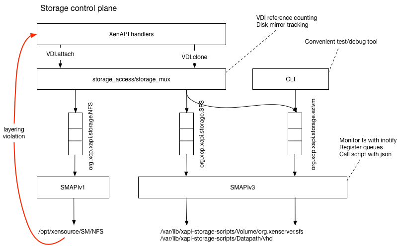
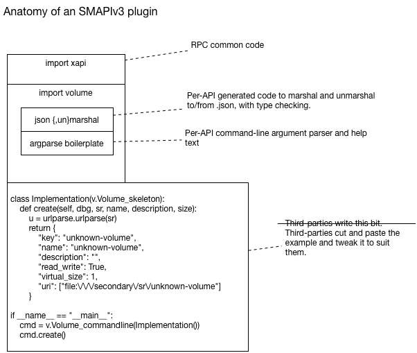

Xapi accesses storage through "plugins" which currently use a protocol
called "SMAPIv1". This protocol has a number of problems:

1. the protocol has many missing features, and this leads to people
   using the XenAPI from within a plugin, which is racy, difficult to
   get right, unscalable and makes component testing impossible.

2. the protocol expects plugin authors to have a deep knowledge of the
   Xen storage datapath (`tapdisk`, `blkback` etc) *and* the storage.

3. the protocol is undocumented.

We shall create a new revision of the protocol ("SMAPIv3") to address these
problems.

The following diagram shows the new control plane:

Requests from xapi are filtered through the existing `storage_access`
layer which is responsible for managing the mapping between VM VBDs and
VDIs.

Each plugin is represented by a named queue, with APIs for

- querying the state of each queue
- explicitly cancelling or replying to messages

Legacy SMAPIv1 plugins will be processed via the existing `storage_access.SMAPIv1`
module. Newer SMAPIv3 plugins will be handled by a new `xapi-storage-script`
service.

The SMAPIv3 APIs will be defined in an IDL format in a separate repo.

xapi-storage-script
===================

The `xapi-storage-script` will run as a service and will

- use `inotify` to monitor a well-known path in dom0
- when a directory is created, check whether it contains storage plugins by
  executing a `Plugin.query`
- assuming the directory contains plugins, it will register the queue name
  and start listening for messages
- when messages from `xapi` or the CLI are received, it will generate the SMAPIv3
  .json message and fork the relevant script.

SMAPIv3 IDL
===========

The IDL will support

- documentation for all functions, parameters and results
  - this will be extended to be a XenAPI-style versioning scheme in future
- generating hyperlinked HTML documentation, published on github
- generating libraries for python and OCaml
  - the libraries will include marshalling, unmarshalling, type-checking
    and command-line parsing and help generation

Diagnostic tools
================

It will be possible to view the contents of the queue associated with any
plugin, and see whether

- the queue is being served or not (perhaps the `xapi-storage-script` has
  crashed)
- there are unanswered messages (perhaps one of the messages has caused
  a deadlock in the implementation?)

It will be possible to

- delete/clear queues/messages
- download a message-sequence chart of the last N messages for inclusion in
  bugtools.

Anatomy of a plugin
===================

The following diagram shows what a plugin would look like:

The SMAPIv3
===========

Please read [the current SMAPIv3 documentation](https://xapi-project.github.io/xapi-storage).
