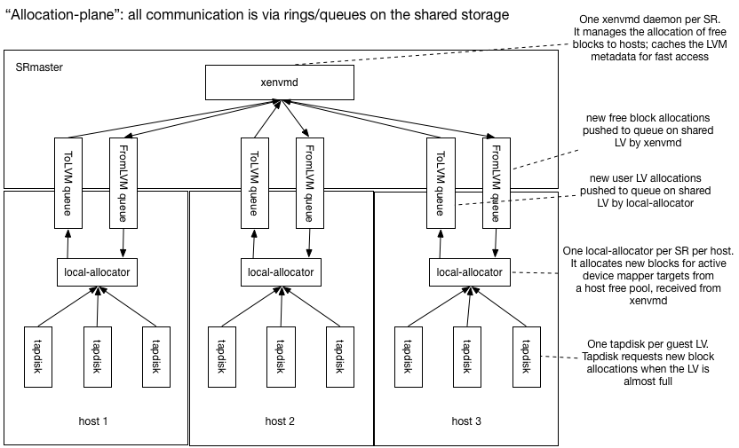
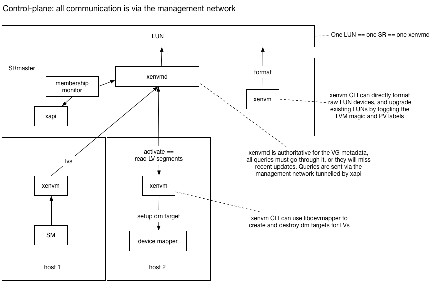

LVHD is a block-based storage system built on top of Xapi and LVM. LVHD
disks are represented as LVM LVs with vhd-format data inside. When a
disk is snapshotted, the LVM LV is "deflated" to the minimum-possible
size, just big enough to store the current vhd data. All other disks are
stored "inflated" i.e. consuming the maximum amount of storage space.
This proposal describes how we could add dynamic thin-provisioning to
LVHD such that

- disks only consume the space they need (plus an adjustable small
  overhead)
- when a disk needs more space, the allocation can be done *locally*
  in the common-case; in particular there is no network RPC needed
- when the resource pool master host has failed, allocations can still
  continue, up to some limit, allowing time for the master host to be
  recovered; in particular there is no need for very low HA timeouts.
- we can (in future) support in-kernel block allocation through the
  device mapper dm-thin target.

The following diagram shows the "Allocation plane":



All VM disk writes are channelled through `tapdisk` which keeps track
of the remaining reserved space within the device mapper device. When
the free space drops below a "low-water mark", tapdisk sends a message
to a local per-SR daemon called `local-allocator` and requests more
space.

The `local-allocator` maintains a free pool of blocks available for
allocation locally (hence the name). It will pick some blocks and
transactionally send the update to the `xenvmd` process running
on the SRmaster via the shared ring (labelled `ToLVM queue` in the diagram)
and update the device mapper tables locally.

There is one `xenvmd` process per SR on the SRmaster. `xenvmd` receives
local allocations from all the host shared rings (labelled `ToLVM queue`
in the diagram) and combines them together, appending them to a redo-log
also on shared storage. When `xenvmd` notices that a host's free space
(represented in the metadata as another LV) is low it allocates new free blocks
and pushes these to the host via another shared ring (labelled `FromLVM queue`
in the diagram).

The `xenvmd` process maintains a cache of the current VG metadata for
fast query and update. All updates are appended to the redo-log to ensure
they operate in O(1) time. The redo log updates are periodically flushed
to the primary LVM metadata.

Since the operations are stored in the redo-log and will only be removed
after the real metadata has been written, the implication is that it is
possible for the operations to be performed more than once. This will
occur if the xenvmd process exits between flushing to the real metadata
and acknowledging the operations as completed. For this to work as expected,
every individual operation stored in the redo-log _must_ be idempotent.

Note on running out of blocks
-----------------------------

Note that, while the host has plenty of free blocks, local allocations should
be fast. If the master fails and the local free pool starts running out
and `tapdisk` asks for more blocks, then the local allocator won't be able
to provide them.
`tapdisk` should start to slow
I/O in order to provide the local allocator more time.
Eventually if ```tapdisk``` runs
out of space before the local allocator can satisfy the request then
guest I/O will block. Note Windows VMs will start to crash if guest
I/O blocks for more than 70s. Linux VMs, no matter PV or HVM, may suffer
from "block for more than 120 seconds" issue due to slow I/O. This
known issue is that, slow I/O during dirty pages writeback/flush may
cause memory starvation, then other userland process or kernel threads
would be blocked.

The following diagram shows the control-plane:



When thin-provisioning is enabled we will be modifying the LVM metadata at
an increased rate. We will cache the current metadata in the `xenvmd` process
and funnel all queries through it, rather than "peeking" at the metadata
on-disk. Note it will still be possible to peek at the on-disk metadata but it
will be out-of-date. Peeking can still be used to query the PV state of the volume
group.

The `xenvm` CLI uses a simple
RPC interface to query the `xenvmd` process, tunnelled through `xapi` over
the management network. The RPC interface can be used for

- activating volumes locally: `xenvm` will query the LV segments and program
  device mapper
- deactivating volumes locally
- listing LVs, PVs etc

Note that current LVHD requires the management network for these control-plane
functions.

When the SM backend wishes to query or update volume group metadata it should use the
`xenvm` CLI while thin-provisioning is enabled.

The `xenvmd` process shall use a redo-log to ensure that metadata updates are
persisted in constant time and flushed lazily to the regular metadata area.

Tunnelling through xapi will be done by POSTing to the localhost URI

    /services/xenvmd/<SR uuid>

Xapi will the either proxy the request transparently to the SRmaster, or issue an
http level redirect that the xenvm CLI would need to follow.

If the xenvmd process is not running on the host on which it should
be, xapi will start it.


Components: roles and responsibilities
======================================

`xenvmd`:

- one per plugged SRmaster PBD
- owns the LVM metadata
- provides a fast query/update API so we can (for example) create lots of LVs very fast
- allocates free blocks to hosts when they are running low
- receives block allocations from hosts and incorporates them in the LVM metadata
- can safely flush all updates and downgrade to regular LVM

`xenvm`:

- a CLI which talks the `xenvmd` protocol to query / update LVs
- can be run on any host, calls (except "format" and "upgrade") are forwarded by `xapi`
- can "format" a LUN to prepare it for `xenvmd`
- can "upgrade" a LUN to prepare it for `xenvmd`

`local_allocator`:

- one per plugged PBD
- exposes a simple interface to `tapdisk` for requesting more space
- receives free block allocations via a queue on the shared disk from `xenvmd`
- sends block allocations to `xenvmd` and updates the device mapper target locally

`tapdisk`:

- monitors the free space inside LVs and requests more space when running out
- slows down I/O when nearly out of space

`xapi`:

- provides authenticated communication tunnels
- ensures the xenvmd daemons are only running on the correct hosts.

`SM`:

- writes the configuration file for xenvmd (though doesn't start it)
- has an on/off switch for thin-provisioning
- can use either normal LVM or the `xenvm` CLI

`membership_monitor`

- configures and manages the connections between `xenvmd` and the `local_allocator`

Queues on the shared disk
=========================

The `local_allocator` communicates with `xenvmd` via a pair
of queues on the shared disk. Using the disk rather than the network means
that VMs will continue to run even if the management network is not working.
In particular

- if the (management) network fails, VMs continue to run on SAN storage
- if a host changes IP address, nothing needs to be reconfigured
- if xapi fails, VMs continue to run.

Logical messages in the queues
------------------------------

The `local_allocator` needs to tell the `xenvmd` which blocks have
been allocated to which guest LV. `xenvmd` needs to tell the
`local_allocator` which blocks have become free. Since we are based on
LVM, a "block" is an extent, and an "allocation" is a segment i.e. the
placing of a physical extent at a logical extent in the logical volume.

The `local_allocator` needs to send a message with logical contents:

- `volume`: a human-readable name of the LV
- `segments`: a list of LVM segments which says
   "place physical extent x at logical extent y using a linear mapping".

Note this message is idempotent.

The `xenvmd` needs to send a message with logical contents:

- `extents`: a list of physical extents which are free for the host to use

Although
for internal housekeeping `xenvmd` will want to assign these
physical extents to logical extents within the host's free LV, the
`local_allocator`
doesn't need to know the logical extents. It only needs to know
the set of blocks which it is free to allocate.

Starting up the local_allocator
-------------------------------

What happens when a `local_allocator` (re)starts, after a

- process crash, respawn
- host crash, reboot?

When the `local_allocator` starts up, there are 2 cases:

1. the host has just rebooted, there are no attached disks and no running VMs
2. the process has just crashed, there are attached disks and running VMs

Case 1 is uninteresting. In case 2 there may have been an allocation in
progress when the process crashed and this must be completed. Therefore
the operation is journalled in a local filesystem in a directory which
is deliberately deleted on host reboot (Case 1). The allocation operation
consists of:

1. `push`ing the allocation to `xenvmd` on the SRmaster
2. updating the device mapper

Note that both parts of the allocation operation are idempotent and hence
the whole operation is idempotent. The journalling will guarantee it executes
at-least-once.

When the `local_allocator` starts up it needs to discover the list of
free blocks. Rather than have 2 code paths, it's best to treat everything
as if it is a cold start (i.e. no local caches already populated) and to
ask the master to resync the free block list. The resync is performed by
executing a "suspend" and "resume" of the free block queue, and requiring
the remote allocator to:

- `pop` all block allocations and incorporate these updates
- send the complete set of free blocks "now" (i.e. while the queue is
  suspended) to the local allocator.

Starting xenvmd
---------------

`xenvmd` needs to know

- the device containing the volume group
- the hosts to "connect" to via the shared queues

The device containing the volume group should be written to a config
file when the SR is plugged.

`xenvmd` does not remember which hosts it is listening to across crashes,
restarts or master failovers. The `membership_monitor` will keep the
`xenvmd` list in sync with the `PBD.currently_attached` fields.

Shutting down the local_allocator
---------------------------------

The `local_allocator` should be able to crash at any time and recover
afterwards. If the user requests a `PBD.unplug` we can perform a 
clean shutdown by:

- signalling `xenvmd` to suspend the block allocation queue
- arranging for the `local_allocator` to acknowledge the suspension and exit
- when the `xenvmd` sees the acknowlegement, we know that the
  `local_allocator` is offline and it doesn't need to poll the queue any more

Downgrading metadata
--------------------

`xenvmd` can be terminated at any time and restarted, since all compound
operations are journalled.

Downgrade is a special case of shutdown.
To downgrade, we need to stop all hosts allocating and ensure all updates
are flushed to the global LVM metadata. `xenvmd` can shutdown
by:

- shutting down all `local_allocator`s (see previous section)
- flushing all outstanding block allocations to the LVM redo log
- flushing the LVM redo log to the global LVM metadata

Queues as rings
---------------

We can use a simple ring protocol to represent the queues on the disk.
Each queue will have a single consumer and single producer and reside within
a single logical volume.

To make diagnostics simpler, we can require the ring to only support `push`
and `pop` of *whole* messages i.e. there can be no partial reads or partial
writes. This means that the `producer` and `consumer` pointers will always
point to valid message boundaries.

One possible format used by the [prototype](https://github.com/mirage/shared-block-ring/blob/master/lib/ring.ml) is as follows:

- sector 0: a magic string
- sector 1: producer state
- sector 2: consumer state
- sector 3...: data

Within the producer state sector we can have:

- octets 0-7: producer offset: a little-endian 64-bit integer
- octet 8: 1 means "suspend acknowledged"; 0 otherwise

Within the consumer state sector we can have:

- octets 0-7: consumer offset: a little-endian 64-bit integer
- octet 8: 1 means "suspend requested"; 0 otherwise

The consumer and producer pointers point to message boundaries. Each
message is prefixed with a 4 byte length and padded to the next 4-byte
boundary.

To push a message onto the ring we need to

- check whether the message is too big to ever fit: this is a permanent
  error
- check whether the message is too big to fit given the current free
  space: this is a transient error
- write the message into the ring
- advance the producer pointer

To pop a message from the ring we need to

- check whether there is unconsumed space: if not this is a transient
  error
- read the message from the ring and process it
- advance the consumer pointer

Journals as queues
------------------

When we journal an operation we want to guarantee to execute it never
*or* at-least-once. We can re-use the queue implementation by `push`ing
a description of the work item to the queue and waiting for the
item to be `pop`ped, processed and finally consumed by advancing the
consumer pointer. The journal code needs to check for unconsumed data
during startup, and to process it before continuing.

Suspending and resuming queues
------------------------------

During startup (resync the free blocks) and shutdown (flush the allocations)
we need to suspend and resume queues. The ring protocol can be extended
to allow the *consumer* to suspend the ring by:

- the consumer asserts the "suspend requested" bit
- the producer `push` function checks the bit and writes "suspend acknowledged"
- the producer also periodically polls the queue state and writes
  "suspend acknowledged" (to catch the case where no items are to be pushed)
- after the producer has acknowledged it will guarantee to `push` no more
  items
- when the consumer polls the producer's state and spots the "suspend acknowledged",
  it concludes that the queue is now suspended.

The key detail is that the handshake on the ring causes the two sides
to synchronise and both agree that the ring is now suspended/ resumed.


Modelling the suspend/resume protocol
-------------------------------------

To check that the suspend/resume protocol works well enough to be used
to resynchronise the free blocks list on a slave, a simple
[promela model](queue.pml) was created. We model the queue state as
2 boolean flags:

```
bool suspend /* suspend requested */
bool suspend_ack /* suspend acknowledged *./
```

and an abstract representation of the data within the ring:

```
/* the queue may have no data (none); a delta or a full sync.
   the full sync is performed immediately on resume. */
mtype = { sync delta none }
mtype inflight_data = none
```

There is a "producer" and a "consumer" process which run forever,
exchanging data and suspending and resuming whenever they want.
The special data item `sync` is only sent immediately after a resume
and we check that we never desynchronise with asserts:

```
  :: (inflight_data != none) ->
    /* In steady state we receive deltas */
    assert (suspend_ack == false);
    assert (inflight_data == delta);
    inflight_data = none
```
i.e. when we are receiving data normally (outside of the suspend/resume
code) we aren't suspended and we expect deltas, not full syncs.

The model-checker [spin](http://spinroot.com/spin/whatispin.html)
verifies this property holds.

Interaction with HA
===================

Consider what will happen if a host fails when HA is disabled:

- if the host is a slave: the VMs running on the host will crash but
  no other host is affected.
- if the host is a master: allocation requests from running VMs will
  continue provided enough free blocks are cached on the hosts. If a
  host eventually runs out of free blocks, then guest I/O will start to
  block and VMs may eventually crash.

Therefore we *recommend* that users enable HA and only disable it
for short periods of time. Note that, unlike other thin-provisioning
implementations, we will allow HA to be disabled.

Host-local LVs
==============

When a host calls SMAPI `sr_attach`, it will use `xenvm` to tell `xenvmd` on the
SRmaster to connect to the `local_allocator` on the host. The `xenvmd`
daemon will create the volumes for queues and a volume to represent the
"free blocks" which a host is allowed to allocate.

Monitoring
==========

The `xenvmd` process should export RRD datasources over shared
memory named

- ```sr_<SR uuid>_<host uuid>_free```: the number of free blocks in
  the local cache. It's useful to look at this and verify that it doesn't
  usually hit zero, since that's when allocations will start to block.
  For this reason we should use the `MIN` consolidation function.
- ```sr_<SR uuid>_<host uuid>_requests```: a counter of the number
  of satisfied allocation requests. If this number is too high then the quantum
  of allocation should be increased. For this reason we should use the
  `MAX` consolidation function.
- ```sr_<SR uuid>_<host uuid>_allocations```: a counter of the number of
  bytes being allocated. If the allocation rate is too high compared with
  the number of free blocks divided by the HA timeout period then the
  `SRmaster-allocator` should be reconfigured to supply more blocks with the host.

Modifications to tapdisk
========================

TODO: to be updated by Germano

```tapdisk``` will be modified to

- on open: discover the current maximum size of the file/LV (for a file
  we assume there is no limit for now)
- read a low-water mark value from a config file ```/etc/tapdisk3.conf```
- read a very-low-water mark value from a config file ```/etc/tapdisk3.conf```
- read a Unix domain socket path from a config file ```/etc/tapdisk3.conf```
- when there is less free space available than the low-water mark: connect
  to Unix domain socket and write an "extend" request
- upon receiving the "extend" response, re-read the maximum size of the
  file/LV
- when there is less free space available than the very-low-water mark:
  start to slow I/O responses and write a single 'error' line to the log.

The extend request
------------------

TODO: to be updated by Germano

The request has the following format:

Octet offsets    | Name     | Description
-----------------|----------|------------
0,1              | tl       | Total length (including this field) of message (in network byte order)
2                | type     | The value '0' indicating an extend request
3                | nl       | The length of the LV name in octets, including NULL terminator
4,..,4+nl-1      | name     | The LV name
4+nl,..,12+nl-1  | vdi_size | The virtual size of the logical VDI (in network byte order)
12+nl,..,20+nl-1 | lv_size  | The current size of the LV (in network byte order)
20+nl,..,28+nl-1 | cur_size | The current size of the vhd metadata (in network byte order)

The extend response
-------------------

The response is a single byte value "0" which is a signal to re-examime
the LV size. The request will block indefinitely until it succeeds. The
request will block for a long time if

- the SR has genuinely run out of space. The admin should observe the
  existing free space graphs/alerts and perform an SR resize.
- the master has failed and HA is disabled. The admin should re-enable
  HA or fix the problem manually.

The local_allocator
===================

There is one `local_allocator` process per plugged PBD.
The process will be
spawned by the SM `sr_attach` call, and shutdown from the `sr_detach` call.

The `local_allocator` accepts the following configuration (via a config file):

- `socket`: path to a local Unix domain socket. This is where the `local_allocator`
  listens for requests from `tapdisk`
- `allocation_quantum`: number of megabytes to allocate to each tapdisk on request
- `local_journal`: path to a block device or file used for local journalling. This
  should be deleted on reboot.
- `free_pool`: name of the LV used to store the host's free blocks
- `devices`: list of local block devices containing the PVs
- `to_LVM`: name of the LV containing the queue of block allocations sent to `xenvmd`
- `from_LVM`: name of the LV containing the queue of messages sent from `xenvmd`.
  There are two types of messages:
  1. Free blocks to put into the free pool
  2. Cap requests to remove blocks from the free pool.

When the `local_allocator` process starts up it will read the host local
journal and

- re-execute any pending allocation requests from tapdisk
- suspend and resume the `from_LVM` queue to trigger a full retransmit
  of free blocks from `xenvmd`

The procedure for handling an allocation request from tapdisk is:

1. if there aren't enough free blocks in the free pool, wait polling the
   `from_LVM` queue
2. choose a range of blocks to assign to the tapdisk LV from the free LV
3. write the operation (i.e. exactly what we are about to do) to the journal.
   This ensures that it will be repeated if the allocator crashes and restarts.
   Note that, since the operation may be repeated multiple times, it must be
   idempotent.
5. push the block assignment to the `toLVM` queue
6. suspend the device mapper device
7. add/modify the device mapper target
8. resume the device mapper device
9. remove the operation from the local journal (i.e. there's no need to repeat
   it now)
10. reply to tapdisk

Shutting down the local-allocator
---------------------------------

The SM `sr_detach` called from `PBD.unplug` will use the `xenvm` CLI to request
that `xenvmd` disconnects from a host. The procedure is:

1. SM calls `xenvm disconnect host`
2. `xenvm` sends an RPC to `xenvmd` tunnelled through `xapi`
3. `xenvmd` suspends the `to_LVM` queue
4. the `local_allocator` acknowledges the suspend and exits
5. `xenvmd` flushes all updates from the `to_LVM` queue and stops listening

xenvmd
======

`xenvmd` is a daemon running per SRmaster PBD, started in `sr_attach` and
terminated in `sr_detach`. `xenvmd` has a config file containing:

- `socket`: Unix domain socket where `xenvmd` listens for requests from
  `xenvm` tunnelled by `xapi`
- `host_allocation_quantum`: number of megabytes to hand to a host at a time
- `host_low_water_mark`: threshold below which we will hand blocks to a host
- `devices`: local devices containing the PVs

`xenvmd` continually

- peeks updates from all the `to_LVM` queues
- calculates how much free space each host still has
- if the size of a host's free pool drops below some threshold:
  - choose some free blocks
- if the size of a host's free pool goes above some threshold:
  - request a cap of the host's free pool
- writes the change it is going to make to a journal stored in an LV
- pops the updates from the `to_LVM` queues
- pushes the updates to the `from_LVM` queues
- pushes updates to the LVM redo-log
- periodically flush the LVM redo-log to the LVM metadata area

The membership monitor
======================

The role of the membership monitor is to keep the list of `xenvmd` connections
in sync with the `PBD.currently_attached` fields.

We shall

- install a ```host-pre-declare-dead``` script to use `xenvm` to send an RPC
  to `xenvmd` to forcibly flush (without acknowledgement) the `to_LVM` queue
  and destroy the LVs.
- modify XenAPI ```Host.declare_dead``` to call ```host-pre-declare-dead``` before
  the VMs are unlocked
- add a ```host-pre-forget``` hook type which will be called just before a Host
  is forgotten
- install a ```host-pre-forget``` script to use `xenvm` to call `xenvmd` to
  destroy the host's local LVs

Modifications to LVHD SR
========================

- `sr_attach` should:
  - if an SRmaster, update the `MGT` major version number to prevent
  - Write the xenvmd configuration file (on _all_ hosts, not just SRmaster)
  - spawn `local_allocator`
- `sr_detach` should:
  - call `xenvm` to request the shutdown of `local_allocator`
- `vdi_deactivate` should:
  - call `xenvm` to request the flushing of all the `to_LVM` queues to the
    redo log
- `vdi_activate` should:
  - if necessary, call `xenvm` to deflate the LV to the minimum size (with some slack)

Note that it is possible to attach and detach the individual hosts in any order
but when the SRmaster is unplugged then there will be no "refilling" of the host
local free LVs; it will behave as if the master host has failed.

Modifications to xapi
=====================

- Xapi needs to learn how to forward xenvm connections to the SR master.
- Xapi needs to start and stop xenvmd at the appropriate times
- We must disable unplugging the PBDs for shared SRs on the pool master
  if any other slave has its PBD plugging. This is actually fixing an
  issue that exists today - LVHD SRs require the master PBD to be
  plugged to do many operations.
- Xapi should provide a mechanism by which the xenvmd process can be killed
  once the last PBD for an SR has been unplugged.

Enabling thin provisioning
==========================

Thin provisioning will be automatically enabled on upgrade. When the SRmaster
plugs in `PBD` the `MGT` major version number will be bumped to prevent old
hosts from plugging in the SR and getting confused.
When a VDI is activated, it will be deflated to the new low size.

Disabling thin provisioning
===========================

We shall make a tool which will

- allow someone to downgrade their pool after enabling thin provisioning
- allow developers to test the upgrade logic without fully downgrading their
  hosts

The tool will

- check if there is enough space to fully inflate all non-snapshot leaves
- unplug all the non-SRmaster `PBD`s
- unplug the SRmaster `PBD`. As a side-effect all pending LVM updates will be
  written to the LVM metadata.
- modify the `MGT` volume to have the lower metadata version
- fully inflate all non-snapshot leaves

Walk-through: upgrade
=====================

Rolling upgrade should work in the usual way. As soon as the pool master has been
upgraded, hosts will be able to use thin provisioning when new VDIs are attached.
A VM suspend/resume/reboot or migrate will be needed to turn on thin provisioning
for existing running VMs.

Walk-through: downgrade
=======================

A pool may be safely downgraded to a previous version without thin provisioning
provided that the downgrade tool is run. If the tool hasn't run then the old
pool will refuse to attach the SR because the metadata has been upgraded.

Walk-through: after a host failure
==================================

If HA is enabled:

- ```xhad``` elects a new master if necessary
- ```Xapi``` on the master will start xenvmd processes for shared thin-lvhd SRs
- the ```xhad``` tells ```Xapi``` which hosts are alive and which have failed.
- ```Xapi``` runs the ```host-pre-declare-dead``` scripts for every failed host
- the ```host-pre-declare-dead``` tells `xenvmd` to flush the `to_LVM` updates
- ```Xapi``` unlocks the VMs and restarts them on new hosts.

If HA is not enabled:

- The admin should verify the host is definitely dead
- If the dead host was the master, a new master must be designated. This will
  start the xenvmd processes for the shared thin-lvhd SRs.
- the admin must tell ```Xapi``` which hosts have failed with ```xe host-declare-dead```
- ```Xapi``` runs the ```host-pre-declare-dead``` scripts for every failed host
- the ```host-pre-declare-dead``` tells `xenvmd` to flush the `to_LVM` updates
- ```Xapi``` unlocks the VMs
- the admin may now restart the VMs on new hosts.

Walk-through: co-operative master transition
============================================

The admin calls Pool.designate_new_master. This initiates a two-phase
commit of the new master. As part of this, the slaves will restart,
and on restart each host's xapi will kill any xenvmd that should only
run on the pool master. The new designated master will then restart itself
and start up the xenvmd process on itself.

Future use of dm-thin?
======================

Dm-thin also uses 2 local LVs: one for the "thin pool" and one for the metadata.
After replaying our journal we could potentially delete our host local LVs and
switch over to dm-thin.

Summary of the impact on the admin
==================================

- If the VM workload performs a lot of disk allocation, then the admin *should*
  enable HA.
- The admin *must* not downgrade the pool without first cleanly detaching the
  storage.
- Extra metadata is needed to track thin provisioing, reducing the amount of
  space available for user volumes.
- If an SR is completely full then it will not be possible to enable thin
  provisioning.
- There will be more fragmentation, but the extent size is large (4MiB) so it
  shouldn't be too bad.

Ring protocols
==============

Each ring consists of 3 sectors of metadata followed by the data area. The
contents of the first 3 sectors are:

Sector, Octet offsets | Name        | Type   | Description
----------------------|-------------|--------|------
0,0-30                | signature   | string | Signature ("mirage shared-block-device 1.0")
1,0-7                 | producer    | uint64 | Pointer to the end of data written by the producer
1,8                   | suspend_ack | uint8  | Suspend acknowledgement byte
2,0-7                 | consumer    | uint64 | Pointer to the end of data read by the consumer
2,8                   | suspend     | uint8  | Suspend request byte


Note. producer and consumer pointers are stored in little endian
format.

The pointers are free running byte offsets rounded up to the next
4-byte boundary, and the position of the actual data is found by
finding the remainder when dividing by the size of the data area. The
producer pointer points to the first free byte, and the consumer
pointer points to the byte after the last data consumed. The actual
payload is preceded by a 4-byte length field, stored in little endian
format. When writing a 1 byte payload, the next value of the producer
pointer will therefore be 8 bytes on from the previous - 4 for the
length (which will contain [0x01,0x00,0x00,0x00]), 1 byte for the
payload, and 3 bytes padding.

A ring is suspended and resumed by the consumer. To suspend, the
consumer first checks that the producer and consumer agree on the
current suspend status. If they do not, the ring cannot be
suspended. The consumer then writes the byte 0x02 into byte 8 of
sector 2. The consumer must then wait for the producer to acknowledge
the suspend, which it will do by writing 0x02 into byte 8 of sector 1.

The FromLVM ring
----------------

Two different types of message can be sent on the FromLVM ring.

The FreeAllocation message contains the blocks for the free pool.
Example message:

    (FreeAllocation((blocks((pv0(12326 12249))(pv0(11 1))))(generation 2)))

Pretty-printed:

    (FreeAllocation
        (
            (blocks
                (
                    (pv0(12326 12249))
                    (pv0(11 1))
                )
            )
            (generation 2)
        )
    )

This is a message to add two new sets of extents to the free pool.  A
span of length 12249 extents starting at extent 12326, and a span of
length 1 starting from extent 11, both within the physical volume
'pv0'. The generation count of this message is '2'. The semantics of
the generation is that the local allocator must record the generation
of the last message it received since the FromLVM ring was resumed,
and ignore any message with a generated less than or equal to the last
message received.

The CapRequest message contains a request to cap the free pool at
a maximum size.
Example message:

    (CapRequest((cap 6127)(name host1-freeme)))

Pretty-printed:

    (CapRequest
        (
            (cap 6127)
            (name host1-freeme)
        )
    )

This is a request to cap the free pool at a maximum size of 6127
extents. The 'name' parameter reflects the name of the LV into which
the extents should be transferred.

The ToLVM Ring
--------------

The ToLVM ring only contains 1 type of message. Example:

    ((volume test5)(segments(((start_extent 1)(extent_count 32)(cls(Linear((name pv0)(start_extent 12328))))))))

Pretty-printed:

    (
        (volume test5)
        (segments
            (
                (
                    (start_extent 1)
                    (extent_count 32)
                    (cls
                        (Linear
                            (
                                (name pv0)
                                (start_extent 12328)
                            )
                        )
                    )
                )
            )
        )
    )

This message is extending an LV named 'test5' by giving it 32 extents
starting at extent 1, coming from PV 'pv0' starting at extent
12328. The 'cls' field should always be 'Linear' - this is the only
acceptable value.


Cap requests
============

Xenvmd will try to keep the free pools of the hosts within a range
set as a fraction of free space. There are 3 parameters adjustable
via the config file:

- low_water_mark_factor
- medium_water_mark_factor
- high_water_mark_factor

These three are all numbers between 0 and 1. Xenvmd will sum the free
size and the sizes of all hosts' free pools to find the total
effective free size in the VG, `F`. It will then subtract the sizes of
any pending desired space from in-flight create or resize calls `s`.  This
will then be divided by the number of hosts connected, `n`, and
multiplied by the three factors above to find the 3 absolute values
for the high, medium and low watermarks.

    {high, medium, low} * (F - s) / n

When xenvmd notices that a host's free pool size has dropped below
the low watermark, it will be topped up such that the size is equal
to the medium watermark. If xenvmd notices that a host's free pool
size is above the high watermark, it will issue a 'cap request' to
the host's local allocator, which will then respond by allocating
from its free pool into the fake LV, which xenvmd will then delete
as soon as it gets the update.

Xenvmd keeps track of the last update it has sent to the local
allocator, and will not resend the same request twice, unless it
is restarted.

