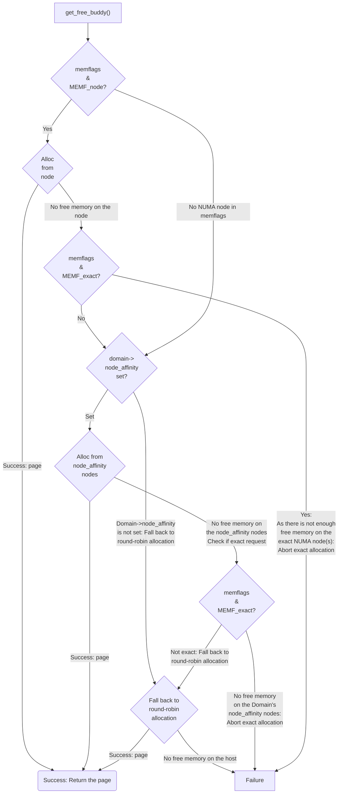

```mermaid
flowchart TD

alloc_round_robin
  --No free memory on the host-->
    Failure

node_affinity_exact
  --No free memory<br>on the Domain's
    node_affinity nodes:<br>Abort exact allocation-->
      Failure

get_free_buddy["get_free_buddy()"]
  -->MEMF_node{memflags<br>&<br>MEMF_node?}
    --Yes-->
      try_MEMF_node{Alloc
                    from
                    node}
        --Success: page-->
          Success
      try_MEMF_node
        --No free memory on the node-->
          MEMF_exact{memflags
                     &
                     MEMF_exact?}
            --"No"-->
              node_affinity_set{NUMA affinity set?}
                --  Domain->node_affinity
                    is not set: Fall back to
                    round-robin allocation
                      --> alloc_round_robin

          MEMF_exact
            --Yes:
              As there is not enough
              free memory on the
              exact NUMA node(s):
              Abort exact allocation
                -->Failure

  MEMF_node
    --No NUMA node in memflags-->
      node_affinity_set{domain-><br>node_affinity<br>set?}
        --Set-->
          node_affinity{Alloc from<br>node_affinity<br>nodes}
            --No free memory on
              the node_affinity nodes
              Check if exact request-->
                node_affinity_exact{memflags<br>&<br>MEMF_exact?}
                  --Not exact: Fall back to<br>round-robin allocation-->
                    alloc_round_robin

    node_affinity--Success: page-->Success

    alloc_round_robin{" Fall back to
                        round-robin
                        allocation"}
                        --Success: page-->
                          Success(Success: Return the page)

click get_free_buddy
"https://github.com/xen-project/xen/blob/e16acd80/xen/common/page_alloc.c#L855-L1116
" _blank
```
