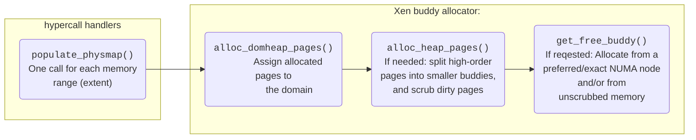

```mermaid
flowchart LR

subgraph hypercall handlers
    populate_physmap("<tt>populate_physmap()</tt>
    One call for each memory
                      range (extent)")
end


subgraph "Xen buddy allocator:"

    populate_physmap
        --> alloc_domheap_pages("<tt>alloc_domheap_pages()</tt>
            Assign allocated pages to
            the domain")

    alloc_domheap_pages
        --> alloc_heap_pages("<tt>alloc_heap_pages()</tt>
                        If needed: split high-order
                        pages into smaller buddies,
                        and scrub dirty pages")
            --> get_free_buddy("<tt>get_free_buddy()</tt>
            If reqested: Allocate from a
            preferred/exact NUMA node
            and/or from
            unscrubbed memory
            ")

end

click populate_physmap
"https://github.com/xen-project/xen/blob/e16acd80/xen/common/memory.c#L159-L314
" _blank

click alloc_domheap_pages
"https://github.com/xen-project/xen/blob/e16acd80/xen/common/page_alloc.c#L2641-L2697
" _blank

click get_free_buddy
"https://github.com/xen-project/xen/blob/e16acd80/xen/common/page_alloc.c#L855-L958
" _blank

click alloc_heap_pages
"https://github.com/xen-project/xen/blob/e16acd80/xen/common/page_alloc.c#L967-L1116
" _blank

```
