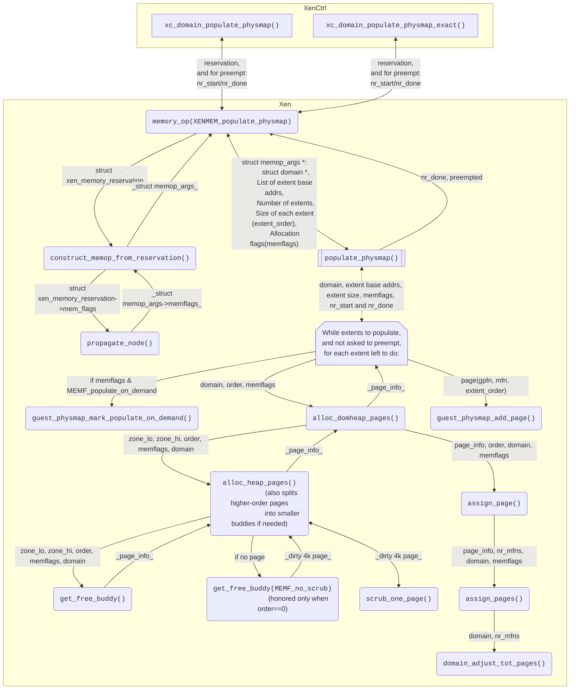

```mermaid
flowchart TD

subgraph XenCtrl
xc_domain_populate_physmap["<tt>xc_domain_populate_physmap()"]
xc_domain_populate_physmap_exact["<tt>xc_domain_populate_physmap_exact()"]
end

subgraph Xen

%% sub-subgraph from memory_op() to populate_node() and back

xc_domain_populate_physmap & xc_domain_populate_physmap_exact
<--reservation,<br>and for preempt:<br>nr_start/nr_done-->
memory_op("<tt>memory_op(XENMEM_populate_physmap)")

memory_op
    --struct xen_memory_reservation-->
        construct_memop_from_reservation("<tt>construct_memop_from_reservation()")
            --struct<br>xen_memory_reservation->mem_flags-->
                propagate_node("<tt>propagate_node()")
            --_struct<br>memop_args->memflags_-->
        construct_memop_from_reservation
    --_struct memop_args_-->
memory_op<--struct memop_args *:
            struct domain *,
            List of extent base addrs,
            Number of extents,
            Size of each extent (extent_order),
            Allocation flags(memflags)-->
    populate_physmap[["<tt>populate_physmap()"]]
        <-.domain, extent base addrs, extent size, memflags, nr_start and nr_done.->
        populate_physmap_loop--if memflags & MEMF_populate_on_demand -->guest_physmap_mark_populate_on_demand("
            <tt>guest_physmap_mark_populate_on_demand()")
        populate_physmap_loop@{ label: "While extents to populate,
                and not asked to preempt,
                for each extent left to do:", shape: notch-pent }
            --domain, order, memflags-->
            alloc_domheap_pages("<tt>alloc_domheap_pages()")
              --zone_lo, zone_hi, order, memflags, domain-->
                alloc_heap_pages
                    --zone_lo, zone_hi, order, memflags, domain-->
                        get_free_buddy("<tt>get_free_buddy()")
                    --_page_info_
                -->alloc_heap_pages
                    --if no page-->
                        no_scrub("<tt>get_free_buddy(MEMF_no_scrub)</tt>
                            (honored only when order==0)")
                    --_dirty 4k page_
                -->alloc_heap_pages
                    <--_dirty 4k page_-->
                        scrub_one_page("<tt>scrub_one_page()")
                alloc_heap_pages("<tt>alloc_heap_pages()</tt>
                        (also splits higher-order pages
                         into smaller buddies if needed)")
              --_page_info_
            -->alloc_domheap_pages
                --page_info, order, domain, memflags-->assign_page("<tt>assign_page()")
                    assign_page
                        --page_info, nr_mfns, domain, memflags-->
                            assign_pages("<tt>assign_pages()")
                            --domain, nr_mfns-->
                                domain_adjust_tot_pages("<tt>domain_adjust_tot_pages()")
            alloc_domheap_pages
            --_page_info_-->
        populate_physmap_loop
            --page(gpfn, mfn, extent_order)-->
                guest_physmap_add_page("<tt>guest_physmap_add_page()")

populate_physmap--nr_done, preempted-->memory_op
end

click memory_op
"https://github.com/xen-project/xen/blob/e16acd80/xen/common/memory.c#L1409-L1425
" _blank

click construct_memop_from_reservation
"https://github.com/xen-project/xen/blob/e16acd80/xen/common/memory.c#L1022-L1071
" _blank

click propagate_node
"https://github.com/xen-project/xen/blob/e16acd80/xen/common/memory.c#L524-L547
" _blank

click populate_physmap
"https://github.com/xen-project/xen/blob/e16acd80/xen/common/memory.c#L159-L314
" _blank

click populate_physmap_loop
"https://github.com/xen-project/xen/blob/e16acd80/xen/common/memory.c#L197-L304
" _blank

click guest_physmap_mark_populate_on_demand
"https://github.com/xen-project/xen/blob/e16acd80/xen/common/page_alloc.c#L210-220
" _blank

click guest_physmap_add_page
"https://github.com/xen-project/xen/blob/e16acd80/xen/common/page_alloc.c#L296
" _blank

click alloc_domheap_pages
"https://github.com/xen-project/xen/blob/e16acd80/xen/common/page_alloc.c#L2641-L2697
" _blank

click alloc_heap_pages
"https://github.com/xen-project/xen/blob/e16acd80/xen/common/page_alloc.c#L967-L1116
" _blank

click get_free_buddy
"https://github.com/xen-project/xen/blob/e16acd80/xen/common/page_alloc.c#L855-L958
" _blank

click assign_page
"https://github.com/xen-project/xen/blob/e16acd80/xen/common/page_alloc.c#L2540-L2633
" _blank

click assign_pages
"https://github.com/xen-project/xen/blob/e16acd80/xen/common/page_alloc.c#L2635-L2639
" _blank
```
