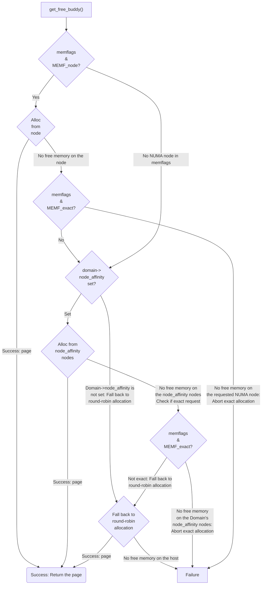

```mermaid
flowchart TD
alloc_round_robin--No free memory on the host-->Failure
node_affinity_exact--No free memory<br>on the Domain's
node_affinity nodes:<br>Abort exact allocation-->Failure

get_free_buddy["get_free_buddy()"]
-->MEMF_node{memflags<br>&<br>MEMF_node?}
--Yes-->
  try_MEMF_node{Alloc<br>from<br>node}--Success: page-->Success
  try_MEMF_node--No free memory on the node
  -->MEMF_exact{memflags<br>&<br>MEMF_exact?}
  MEMF_exact--"No"-->node_affinity_set{NUMA affinity set?}
  node_affinity_set
  --Domain->node_affinity is<br>not set: Fall back to<br>round-robin allocation
  -->alloc_round_robin
  MEMF_exact--No free memory on<br>the requested NUMA node:
    Abort exact allocation-->Failure
  MEMF_node--No NUMA node in memflags
  -->node_affinity_set{domain-><br>node_affinity<br>set?}
  --Set-->node_affinity{Alloc from<br>node_affinity<br>nodes}
    --No free memory on<br>the node_affinity nodes<br>Check if exact request
      -->node_affinity_exact{memflags<br>&<br>MEMF_exact?}
         --Not exact: Fall back to<br>round-robin allocation-->alloc_round_robin
    node_affinity--Success: page-->Success
    alloc_round_robin{"Fall back to<br>round-robin
        allocation"}--Success: page-->Success(Success: Return the page)
click get_free_buddy
"https://github.com/xen-project/xen/blob/e16acd80/xen/common/page_alloc.c#L855" _blank
```
