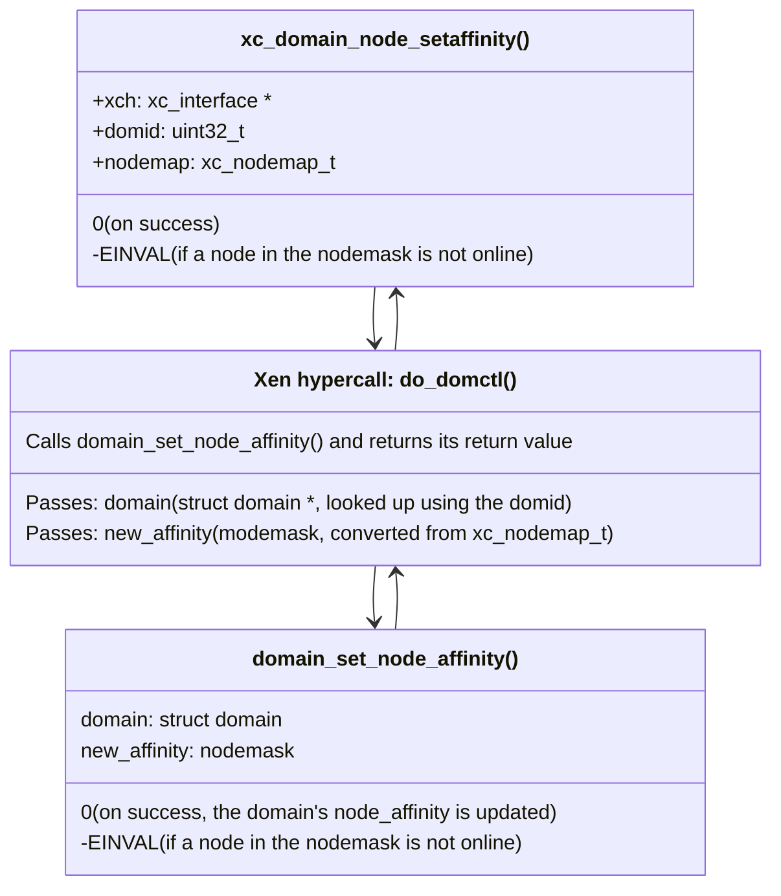

`xc_domain_node_setaffinity()` controls the NUMA node affinity of a domain.

By default, Xen enables the `auto_node_affinity` feature flag,
where setting the vCPU affinity also sets the NUMA node affinity for
memory allocations to be aligned with the vCPU affinity of the domain.

Setting the NUMA node affinity using this call can be used,
for example, when there might not be enough memory on the
preferred NUMA node, but there are other NUMA nodes that have
enough free memory to be used for the system memory of the domain.

In terms of future NUMA design, it might be even more favourable to
have a strategy in `xenguest` where in such cases, the superpages
of the preferred node are used first and a fallback to neighbouring
NUMA nodes only happens to the extent necessary.

Likely, the future allocation strategy should be passed to `xenguest`
using Xenstore like the other platform parameters for the VM.

## Walk-through of xc_domain_node_setaffinity()

### domain_set_node_affinity()

This function implements the functionality of `xc_domain_node_setaffinity`
to set the NUMA affinity of a domain as described above.
If the new_affinity does not intersect the `node_online_map`,
it returns `-EINVAL`, otherwise on success `0`.

When the `new_affinity` is a specific set of NUMA nodes, it updates the NUMA
`node_affinity` of the domain to these nodes and disables `auto_node_affinity`
for this domain. It also notifies the Xen scheduler of the change.

This sets the preference the memory allocator to the new NUMA nodes,
and in theory, it could also alter the behaviour of the scheduler.
This of course depends on the scheduler and its configuration.

## Notes on future design improvements

This call cannot influence the past: The `xenopsd`
[VM_create](../../xenopsd/walkthroughs/VM.start.md#2-create-a-xen-domain)
micro-ops calls `Xenctrl.domain_create`. It currently creates
the domain's data structures before `numa_placement` was done.

Improving `Xenctrl.domain_create` to pass a NUMA node
for allocating the Hypervisor's data structures (e.g. vCPU)
of the domain would require changes
to the Xen hypervisor and the `xenopsd`
[xenopsd VM_create](../../xenopsd/walkthroughs/VM.start.md#2-create-a-xen-domain)
micro-op.
