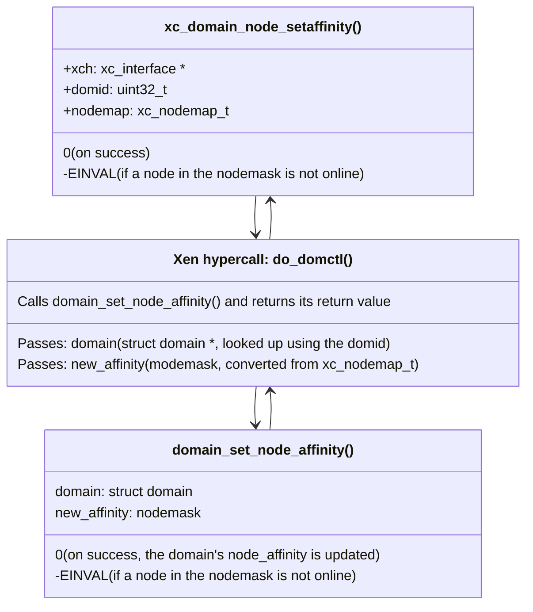

`xc_domain_node_setaffinity()` controls the NUMA node affinity of a domain,
but it only updates the Xen hypervisor domain's `d->node_affinity` mask.
This mask is read by the Xen memory allocator as the 2nd preference for the
NUMA node to allocate memory from for this domain.

> [!info] Preferences of the Xen memory allocator:
> 1. A NUMA node passed to the allocator directly takes precedence, if present.
> 2. Then, if the allocation is for a domain, it's `node_affinity` mask is tried.
> 3. Finally, it falls back to spread the pages over all remaining NUMA nodes.

As this call has no practical effect on the Xen scheduler, vCPU affinities
need to be set separately anyways.

And, the domain's `auto_node_affinity` flag is enabled by default. It means
that when setting vCPU affinities, Xen updates the `d->node_affinity` mask
to consist of the NUMA nodes to which its vCPUs have affinity to.

See [xc_vcpu_setaffinity()](xc_vcpu_setaffinity) for more information
on how `d->auto_node_affinity` is used to set the NUMA node affinity.

Thus, so far, there is no obvious need to call `xc_domain_node_setaffinity()`
when building a domain.

Setting the NUMA node affinity using this call can be used,
for example, when there might not be enough memory on the
preferred NUMA node, but there are other NUMA nodes that have
enough free memory to be used for the system memory of the domain.

In terms of future NUMA design, it might be even more favourable to
have a strategy in `xenguest` where in such cases, the superpages
of the preferred node are used first and a fallback to neighbouring
NUMA nodes only happens to the extent necessary.

Likely, the future allocation strategy should be passed to `xenguest`
using Xenstore like the other platform parameters for the VM.

## Walk-through of xc_domain_node_setaffinity()

### domain_set_node_affinity()

This function implements the functionality of `xc_domain_node_setaffinity`
to set the NUMA affinity of a domain as described above.
If the new_affinity does not intersect the `node_online_map`,
it returns `-EINVAL`. Otherwise, the result is a success, and it returns `0`.

When the `new_affinity` is a specific set of NUMA nodes, it updates the NUMA
`node_affinity` of the domain to these nodes and disables `d->auto_node_affinity`
for this domain. With `d->auto_node_affinity` disabled,
[xc_vcpu_setaffinity()](xc_vcpu_setaffinity) no longer updates the NUMA affinity
of this domain.

If `new_affinity` has all bits set, it re-enables the `d->auto_node_affinity`
for this domain and calls
[domain_update_node_aff()](https://github.com/xen-project/xen/blob/e16acd80/xen/common/sched/core.c#L1809-L1876)
to re-set the domain's `node_affinity` mask to the NUMA nodes of the current
the hard and soft affinity of the domain's online vCPUs.

### Flowchart in relation to xc_set_vcpu_affinity()

The effect of `domain_set_node_affinity()` can be seen more clearly on this
flowchart which shows how `xc_set_vcpu_affinity()` is currently used to set
the NUMA affinity of a new domain, but also shows how `domain_set_node_affinity()`
relates to it:

{}

Essentially, `xc_domain_node_setaffinity` can be used to:

- Set the domain's `node_affinity` which is normally set by
  `xc_set_vcpu_affinity()` to a different set of NUMA nodes that are not
  aligned with the CPU affinity of the vCPUs of the domain.

  This can be useful for special situations:

  - If we like to use the CPUs of one set of NUMA nodes for booting a VM,
    but allocate or spread the memory of this VM on/over other NUMA nodes.

    This can be useful if we want to avoid using memory from some NUMA nodes,
    for example, to keep those NUMA nodes free for other VMs,
    but still want to run the CPUs on those NUMA nodes, which
    might be helpful to better define on which NUMA nodes the vCPUs
    may wander to in order to prevent vCPUs from wandering to another
    CPU package. Such preventions might be valid use of vCPU hard-affinity.

- Run tests that check the performance difference from using remote memory
  explicitly when starting a VM. This can be useful for testing if a given
  performance reading matches the performance of local or remote memory
  on a given tested system.

#### Effect on the Xen scheduler

If `d->node_affinity` is set before vCPU creation, the initial pCPU
of the new vCPU is the first pCPU of the first NUMA node in the domain's
`node_affinity`. This is further changed when one of more `cpupools` are set up.

However, as this is only the initial pCPU of the vCPU, this alone does
not have a lot of effect on the Xen scheduler.

## Notes on future design improvements

### It may be possible to call it before vCPUs are created

When done early, before vCPU creation, some domain-related data structures
could be allocated using the domain's `d->node_affinity` NUMA node mask.

With further changes in Xen and `xenopsd`, Xen could allocate the vCPU structs
on the affine NUMA nodes of the domain.

The pre-condition for this would be that `xenopsd` needs to call this function
before vCPU creation and after having decided the domain's NUMA placement,
preferably including claiming the required memory for the domain to ensure
that the domain will be populated from the same NUMA node(s).

This call cannot influence the past: The `xenopsd`
[VM_create](../../xenopsd/walkthroughs/VM.start.md#2-create-a-xen-domain)
micro-ops calls `Xenctrl.domain_create`. It currently creates
the domain's data structures before `numa_placement` was done.

Improving `Xenctrl.domain_create` to pass a NUMA node
for allocating the Hypervisor's data structures (e.g. vCPU)
of the domain would require changes
to the Xen hypervisor and the `xenopsd`
[xenopsd VM_create](../../xenopsd/walkthroughs/VM.start.md#2-create-a-xen-domain)
micro-op.
