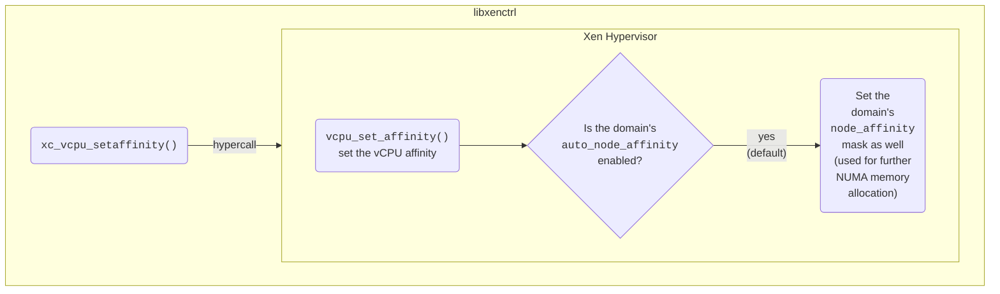

```mermaid
flowchart TD
subgraph libxenctrl
    xc_vcpu_setaffinity("<tt>xc_vcpu_setaffinity()")--hypercall-->xen
end
subgraph xen[Xen Hypervisor]
direction LR
vcpu_set_affinity("<tt>vcpu_set_affinity()</tt><br>set the vCPU affinity")
    -->check_auto_node{"Is the domain's<br><tt>auto_node_affinity</tt><br>enabled?"}
        --"yes<br>(default)"-->
            auto_node_affinity("Set the<br>domain's<br><tt>node_affinity</tt>
            mask as well<br>(used for further<br>NUMA memory<br>allocation)")

click xc_vcpu_setaffinity
"https://github.com/xen-project/xen/blob/7cf16387/tools/libs/ctrl/xc_domain.c#L199-L250" _blank
click vcpu_set_affinity
"https://github.com/xen-project/xen/blob/7cf16387/xen/common/sched/core.c#L1353-L1393" _blank
click domain_update_node_aff
"https://github.com/xen-project/xen/blob/7cf16387/xen/common/sched/core.c#L1809-L1876" _blank
click check_auto_node
"https://github.com/xen-project/xen/blob/7cf16387/xen/common/sched/core.c#L1840-L1870" _blank
click auto_node_affinity
"https://github.com/xen-project/xen/blob/7cf16387/xen/common/sched/core.c#L1867-L1869" _blank
end
```
