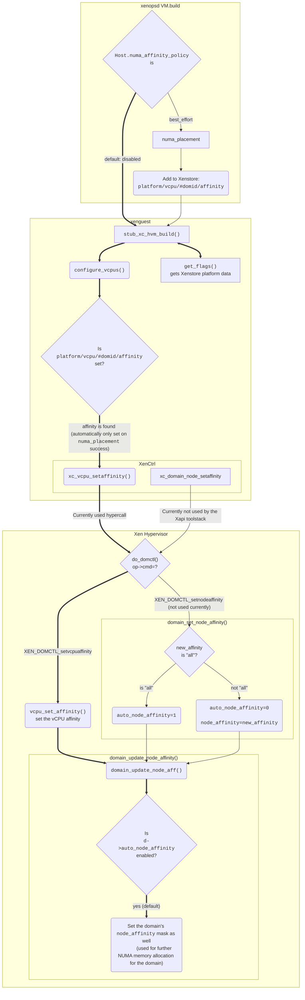

```mermaid
flowchart TD
subgraph xenopsd["xenopsd VM.build"]

Host.numa_affinity_policy{<tt>Host.numa_affinity_policy</tt><br>is}
    --best_effort-->numa_placement-->XenStore
end

subgraph xenguest
Host.numa_affinity_policy=="default: disabled"==>stub_xc_hvm_build
XenStore(Add to Xenstore:<br><tt>platform/vcpu/#domid/affinity</tt>)-->
    stub_xc_hvm_build("<tt>stub_xc_hvm_build()")
    ==> configure_vcpus("<tT>configure_vcpus()")
        ==> affinity_set{"Is<br><tt>platform/vcpu/#domid/affinity</tt><br>set?"}
            =="affinity is found (automatically only set on <tt>numa_placement</tt> success)"==>
                xc_vcpu_setaffinity("<tt>xc_vcpu_setaffinity()")

    stub_xc_hvm_build["<tt>stub_xc_hvm_build()"]
        <==> get_flags["<tt>get_flags()</tt><br>gets Xenstore platform data"]

    subgraph xenctrl[XenCtrl]
        xc_vcpu_setaffinity
        xc_domain_node_setaffinity
    end
end

xc_vcpu_setaffinity ==Currently used hypercall==> do_domctl
xc_domain_node_setaffinity --Currently not used by the Xapi toolstack--> do_domctl

subgraph xen[Xen Hypervisor]

    subgraph domain_update_node_affinity["domain_update_node_affinity()"]
        domain_update_node_aff("<tt>domain_update_node_aff()")
        ==> check_auto_node{"Is<br><tt>d->auto_node_affinity</tt><br>enabled?"}
          =="yes (default)"==>set_node_affinity_from_vcpu_affinities("
            Set the domain's <tt>node_affinity</tt> mask as well
            (used for further NUMA memory allocation for the domain)")
    end

    do_domctl{"do_domctl()<br>op->cmd=?"}
        ==XEN_DOMCTL_setvcpuaffinity==>
            vcpu_set_affinity("<tt>vcpu_set_affinity()</tt><br>set the vCPU affinity")
                ==>domain_update_node_aff
    do_domctl
        --XEN_DOMCTL_setnodeaffinity (not used currently)
            -->nodes_full

    subgraph  domain_set_node_affinity["domain_set_node_affinity()"]
        nodes_full{new_affinity<br>is #34;all#34;?}
            --is #34;all#34;-->
                set_auto("<tt>auto_node_affinity=1")-->
                    domain_update_node_aff
        nodes_full
            --not #34;all#34;-->fixed("<tt>auto_node_affinity=0
            node_affinity=new_affinity")
            -->domain_update_node_aff
    end
end
click Host.numa_affinity_policy
"https://github.com/xapi-project/xen-api/blob/90ef043c1f3a3bc20f1c5d3ccaaf6affadc07983/ocaml/xenopsd/xc/domain.ml#L951-L962"
click numa_placement
"https://github.com/xapi-project/xen-api/blob/90ef043c/ocaml/xenopsd/xc/domain.ml#L862-L897"
click stub_xc_hvm_build
"https://github.com/xenserver/xen.pg/blob/65c0438b/patches/xenguest.patch#L2329-L2436" _blank
click get_flags
"https://github.com/xenserver/xen.pg/blob/65c0438b/patches/xenguest.patch#L1164-L1288" _blank
click do_domctl
"https://github.com/xen-project/xen/blob/7cf163879/xen/common/domctl.c#L282-L894" _blank
click domain_set_node_affinity
"https://github.com/xen-project/xen/blob/7cf163879/xen/common/domain.c#L943-L970" _blank
click configure_vcpus
"https://github.com/xenserver/xen.pg/blob/65c0438b/patches/xenguest.patch#L1297-L1348" _blank
click affinity_set
"https://github.com/xenserver/xen.pg/blob/65c0438b/patches/xenguest.patch#L1305-L1326" _blank
click xc_vcpu_setaffinity
"https://github.com/xen-project/xen/blob/7cf16387/tools/libs/ctrl/xc_domain.c#L199-L250" _blank
click vcpu_set_affinity
"https://github.com/xen-project/xen/blob/7cf16387/xen/common/sched/core.c#L1353-L1393" _blank
click domain_update_node_aff
"https://github.com/xen-project/xen/blob/7cf16387/xen/common/sched/core.c#L1809-L1876" _blank
click check_auto_node
"https://github.com/xen-project/xen/blob/7cf16387/xen/common/sched/core.c#L1840-L1870" _blank
click set_node_affinity_from_vcpu_affinities
"https://github.com/xen-project/xen/blob/7cf16387/xen/common/sched/core.c#L1867-L1869" _blank
```
