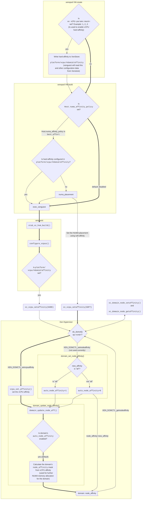

```mermaid
flowchart TD

subgraph VM.create["xenopsd VM.create"]

    %% Is xe vCPU-params:mask= set? If yes, write to Xenstore:

    is_xe_vCPUparams_mask_set?{"

            Is
            <tt>xe vCPU-params:mask=</tt>
            set? Example: <tt>1,2,3</tt>
            (Is used to enable vCPU<br>hard-affinity)

        "} --"yes"--> set_hard_affinity("Write hard-affinity to XenStore:
                        <tt>platform/vcpu/#domid/affinity</tt>
                        (xenguest will read this and other configuration data
                         from Xenstore)")

end

subgraph VM.build["xenopsd VM.build"]

    %% Labels of the decision nodes

    is_Host.numa_affinity_policy_set?{
        Is<p><tt>Host.numa_affinity_policy</tt><p>set?}
    has_hard_affinity?{
        Is hard-affinity configured in <p><tt>platform/vcpu/#domid/affinity</tt>?}

    %% Connections from VM.create:
    set_hard_affinity --> is_Host.numa_affinity_policy_set?
    is_xe_vCPUparams_mask_set? == "no"==> is_Host.numa_affinity_policy_set?

    %% The Subgraph itself:

    %% Check Host.numa_affinity_policy

    is_Host.numa_affinity_policy_set?

        %% If Host.numa_affinity_policy is "best_effort":

        -- Host.numa_affinity_policy is<p><tt>best_effort -->

            %% If has_hard_affinity is set, skip numa_placement:

            has_hard_affinity?
                --"yes"-->exec_xenguest

            %% If has_hard_affinity is not set, run numa_placement:

            has_hard_affinity?
                --"no"-->numa_placement-->exec_xenguest

        %% If Host.numa_affinity_policy is off (default, for now),
        %% skip NUMA placement:

        is_Host.numa_affinity_policy_set?
            =="default: disabled"==>
            exec_xenguest
end

%% xenguest subgraph

subgraph xenguest

    exec_xenguest

        ==> stub_xc_hvm_build("<tt>stub_xc_hvm_build()")

            ==> configure_vcpus("<tT>configure_vcpus()")

                %% Decision
                ==> set_hard_affinity?{"
                        Is <tt>platform/<br>vcpu/#domid/affinity</tt>
                        set?"}

end

%% do_domctl Hypercalls

numa_placement
    --Set the NUMA placement using soft-affinity-->
    XEN_VCPUAFFINITY_SOFT("<tt>xc_vcpu_setaffinity(SOFT)")
        ==> do_domctl

set_hard_affinity?
    --yes-->
    XEN_VCPUAFFINITY_HARD("<tt>xc_vcpu_setaffinity(HARD)")
        --> do_domctl

xc_domain_node_setaffinity("<tt>xc_domain_node_setaffinity()</tt>
                            and
                            <tt>xc_domain_node_getaffinity()")
                                <--> do_domctl

%% Xen subgraph

subgraph xen[Xen Hypervisor]

    subgraph domain_update_node_affinity["domain_update_node_affinity()"]
        domain_update_node_aff("<tt>domain_update_node_aff()")
        ==> check_auto_node{"Is domain's<br><tt>auto_node_affinity</tt><br>enabled?"}
          =="yes (default)"==>set_node_affinity_from_vcpu_affinities("
            Calculate the domain's <tt>node_affinity</tt> mask from vCPU affinity
            (used for further NUMA memory allocation for the domain)")
    end

    do_domctl{"do_domctl()<br>op->cmd=?"}
        ==XEN_DOMCTL_setvcpuaffinity==>
            vcpu_set_affinity("<tt>vcpu_set_affinity()</tt><br>set the vCPU affinity")
                ==>domain_update_node_aff
    do_domctl
        --XEN_DOMCTL_setnodeaffinity (not used currently)
            -->is_new_affinity_all_nodes?

    subgraph  domain_set_node_affinity["domain_set_node_affinity()"]

        is_new_affinity_all_nodes?{new_affinity<br>is #34;all#34;?}

            --is #34;all#34;

                --> enable_auto_node_affinity("<tt>auto_node_affinity=1")
                    --> domain_update_node_aff

        is_new_affinity_all_nodes?

            --not #34;all#34;

                --> disable_auto_node_affinity("<tt>auto_node_affinity=0")
                    --> domain_update_node_aff
    end

%% setting and getting the struct domain's node_affinity:

disable_auto_node_affinity
    --node_affinity=new_affinity-->
        domain_node_affinity

set_node_affinity_from_vcpu_affinities
    ==> domain_node_affinity@{ shape: bow-rect,label: "domain:&nbsp;node_affinity" }
        --XEN_DOMCTL_getnodeaffinity--> do_domctl

end
click is_Host.numa_affinity_policy_set?
"https://github.com/xapi-project/xen-api/blob/90ef043c1f3a3bc20f1c5d3ccaaf6affadc07983/ocaml/xenopsd/xc/domain.ml#L951-L962"
click numa_placement
"https://github.com/xapi-project/xen-api/blob/90ef043c/ocaml/xenopsd/xc/domain.ml#L862-L897"
click stub_xc_hvm_build
"https://github.com/xenserver/xen.pg/blob/65c0438b/patches/xenguest.patch#L2329-L2436" _blank
click get_flags
"https://github.com/xenserver/xen.pg/blob/65c0438b/patches/xenguest.patch#L1164-L1288" _blank
click do_domctl
"https://github.com/xen-project/xen/blob/7cf163879/xen/common/domctl.c#L282-L894" _blank
click domain_set_node_affinity
"https://github.com/xen-project/xen/blob/7cf163879/xen/common/domain.c#L943-L970" _blank
click configure_vcpus
"https://github.com/xenserver/xen.pg/blob/65c0438b/patches/xenguest.patch#L1297-L1348" _blank
click set_hard_affinity?
"https://github.com/xenserver/xen.pg/blob/65c0438b/patches/xenguest.patch#L1305-L1326" _blank
click xc_vcpu_setaffinity
"https://github.com/xen-project/xen/blob/7cf16387/tools/libs/ctrl/xc_domain.c#L199-L250" _blank
click vcpu_set_affinity
"https://github.com/xen-project/xen/blob/7cf16387/xen/common/sched/core.c#L1353-L1393" _blank
click domain_update_node_aff
"https://github.com/xen-project/xen/blob/7cf16387/xen/common/sched/core.c#L1809-L1876" _blank
click check_auto_node
"https://github.com/xen-project/xen/blob/7cf16387/xen/common/sched/core.c#L1840-L1870" _blank
click set_node_affinity_from_vcpu_affinities
"https://github.com/xen-project/xen/blob/7cf16387/xen/common/sched/core.c#L1867-L1869" _blank
```
