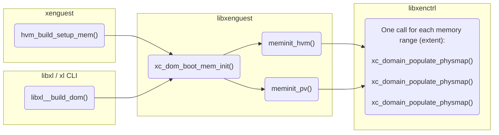

```mermaid
flowchart LR

subgraph libxl / xl CLI
    libxl__build_dom("libxl__build_dom()")
end

subgraph xenguest
    hvm_build_setup_mem("hvm_build_setup_mem()")
end

subgraph libxenctrl
    xc_domain_populate_physmap("One call for each memory range&nbsp;(extent):
    xc_domain_populate_physmap()
    xc_domain_populate_physmap()
    xc_domain_populate_physmap()")
end

subgraph libxenguest

    hvm_build_setup_mem & libxl__build_dom
        --> xc_dom_boot_mem_init("xc_dom_boot_mem_init()")

    xc_dom_boot_mem_init
        --> meminit_hvm("meminit_hvm()") & meminit_pv("meminit_pv()")
            --> xc_domain_populate_physmap
end

click xc_dom_boot_mem_init
"https://github.com/xen-project/xen/blob/39c45c/tools/libs/guest/xg_dom_boot.c#L110-L126
" _blank

click meminit_hvm
"https://github.com/xen-project/xen/blob/39c45c/tools/libs/guest/xg_dom_x86.c#L1348-L1648
" _blank

click meminit_pv
"https://github.com/xen-project/xen/blob/de0254b9/tools/libs/guest/xg_dom_x86.c#L1183-L1333
" _blank
```
