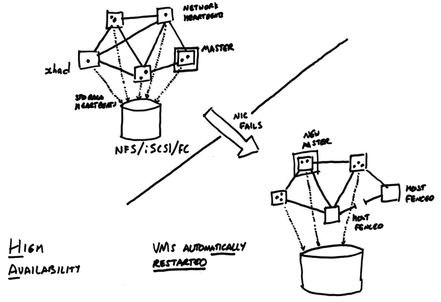
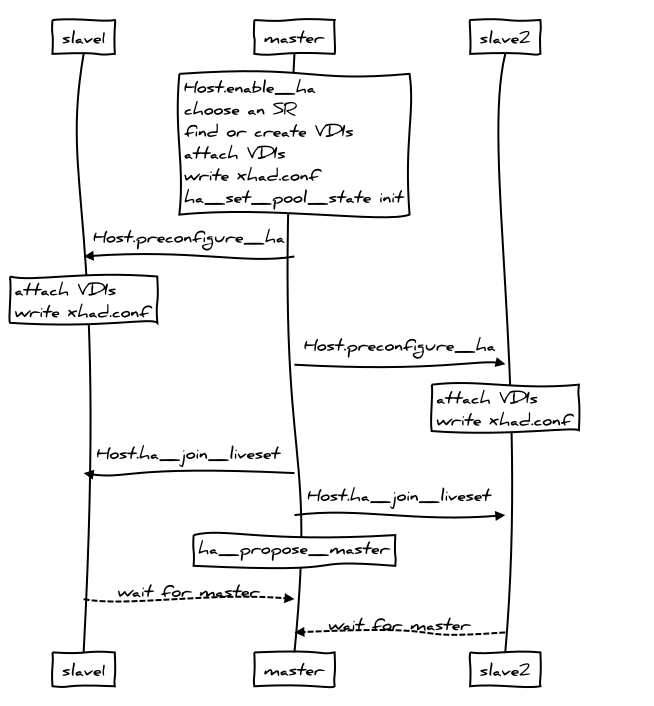
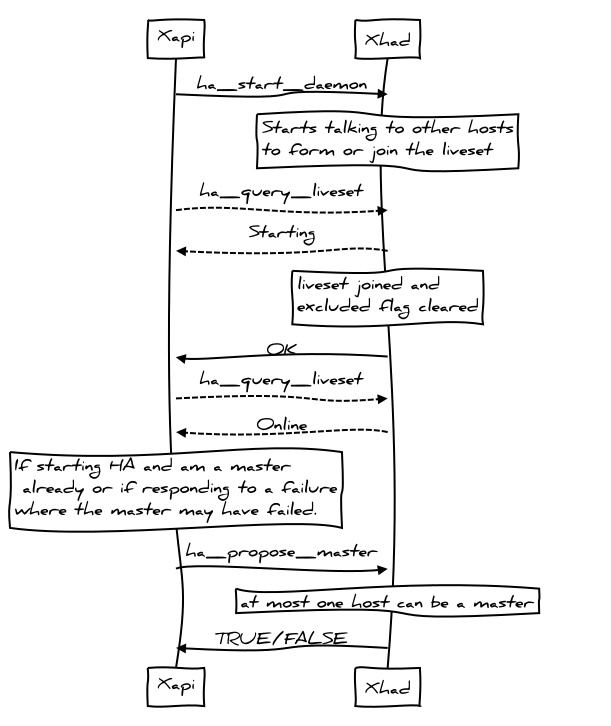
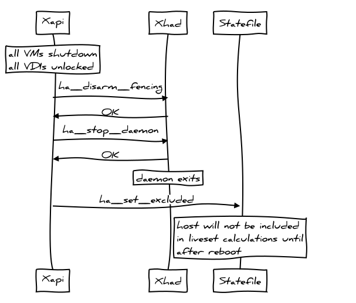
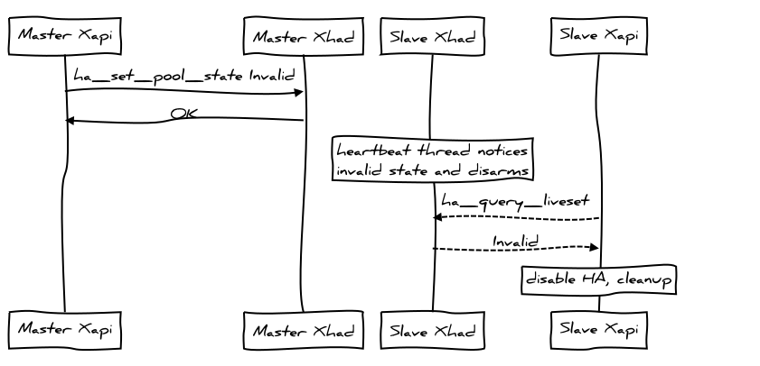
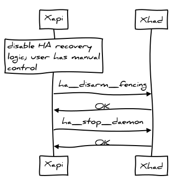

+++
title = "High-Availability"
+++

High-Availability (HA) tries to keep VMs running, even when there are hardware
failures in the resource pool, when the admin is not present. Without HA
the following may happen:

- during the night someone spills a cup of coffee over an FC switch; then
- VMs running on the affected hosts will lose access to their storage; then
- business-critical services will go down; then
- monitoring software will send a text message to an off-duty admin; then
- the admin will travel to the office and fix the problem by restarting
  the VMs elsewhere.

With HA the following will happen:

- during the night someone spills a cup of coffee over an FC switch; then
- VMs running on the affected hosts will lose access to their storage; then
- business-critical services will go down; then
- the HA software will determine which hosts are affected and shut them down; then
- the HA software will restart the VMs on unaffected hosts; then
- services are restored; then *on the next working day*
- the admin can arrange for the faulty switch to be replaced.

HA is designed to handle an emergency and allow the admin time to fix
failures properly.

Example
=======

The following diagram shows an HA-enabled pool, before and after a network
link between two hosts fails.



When HA is enabled, all hosts in the pool

- exchange periodic heartbeat messages over the network
- send heartbeats to a shared storage device.
- attempt to acquire a "master lock" on the shared storage.

HA is designed to recover as much as possible of the pool after a single failure
i.e. it removes single points of failure. When some subset of the pool suffers
a failure then the remaining pool members

- figure out whether they are in the largest fully-connected set (the
  "liveset");
  - if they are not in the largest set then they "fence" themselves (i.e.
    force reboot via the hypervisor watchdog)
- elect a master using the "master lock"
- restart all lost VMs.

After HA has recovered a pool, it is important that the original failure is
addressed because the remaining pool members may not be able to cope with
any more failures.

Design
======

HA must never violate the following safety rules:

1. there must be at most one master at all times. This is because the master
   holds the VM and disk locks.
2. there must be at most one instance of a particular VM at all times. This
   is because starting the same VM twice will result in severe filesystem
   corruption.

However to be useful HA must:

- detect failures quickly;
- minimise the number of false-positives in the failure detector; and
- make the failure handling logic as robust as possible.

The implementation difficulty arises when trying to be both useful and safe
at the same time.

Terminology
-----------

We use the following terminology:

- *fencing*: also known as I/O fencing, refers to the act of isolating a
  host from network and storage. Once a host has been fenced, any VMs running
  there cannot generate side-effects observable to a third party. This means
  it is safe to restart the running VMs on another node without violating the
  safety-rule and running the same VM simultaneously in two locations.
- *heartbeating*: exchanging status updates with other hosts at regular
  pre-arranged intervals. Heartbeat messages reveal that hosts are alive
  and that I/O paths are working.
- *statefile*: a shared disk (also known as a "quorum disk") on the "Heartbeat"
  SR which is mapped as a block device into every host's domain 0. The shared
  disk acts both as a channel for heartbeat messages and also as a building
  block of a Pool master lock, to prevent multiple hosts becoming masters in
  violation of the safety-rule (a dangerous situation also known as
  "split-brain").
- *management network*: the network over which the XenAPI XML/RPC requests
  flow and also used to send heartbeat messages.
- *liveset*: a per-Host view containing a subset of the Hosts in the Pool
  which are considered by that Host to be alive i.e. responding to XenAPI
  commands and running the VMs marked as `resident_on` there. When a Host `b`
  leaves the liveset as seen by Host `a` it is safe for Host `a` to assume
  that Host `b` has been fenced and to take recovery actions (e.g. restarting
  VMs), without violating either of the safety-rules.
- *properly shared SR*: an SR which has field `shared=true`; and which has a
  `PBD` connecting it to every `enabled` Host in the Pool; and where each of
  these `PBD`s has field `currently_attached` set to true. A VM whose disks
  are in a properly shared SR could be restarted on any `enabled` Host,
  memory and network permitting.
- *properly shared Network*: a Network which has a `PIF` connecting it to
  every `enabled` Host in the Pool; and where each of these `PIF`s has
  field `currently_attached` set to true. A VM whose VIFs connect to
  properly shared Networks could be restarted on any `enabled` Host,
  memory and storage permitting.
- *agile*: a VM is said to be agile if all disks are in properly shared SRs
  and all network interfaces connect to properly shared Networks.
- *unprotected*: an unprotected VM has field `ha_always_run` set to false
  and will never be restarted automatically on failure
  or have reconfiguration actions blocked by the HA overcommit protection.
- *best-effort*: a best-effort VM has fields `ha_always_run` set to true and
  `ha_restart_priority` set to best-effort.
  A best-effort VM will only be restarted if (i) the failure is directly
  observed; and (ii) capacity exists for an immediate restart.
  No more than one restart attempt will ever be made.
- *protected*: a VM is said to be protected if it will be restarted by HA
  i.e. has field `ha_always_run` set to true and
  field `ha_restart_priority` not set to `best-effort.
- *survival rule 1*: describes the situation where hosts survive 
  because they are in the largest network partition with statefile access.
  This is the normal state of the `xhad` daemon.
- *survival rule 2*: describes the situation where *all* hosts have lost
  access to the statefile but remain alive
  while they can all see each-other on the network. In this state any further
  failure will cause all nodes to self-fence.
  This state is intended to cope with the system-wide temporary loss of the
  storage service underlying the statefile.

Assumptions
-----------

We assume:

- All I/O used for monitoring the health of hosts (i.e. both storage and
  network-based heartbeating) is along redundant paths, so that it survives
  a single hardware failure (e.g. a broken switch or an accidentally-unplugged
  cable). It is up to the admin to ensure their environment is setup correctly.
- The hypervisor watchdog mechanism will be able to guarantee the isolation
  of nodes, once communication has been lost, within a pre-arranged time
  period. Therefore no active power fencing equipment is required.
- VMs may only be marked as *protected* if they are fully *agile* i.e. able
  to run on any host, memory permitting. No additional constraints of any kind
  may be specified e.g. it is not possible to make "CPU reservations".
- Pools are assumed to be homogenous with respect to CPU type and presence of
  VT/SVM support (also known as "HVM"). If a Pool is created with
  non-homogenous hosts using the `--force` flag then the additional
  constraints will not be noticed by the VM failover planner resulting in
  runtime failures while trying to execute the failover plans.
- No attempt will ever be made to shutdown or suspend "lower" priority VMs
  to guarantee the survival of "higher" priority VMs.
- Once HA is enabled it is not possible to reconfigure the management network
  or the SR used for storage heartbeating.
- VMs marked as *protected* are considered to have failed if they are offline
  i.e. the VM failure handling code is level-sensitive rather than
  edge-sensitive.
- VMs marked as *best-effort* are considered to have failed only when the host
  where they are resident is declared offline
  i.e. the best-effort VM failure handling code is edge-sensitive rather than
  level-sensitive.
  A single restart attempt is attempted and if this fails no further start is
  attempted.
- HA can only be enabled if all Pool hosts are online and actively responding
  to requests.
- when HA is enabled the database is configured to write all updates to
  the "Heartbeat" SR, guaranteeing that VM configuration changes are not lost
  when a host fails.

Components
----------

The implementation is split across the following components:

- [xhad](https://github.com/xenserver/xha): the cluster membership daemon
  maintains a quorum of hosts through network and storage heartbeats
- [xapi](https://github.com/xapi-project/xen-api): used to configure the
  HA policy i.e. which network and storage to use for heartbeating and which
  VMs to restart after a failure.
- [xen](http://xenproject.org/): the Xen watchdog is used to reliably
  fence the host when the host has been (partially or totally) isolated
  from the cluster

To avoid a "split-brain", the cluster membership daemon must "fence" (i.e.
isolate) nodes when they are not part of the cluster. In general there are
2 approaches:

- cut the power of remote hosts which you can't talk to on the network
  any more. This is the approach taken by most open-source clustering
  software since it is simpler. However it has the downside of requiring
  the customer buy more hardware and set it up correctly.
- rely on the remote hosts using a watchdog to cut their own power (i.e.
  halt or reboot) after a timeout. This relies on the watchdog being
  reliable. Most other people [don't trust the Linux watchdog](https://www.suse.com/documentation/sle_ha/singlehtml/book_sleha/book_sleha.html); 
  after all the Linux kernel is highly threaded, performs a lot of (useful)
  functions and kernel bugs which result in deadlocks do happen.
  We use the Xen watchdog because we believe that the Xen hypervisor is
  simple enough to reliably fence the host (via triggering a reboot of
  domain 0 which then triggers a host reboot).

xhad
====

[xhad](https://github.com/xenserver/xha) is the cluster membership daemon:
it exchanges heartbeats with the other nodes to determine which nodes are
still in the cluster (the "live set") and which nodes have *definitely*
failed (through watchdog fencing). When a host has definitely failed, xapi
will unlock all the disks and restart the VMs according to the HA policy.

Since Xapi is a critical part of the system, the xhad also acts as a
Xapi watchdog. It polls Xapi every few seconds and checks if Xapi can
respond. If Xapi seems to have failed then xhad will restart it. If restarts
continue to fail then xhad will consider the host to have failed and
self-fence.

xhad is configured via a simple config file written on each host in
`/etc/xensource/xhad.conf`. The file must be identical on each host
in the cluster. To make changes to the file, HA must be disabled and then
re-enabled afterwards. Note it may not be possible to re-enable HA depending
on the configuration change (e.g. if a host has been added but that host has
a broken network configuration then this will block HA enable).

The xhad.conf file is written in XML and contains

- pool-wide configuration: this includes a list of all hosts which should
  be in the liveset and global timeout information
- local host configuration: this identifies the local host and described
  which local network interface and block device to use for heartbeating.

The following is an example xhad.conf file:

```xml
<?xml version="1.0" encoding="utf-8"?>
<xhad-config version="1.0">

  <!--pool-wide configuration-->
  <common-config>
    <GenerationUUID>xxxxxxxx-xxxx-xxxx-xxxx-xxxxxxxxxxxx</GenerationUUID>
    <UDPport>694</UDPport>

    <!--for each host, specify host UUID, and IP address-->
    <host>
      <HostID>xxxxxxxx-xxxx-xxxx-xxxx-xxxxxxxxxxxx</HostID>
      <IPaddress>xxx.xxx.xxx.xx1</IPaddress>
    </host>

    <host>
      <HostID>xxxxxxxx-xxxx-xxxx-xxxx-xxxxxxxxxxxx</HostID>
      <IPaddress>xxx.xxx.xxx.xx2</IPaddress>
    </host>

    <host>
      <HostID>xxxxxxxx-xxxx-xxxx-xxxx-xxxxxxxxxxxx</HostID>
      <IPaddress>xxx.xxx.xxx.xx3</IPaddress>
    </host>

    <!--optional parameters [sec] -->
    <parameters>
      <HeartbeatInterval>4</HeartbeatInterval>
      <HeartbeatTimeout>30</HeartbeatTimeout>
      <StateFileInterval>4</StateFileInterval>
      <StateFileTimeout>30</StateFileTimeout>
      <HeartbeatWatchdogTimeout>30</HeartbeatWatchdogTimeout>
      <StateFileWatchdogTimeout>45</StateFileWatchdogTimeout>
      <BootJoinTimeout>90</BootJoinTimeout>
      <EnableJoinTimeout>90</EnableJoinTimeout>
      <XapiHealthCheckInterval>60</XapiHealthCheckInterval>
      <XapiHealthCheckTimeout>10</XapiHealthCheckTimeout>
      <XapiRestartAttempts>1</XapiRestartAttempts>
      <XapiRestartTimeout>30</XapiRestartTimeout>
      <XapiLicenseCheckTimeout>30</XapiLicenseCheckTimeout>
    </parameters>
  </common-config>

  <!--local host configuration-->
  <local-config>
    <localhost>
      <HostID>xxxxxxxx-xxxx-xxxx-xxxx-xxxxxxxxxxx2</HostID>
      <HeartbeatInterface> xapi1</HeartbeatInterface>
      <HeartbeatPhysicalInterface>bond0</HeartbeatPhysicalInterface>
      <StateFile>/dev/statefiledevicename</StateFile>
    </localhost>
  </local-config>

</xhad-config>
```

The fields have the following meaning:

- GenerationUUID: a UUID generated each time HA is reconfigured. This allows
  xhad to tell an old host which failed; had been removed from the
  configuration; repaired and then restarted that the world has changed
  while it was away.
- UDPport: the port number to use for network heartbeats. It's important
  to allow this traffic through the firewall and to make sure the same
  port number is free on all hosts (beware of portmap services occasionally
  binding to it).
- HostID: a UUID identifying a host in the pool. We would normally use
  xapi's notion of a host uuid.
- IPaddress: any IP address on the remote host. We would normally use
  xapi's notion of a management network.
- HeartbeatTimeout: if a heartbeat packet is not received for this many
  seconds, then xhad considers the heartbeat to have failed. This is
  the user-supplied "HA timeout" value, represented below as `T`.
  `T` must be bigger than 10; we would normally use 60s.
- StateFileTimeout: if a storage update is not seen for a host for this
  many seconds, then xhad considers the storage heartbeat to have failed.
  We would normally use the same value as the HeartbeatTimeout `T`.
- HeartbeatInterval: interval between heartbeat packets sent. We would
  normally use a value `2 <= t <= 6`, derived from the user-supplied
  HA timeout via `t = (T + 10) / 10`
- StateFileInterval: interval betwen storage updates (also known as
  "statefile updates"). This would normally be set to the same value as
  HeartbeatInterval.
- HeartbeatWatchdogTimeout: If the host does not send a heartbeat for this
  amount of time then the host self-fences via the Xen watchdog. We normally
  set this to `T`.
- StateFileWatchdogTimeout: If the host does not update the statefile for
  this amount of time then the host self-fences via the Xen watchdog. We
  normally set this to `T+15`.
- BootJoinTimeout: When the host is booting and joining the liveset (i.e.
  the cluster), consider the join a failure if it takes longer than this
  amount of time. We would normally set this to `T+60`.
- EnableJoinTimeout: When the host is enabling HA for the first time,
  consider the enable a failure if it takes longer than this amount of time.
  We would normally set this to `T+60`.
- XapiHealthCheckInterval: Interval between "health checks" where we run
  a script to check whether Xapi is responding or not.
- XapiHealthCheckTimeout: Number of seconds to wait before assuming that
  Xapi has deadlocked during a "health check".
- XapiRestartAttempts: Number of Xapi restarts to attempt before concluding
  Xapi has permanently failed.
- XapiRestartTimeout: Number of seconds to wait for a Xapi restart to
  complete before concluding it has failed.
- XapiLicenseCheckTimeout: Number of seconds to wait for a Xapi license
  check to complete before concluding that xhad should terminate.

In addition to the config file, Xhad exposes a simple control API which
is exposed as scripts:

- `ha_set_pool_state (Init | Invalid)`: sets the global pool state to "Init" (before starting
  HA) or "Invalid" (causing all other daemons who can see the statefile to
  shutdown)
- `ha_start_daemon`: if the pool state is "Init" then the daemon will
  attempt to contact other daemons and enable HA. If the pool state is
  "Active" then the host will attempt to join the existing liveset.
- `ha_query_liveset`: returns the current state of the cluster.
- `ha_propose_master`: returns whether the current node has been
  elected pool master.
- `ha_stop_daemon`: shuts down the xhad on the local host. Note this
  will not disarm the Xen watchdog by itself.
- `ha_disarm_fencing`: disables fencing on the local host.
- `ha_set_excluded`: when a host is being shutdown cleanly, record the
  fact that the VMs have all been shutdown so that this host can be ignored
  in future cluster membership calculations.

Fencing
-------

Xhad continuously monitors whether the host should remain alive, or if
it should self-fence. There are two "survival rules" which will keep a host
alive; if neither rule applies (or if xhad crashes or deadlocks) then the
host will fence. The rules are:

1. Xapi is running; the storage heartbeats are visible; this host is a
   member of the "best" partition (as seen through the storage heartbeats)
2. Xapi is running; the storage is inaccessible; all hosts which should
   be running (i.e. not those "excluded" by being cleanly shutdown) are
   online and have also lost storage access (as seen through the network
   heartbeats).

where the "best" partition is the largest one if that is unique, or if there
are multiple partitions of the same size then the one containing the lowest
host uuid is considered best.

The first survival rule is the "normal" case. The second rule exists only
to prevent the storage from becoming a single point of failure: all hosts
can remain alive until the storage is repaired. Note that if a host has
failed and has not yet been repaired, then the storage becomes a single
point of failure for the degraded pool. HA removes single point of failures,
but multiple failures can still cause problems. It is important to fix
failures properly after HA has worked around them.


xapi
====

[Xapi](https://github.com/xapi-project/xen-api) is responsible for

- exposing an interface for setting HA policy
- creating VDIs (disks) on shared storage for heartbeating and storing
  the pool database
- arranging for these disks to be attached on host boot, before the "SRmaster"
  is online
- configuring and managing the `xhad` heartbeating daemon

The HA policy APIs include

- methods to determine whether a VM is *agile* i.e. can be restarted in
  principle on any host after a failure
- planning for a user-specified number of host failures and enforcing
  access control
- restarting failed *protected* VMs in policy order

The HA policy settings are stored in the Pool database which is written
(synchronously)
to a VDI in the same SR that's being used for heartbeating. This ensures
that the database can be recovered after a host fails and the VMs are
recovered.

Xapi stores 2 settings in its local database:

- *ha_disable_failover_actions*: this is set to false when we want nodes
  to be able to recover VMs -- this is the normal case. It is set to true
  during the HA disable process to prevent a split-brain forming while
  HA is only partially enabled.
- *ha_armed*: this is set to true to tell Xapi to start `Xhad` during
  host startup and wait to join the liveset.

Disks on shared storage
-----------------------

The regular disk APIs for creating, destroying, attaching, detaching (etc)
disks need the `SRmaster` (usually but not always the Pool master) to be
online to allow the disks to be locked. The `SRmaster` cannot be brought
online until the host has joined the liveset. Therefore we have a
cyclic dependency: joining the liveset needs the statefile disk to be attached
but attaching a disk requires being a member of the liveset already.

The dependency is broken by adding an explicit "unlocked" attach storage
API called `VDI_ATTACH_FROM_CONFIG`. Xapi uses the `VDI_GENERATE_CONFIG` API
during the HA enable operation and stores away the result. When the system
boots the `VDI_ATTACH_FROM_CONFIG` is able to attach the disk without the
SRmaster.

The role of Host.enabled
------------------------

The `Host.enabled` flag is used to mean, "this host is ready to start VMs and
should be included in failure planning".
The VM restart planner assumes for simplicity that all *protected* VMs can
be started anywhere; therefore all involved networks and storage must be
*properly shared*.
If a host with an unplugged `PBD` were to become enabled then the corresponding
`SR` would cease to be *properly shared*, all the VMs would cease to be
*agile* and the VM restart logic would fail.

To ensure the VM restart logic always works, great care is taken to make
sure that Hosts may only  become enabled when their networks and storage are
properly configured. This is achieved by:

- when the master boots and initialises its database it sets all Hosts to
  dead and disabled and then signals the HA background thread
  ([signal_database_state_valid](https://github.com/xapi-project/xen-api/blob/0bbd4f5ac5fe46f9e982e5d5587ac56ed8427295/ocaml/xapi/xapi_ha.ml#L627))
  to wake up from sleep and 
  start processing liveset information (and potentially setting hosts to live)
- when a slave calls
  [Pool.hello](https://github.com/xapi-project/xen-api/blob/0bbd4f5ac5fe46f9e982e5d5587ac56ed8427295/ocaml/xapi/xapi_pool.ml#L1019)
  (i.e. after the slave has rebooted),
  the master sets it to disabled, allowing it a grace period to plug in its
  storage;
- when a host (master or slave) successfully plugs in its networking and
  storage it calls 
  [consider_enabling_host](https://github.com/xapi-project/xen-api/blob/0bbd4f5ac5fe46f9e982e5d5587ac56ed8427295/ocaml/xapi/xapi_host_helpers.ml#L193)
  which checks that the
  preconditions are met and then sets the host to enabled; and
- when a slave notices its database connection to the master restart
  (i.e. after the master `xapi` has just restarted) it calls
  `consider_enabling_host}`

The steady-state
----------------

When HA is enabled and all hosts are running normally then each calls 
`ha_query_liveset` every 10s.

Slaves check to see if the host they believe is the master is alive and has
the master lock. If another node has become master then the slave will
rewrite its `pool.conf` and restart. If no node is the master then the
slave will call 
[on_master_failure](https://github.com/xapi-project/xen-api/blob/0bbd4f5ac5fe46f9e982e5d5587ac56ed8427295/ocaml/xapi/xapi_ha.ml#L129),
proposing itself and, if it is rejected,
checking the liveset to see which node acquired the lock.

The master monitors the liveset and updates the `Host_metrics.live` flag
of every host to reflect the liveset value. For every host which is not in
the liveset (i.e. has fenced) it enumerates all resident VMs and marks them
as `Halted`. For each protected VM which is not running, the master computes
a VM restart plan and attempts to execute it. If the plan fails then a
best-effort `VM.start` call is attempted. Finally an alert is generated if
the VM could not be restarted.

Note that XenAPI heartbeats are still sent when HA is enabled, even though
they are not used to drive the values of the `Host_metrics.live` field.
Note further that, when a host is being shutdown, the host is immediately
marked as dead and its host reference is added to a list used to prevent the
`Host_metrics.live` being accidentally reset back to live again by the
asynchronous liveset query. The Host reference is removed from the list when
the host restarts and calls `Pool.hello`.

Planning and overcommit
-----------------------

The VM failover planning code is sub-divided into two pieces, stored in
separate files:

- [binpack.ml](https://github.com/xapi-project/xen-api/blob/0bbd4f5ac5fe46f9e982e5d5587ac56ed8427295/ocaml/xapi/binpack.ml): contains two algorithms for packing items of different sizes
  (i.e. VMs) into bins of different sizes (i.e. Hosts); and
- [xapi_ha_vm_failover.ml](https://github.com/xapi-project/xen-api/blob/0bbd4f5ac5fe46f9e982e5d5587ac56ed8427295/ocaml/xapi/xapi_ha_vm_failover.ml): interfaces between the Pool database and the
  binpacker; also performs counterfactual reasoning for overcommit protection.

The input to the binpacking algorithms are configuration values which
represent an abstract view of the Pool:

```ocaml
type ('a, 'b) configuration = {
  hosts:        ('a * int64) list; (** a list of live hosts and free memory *)
  vms:          ('b * int64) list; (** a list of VMs and their memory requirements *)
  placement:    ('b * 'a) list;    (** current VM locations *)
  total_hosts:  int;               (** total number of hosts in the pool 'n' *)
  num_failures: int;               (** number of failures to tolerate 'r' *)
}
```
Note that:

- the memory required by the VMs listed in `placement` has already been
  substracted from the free memory of the hosts; it doesn't need to be
  subtracted again.
- the free memory of each host has already had per-host miscellaneous
  overheads subtracted from it, including that used by unprotected VMs,
  which do not appear in the VM list.
- the total number of hosts in the pool (`total_hosts`) is a constant for
  any particular invocation of HA.
- the number of failures to tolerate (`num_failures`) is the user-settable
  value from the XenAPI `Pool.ha_host_failures_to_tolerate`.


There are two algorithms which satisfy the interface:

```ocaml
sig
  plan_always_possible: ('a, 'b) configuration -> bool;
  get_specific_plan: ('a, 'b) configuration -> 'b list -> ('b * 'a) list
end
```

The function `get_specific_plan` takes a configuration and a list of VMs(
the host where they are resident on have failed). It returns a VM restart
plan represented as a VM to Host association list. This is the function
called by the background HA VM restart thread on the master.

The function `plan_always_possible` returns true if every sequence of Host
failures of length
`num_failures` (irrespective of whether all hosts failed at once, or in
multiple separate episodes)
would result in calls to `get_specific_plan` which would allow all protected
VMs to be restarted.
This function is heavily used by the overcommit protection logic as well as code in XenCenter which aims to 
maximise failover capacity using the counterfactual reasoning APIs:

```ocaml
Pool.ha_compute_max_host_failures_to_tolerate
Pool.ha_compute_hypothetical_max_host_failures_to_tolerate
```

There are two binpacking algorithms: the more detailed but expensive
algorithmm is used for smaller/less 
complicated pool configurations while the less detailed, cheaper algorithm
is used for the rest. The
choice between algorithms is based only on `total_hosts` (`n`) and
`num_failures` (`r`).
Note that the choice of algorithm will only change if the number of Pool
hosts is varied (requiring HA to be disabled and then enabled) or if the
user requests a new `num_failures` target to plan for.

The expensive algorithm uses an exchaustive search with a
"biggest-fit-decreasing" strategy that
takes the biggest VMs first and allocates them to the biggest remaining Host.
The implementation keeps the VMs and Hosts as sorted lists throughout.
There are a number of transformations to the input configuration which are
guaranteed to preserve the existence of a VM to host allocation (even if
the actual allocation is different). These transformations which are safe
are:

- VMs may be removed from the list
- VMs may have their memory requirements reduced
- Hosts may be added
- Hosts may have additional memory added.

The cheaper algorithm is used for larger Pools where the state space to
search is too large. It uses the same "biggest-fit-decreasing" strategy
with the following simplifying approximations:

- every VM that fails is as big as the biggest
- the number of VMs which fail due to a single Host failure is always the
  maximum possible (even if these are all very small VMs)
- the largest and most capable Hosts fail

An informal argument that these approximations are safe is as follows:
if the maximum *number* of VMs fail, each of which is size of the largest
and we can find a restart plan using only the smaller hosts then any real
failure:

- can never result in the failure of more VMs;
- can never result in the failure of bigger VMs; and
- can never result in less host capacity remaining.

Therefore we can take this *almost-certainly-worse-than-worst-case* failure
plan and:

- replace the remaining hosts in the worst case plan with the real remaining
  hosts, which will be the same size or larger; and
- replace the failed VMs in the worst case plan with the real failed VMs,
  which will be fewer or the same in number and smaller or the same in size.

Note that this strategy will perform best when each host has the same number
of VMs on it and when all VMs are approximately the same size. If one very big
VM exists and a lot of smaller VMs then it will probably fail to find a plan.
It is more tolerant of differing amounts of free host memory.

Overcommit protection
---------------------

Overcommit protection blocks operations which would prevent the Pool being
able to restart *protected* VMs after host failure.
The Pool may become unable to restart protected VMs in two general ways:
(i) by running out of resource i.e. host memory; and (ii) by altering host
configuration in such a way that VMs cannot be started (or the planner
thinks that VMs cannot be started).

API calls which would change the amount of host memory currently in use
(`VM.start`, `VM.resume`, `VM.migrate` etc) 
have been modified to call the planning functions supplying special
"configuration change" parameters.
Configuration change values represent the proposed operation and have type

```ocaml
type configuration_change = {
  (** existing VMs which are leaving *)
  old_vms_leaving: (API.ref_host * (API.ref_VM * API.vM_t)) list;
  (** existing VMs which are arriving *)
  old_vms_arriving: (API.ref_host * (API.ref_VM * API.vM_t)) list;  
  (** hosts to pretend to disable *)
  hosts_to_disable: API.ref_host list;
  (** new number of failures to consider *)
  num_failures: int option;
  (** new VMs to restart *)  
  new_vms_to_protect: API.ref_VM list;
}
```

A VM migration will be represented by saying the VM is "leaving" one host and
"arriving" at another. A VM start or resume will be represented by saying the
VM is "arriving" on a host.


Note that no attempt is made to integrate the overcommit protection with the
general `VM.start` host chooser as this would be quite expensive.

Note that the overcommit protection calls are written as `asserts` called
within the message forwarder in the master, holding the main forwarding lock.

API calls which would change the system configuration in such a way as to
prevent the HA restart planner being able to guarantee to restart protected
VMs are also blocked.  These calls include:

- `VBD.create`: where the disk is not in a *properly shared* SR
- `VBD.insert`: where the CDROM is local to a host
- `VIF.create`: where the network is not *properly shared*
- `PIF.unplug`: when the network would cease to be *properly shared*
- `PBD.unplug`: when the storage would cease to be *properly shared*
- `Host.enable`: when some network or storage would cease to be
  *properly shared* (e.g. if this host had a broken storage configuration)


xen
===

The Xen hypervisor has per-domain watchdog counters which, when enabled,
decrement as time passes and can be reset from a hypercall from the domain.
If the domain fails to make the hypercall and the timer reaches zero then
the domain is immediately shutdown with reason reboot. We configure Xen
to reboot the host when domain 0 enters this state.

High-level operations
=====================


Enabling HA
-----------

Before HA can be enabled the admin must take care to configure the
environment properly. In particular:

- NIC bonds should be available for network heartbeats;
- multipath should be configured for the storage heartbeats;
- all hosts should be online and fully-booted.

The XenAPI client can request a specific shared SR to be used for
storage heartbeats, otherwise Xapi will use the Pool's default SR.
Xapi will use `VDI_GENERATE_CONFIG` to ensure the disk will be attached
automatically on system boot before the liveset has been joined.

Note that extra effort is made to re-use any existing heartbeat VDIS
so that

- if HA is disabled with some hosts offline, when they are rebooted they
  stand a higher chance of seeing a well-formed statefile with an explicit
  *invalid* state. If the VDIs were destroyed on HA disable then hosts which
  boot up later would fail to attach the disk and it would be harder to
  distinguish between a temporary storage failure and a permanent HA disable.
- the heartbeat SR can be created on expensive low-latency high-reliability
  storage and made as small as possible (to minimise infrastructure cost),
  safe in the knowledge that if HA enables successfully once, it won't run
  out of space and fail to enable in the future.

The Xapi-to-Xapi communication looks as follows:



The Xapi Pool master calls `Host.ha_join_liveset` on all hosts in the
pool simultaneously. Each host 
runs the `ha_start_daemon` script
which starts Xhad. Each Xhad starts exchanging heartbeats over the network
and storage defined in the `xhad.conf`.

Joining a liveset
-----------------



The Xhad instances exchange heartbeats and decide which hosts are in
the "liveset" and which have been fenced.

After joining the liveset, each host clears
the "excluded" flag which would have
been set if the host had been shutdown cleanly before -- this is only
needed when a host is shutdown cleanly and then restarted.

Xapi periodically queries the state of xhad via the `ha_query_liveset`
command. The state will be `Starting` until the liveset is fully
formed at which point the state will be `Online`.

When the `ha_start_daemon` script returns then Xapi will decide
whether to stand for master election or not. Initially when HA is being
enabled and there is a master already, this node will be expected to
stand unopposed. Later when HA notices that the master host has been
fenced, all remaining hosts will stand for election and one of them will
be chosen.

Shutting down a host
--------------------



When a host is to be shutdown cleanly, it can be safely "excluded"
from the pool such that a future failure of the storage heartbeat will
not cause all pool hosts to self-fence (see survival rule 2 above).
When a host is "excluded" all other hosts know that the host does not
consider itself a master and has no resources locked i.e. no VMs are
running on it. An excluded host will never allow itself to form part
of a "split brain".

Once a host has given up its master role and shutdown any VMs, it is safe
to disable fencing with `ha_disarm_fencing` and stop xhad with
`ha_stop_daemon`. Once the daemon has been stopped the "excluded"
bit can be set in the statefile via `ha_set_excluded` and the
host safely rebooted.

Restarting a host
-----------------

When a host restarts after a failure Xapi notices that *ha_armed* is
set in the local database. Xapi 

- runs the `attach-static-vdis` script to attach the statefile and
  database VDIs. This can fail if the storage is inaccessible; Xapi will
  retry until it succeeds.
- runs the ha_start_daemon to join the liveset, or determine that HA
  has been cleanly disabled (via setting the state to *Invalid*).

In the special case where Xhad fails to access the statefile and the
host used to be a slave then Xapi will try to contact the previous master
and find out

- who the new master is;
- whether HA is enabled on the Pool or not.

If Xapi can confirm that HA was disabled then it will disarm itself and
join the new master. Otherwise it will keep waiting for the statefile
to recover.

In the special case where the statefile has been destroyed and cannot
be recovered, there is an emergency HA disable API the admin can use to
assert that HA really has been disabled, and it's not simply a connectivity
problem. Obviously this API should only be used if the admin is totally
sure that HA has been disabled.

Disabling HA
------------

There are 2 methods of disabling HA: one for the "normal" case when the
statefile is available; and the other for the "emergency" case when the
statefile has failed and can't be recovered.

Disabling HA cleanly
--------------------



HA can be shutdown cleanly when the statefile is working i.e. when hosts
are alive because of survival rule 1. First the master Xapi tells the local
Xhad to mark the pool state as "invalid" using `ha_set_pool_state`.
Every xhad instance will notice this state change the next time it performs
a storage heartbeat. The Xhad instances will shutdown and Xapi will notice
that HA has been disabled the next time it attempts to query the liveset.

If a host loses access to the statefile (or if none of the hosts have
access to the statefile) then HA can be disabled uncleanly.

Disabling HA uncleanly
----------------------

The Xapi master first calls `Host.ha_disable_failover_actions` on each host
which sets `ha_disable_failover_decisions` in the lcoal database. This
prevents the node rebooting, gaining statefile access, acquiring the
master lock and restarting VMs when other hosts have disabled their
fencing (i.e. a "split brain").



Once the master is sure that no host will suddenly start recovering VMs
it is safe to call `Host.ha_disarm_fencing` which runs the script
`ha_disarm_fencing` and then shuts down the Xhad with `ha_stop_daemon`.

Add a host to the pool
----------------------

We assume that adding a host to the pool is an operation the admin will
perform manually, so it is acceptable to disable HA for the duration
and to re-enable it afterwards. If a failure happens during this operation
then the admin will take care of it by hand.
