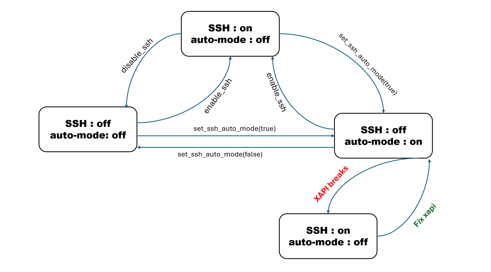

# SSH Management

SSH Management enables programmatic control of SSH access to XenServer hosts. This feature
allows administrators to enable/disable SSH services, configure timeout settings, and implement
automatic SSH management based on XAPI health status.

## Architecture Overview

The SSH Management feature is built around three core components:

1. **SSH Service Control**: Direct enable/disable operations for SSH on individual hosts or entire pools
2. **Timeout Management**: Configurable timeouts for both SSH sessions and service duration limits
3. **Auto Mode**: Intelligent SSH management that automatically adjusts based on XAPI health status



## SSH Service Control

### API Design

#### Host APIs

- `host.enable_ssh`: Enables SSH access on the specified host
- `host.disable_ssh`: Disables SSH access on the specified host  
- `host.set_ssh_enabled_timeout`: Configures SSH service timeout duration (0-172800 seconds, maximum 2 days)
- `host.set_console_idle_timeout`: Sets idle timeout for SSH/VNC console sessions
- `host.set_ssh_auto_mode`: Controls SSH auto mode behavior (when true, SSH is normally disabled but enabled during XAPI downtime)

#### Pool APIs

- `pool.enable_ssh`: Enables SSH access across all hosts in the pool
- `pool.disable_ssh`: Disables SSH access across all hosts in the pool
- `pool.set_ssh_enabled_timeout`: Sets SSH service timeout for all pool hosts
- `pool.set_console_idle_timeout`: Configures console idle timeout for all pool hosts
- `pool.set_ssh_auto_mode`: Applies SSH auto mode configuration to all pool hosts

### Implementation Details

The enable/disable operations work by directly managing systemd services. The code starts and enables the sshd systemd service to enable SSH access, or stops and disables it to disable SSH access:

```ocaml
Xapi_systemctl.start "sshd"
Xapi_systemctl.enable "sshd"

Xapi_systemctl.stop "sshd"
Xapi_systemctl.disable "sshd"
```

#### SSH Timeout Management

The timeout management uses the scheduler system to automatically disable SSH after a specified period. The function removes any existing disable job from the queue and creates a new one-shot job that will execute the SSH disable operation when the timeout expires. if the XAPI restart during this period, xapi will schedule a new job to disable SSH with remaining time:

```ocaml
let schedule_disable_ssh_job ~__context ~self ~timeout ~auto_mode =
  Xapi_stdext_threads_scheduler.Scheduler.remove_from_queue
    !Xapi_globs.job_for_disable_ssh ;
  Xapi_stdext_threads_scheduler.Scheduler.add_to_queue
    !Xapi_globs.job_for_disable_ssh
    Xapi_stdext_threads_scheduler.Scheduler.OneShot (Int64.to_float timeout)
    (fun () ->
      disable_ssh_internal ~__context ~self
    )
```

#### Console Idle Timeout

The console idle timeout is configured by writing to a profile script that sets the TMOUT environment variable. The function generates appropriate content based on the timeout value and atomically writes it to the profile script file:

```ocaml
let set_console_idle_timeout ~__context ~self ~value =
  let content = match value with
    | 0L -> "# Console timeout is disabled\n"
    | timeout -> Printf.sprintf "# Console timeout configuration\nexport TMOUT=%Ld\n" timeout
  in
  Unixext.atomic_write_to_file !Xapi_globs.console_timeout_profile_path 0o0644
    (fun fd -> Unix.write fd (Bytes.of_string content) 0 (String.length content))
```

#### SSH Auto Mode

The SSH auto mode is configured by managing the monitoring service. The function updates the database with the auto mode setting and then enables or disables the SSH monitoring daemon accordingly. When auto mode is enabled, it starts the monitoring service and enable SSH service (Always enable SSH service for avoid both XAPI and Monitor service are down, user is still able to start SSH service by reboot host); when disabled, it stops and disables the monitoring service:

```ocaml
let set_ssh_auto_mode ~__context ~self ~value =
  Db.Host.set_ssh_auto_mode ~__context ~self ~value ;
  if value then (
    Xapi_systemctl.enable ~wait_until_success:false !Xapi_globs.ssh_service ;
    Xapi_systemctl.enable ~wait_until_success:false !Xapi_globs.ssh_monitor_service ;
    Xapi_systemctl.start ~wait_until_success:false !Xapi_globs.ssh_monitor_service
  ) else (
    Xapi_systemctl.stop ~wait_until_success:false !Xapi_globs.ssh_monitor_service ;
    Xapi_systemctl.disable ~wait_until_success:false !Xapi_globs.ssh_monitor_service
  )
```

### CLI Commands

```bash
# Enable/disable SSH on hosts
xe host-enable-ssh host=<UUID or name>
xe host-disable-ssh host-uuid=<UUID or name>

# Configure timeouts on individual hosts
xe host-param-set uuid=<host-uuid> ssh-enabled-timeout=3600
xe host-param-set uuid=<host-uuid> console-idle-timeout=300
xe host-param-set uuid=<host-uuid> ssh-auto-mode=true

# Query host SSH parameters
xe host-param-get uuid=<host-uuid> param-name=ssh-enabled
xe host-param-get uuid=<host-uuid> param-name=ssh-expiry
xe host-param-get uuid=<host-uuid> param-name=ssh-enabled-timeout
xe host-param-get uuid=<host-uuid> param-name=console-idle-timeout
xe host-param-get uuid=<host-uuid> param-name=ssh-auto-mode

# Enable/disable SSH across pool
xe pool-enable-ssh
xe pool-disable-ssh

# Configure timeouts across pool
xe pool-param-set uuid=<pool-uuid> ssh-enabled-timeout=3600
xe pool-param-set uuid=<pool-uuid> console-idle-timeout=300
xe pool-param-set uuid=<pool-uuid> ssh-auto-mode=true

# Query pool SSH parameters
xe pool-param-get uuid=<pool-uuid> param-name=ssh-enabled
xe pool-param-get uuid=<pool-uuid> param-name=ssh-expiry
xe pool-param-get uuid=<pool-uuid> param-name=ssh-enabled-timeout
xe pool-param-get uuid=<pool-uuid> param-name=console-idle-timeout
xe pool-param-get uuid=<pool-uuid> param-name=ssh-auto-mode
```

## Auto Mode

### Overview

The auto mode feature intelligently manages SSH access based on XAPI health status:
- SSH is automatically enabled when XAPI becomes unhealthy
- SSH is automatically disabled when XAPI is healthy and running normally

When the user enables the SSH service with `enable_ssh` API, SSH auto mode will be turned off.
| SSH service | auto mode |
|-------------|-----------|
| enabled | off |

If SSH auto mode is enabled and XAPI becomes unresponsive, the system will automatically enable the SSH service to allow access.
| auto mode | xapi healthy | SSH service |
|-----------|--------------|-------------|
| on | yes | disable |
| on | no | enable |
| off | NA | NA |

When SSH is temporarily enabled using the ssh-enabled-timeout setting and enable-ssh command, the system preserves the original SSH auto-mode state in cache. During the timeout period, SSH auto-mode is suspended (set to off) to allow SSH access. Once the timeout expires, the system restores the cached auto-mode state - if auto-mode was originally enabled, it will be reactivated and automatically stop the SSH service again
| auto mode before set enable timeout | SSH service before set enable timeout | auto mode during the limited time period | auto mode after enable timeout |
|-----------------------------------|--------------------------------------|----------------------------------------|-------------------------------|
| on | off | off | on |

### Service Architecture

#### Monitoring Daemon

The monitoring daemon (`/opt/xensource/libexec/xapi-state-monitor`) operates continuously:

1. Monitors current SSH service status
2. When auto mode is enabled:
   - If XAPI is healthy and SSH is active → Stop SSH
   - If XAPI is unhealthy and SSH is inactive → Start SSH
3. Implements retry logic with up to 3 attempts for failed operations
4. Pauses for 60 seconds between health check cycles

### Health Check Integration

The system leverages the existing `xapi-health-check` script for health monitoring:
- Returns 0 when XAPI is healthy
- Returns 1 when XAPI is unhealthy
- Triggers unhealthy status after 20 consecutive failures

### Configuration

#### Default Behavior

- **XenServer 8**: `ssh_auto_mode=false` (SSH is enabled by default)
- **XenServer 9**: `ssh_auto_mode=true` (SSH is disabled by default)

#### Configuration Files

In XS8, the ssh_auto_mode default value will be overridden by the configuration file as below, while in XS9, there is no configuration file, so auto-mode will remain enabled by default.

```bash
# XS8: /etc/xapi.conf.d/ssh-auto-mode.conf
ssh_auto_mode=false
```

## Pool Operations

### Pool Join

When a host joins a pool, the following sequence occurs:
1. The host inherits SSH configuration from the pool coordinator
2. SSH settings are applied before metadata updates
3. The xapi-ssh-monitor service is started if auto mode is enabled

### Pool Eject

When a host is ejected from a pool:
1. The host resets to its default configuration (e.g., in XS8 SSH enabled, no timeout)
2. Default SSH configuration is applied before the host becomes a coordinator

## XAPI Restart Handling

During XAPI startup, the system performs several key operations to handle different restart scenarios:

#### SSH Status Synchronization
The database is updated to reflect the actual SSH service state, ensuring consistency between the database and the running system.

#### Short XAPI Downtime Recovery
When `ssh_enabled_timeout > 0` and `ssh_expiry > current_time`, indicating that XAPI restarted during a temporary SSH disable period:
- The system reschedules the disable SSH job with the remaining time
- This ensures that the original timeout period is maintained even after XAPI restart

#### Extended XAPI Downtime Handling
When a ssh_enabled_timeout is configured, `ssh_expiry < current_time` and the SSH service is currently active, indicating that XAPI was down for an extended period that exceeded the timeout duration:
- SSH is automatically disabled
- SSH auto mode is enabled to ensure continuous SSH availability

This scenario typically occurs when XAPI is not active when the SSH timeout expires, requiring the system to disable SSH and enable auto mode for remains continuously available.

## Error Handling

### Retry Logic

The system implements robust retry mechanisms:
- SSH disable operations are retried up to 3 times
- 5-second intervals are maintained between retry attempts

## Integration Points

### xsconsole Integration

The xsconsole interface has been updated to use XAPI APIs rather than direct systemd commands for consistent with XAPI db status:
- Enable/Disable operations: Calls `host.enable_ssh`/`host.disable_ssh`
- Auto mode configuration: Calls `host.set_ssh_auto_mode`

### Answerfile Support

The following configuration in answerfile can be used, when configure ssh-mode to on, auto-mode will be disabled and SSH will be enabled, when configure ssh-mode to off, auto-mode will be disabled and SSH will be disabled as well, when configure to auto, the auto-mode will be enabled and SSH will be disabled by auto-mode once the XAPI is on:

```xml
<ssh-mode>on|off|auto</ssh-mode>
```