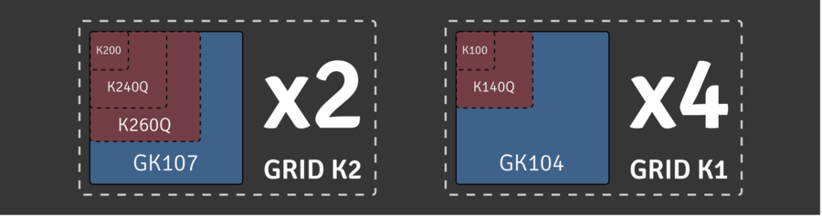
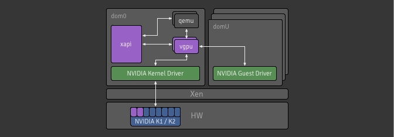
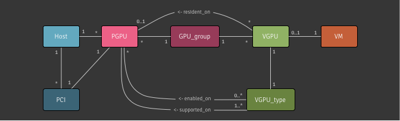

+++
title = "vGPU"
+++

XenServer has supported passthrough for GPU devices since XenServer 6.0. Since
the advent of NVIDIA's vGPU-capable GRID K1/K2 cards it has been possible to
carve up a GPU into smaller pieces yielding a more scalable solution to
boosting graphics performance within virtual machines.

The K1 has four GK104 GPUs and the K2 two GK107 GPUs. Each of these will be exposed through Xapi so a host with a single K1 card will have access to four independent PGPUs.

Each of the GPUs can then be subdivided into vGPUs. For each type of PGPU,
there are a few options of vGPU type which consume different amounts of the
PGPU. For example, K1 and K2 cards can currently be configured in the following
ways:



Note, this diagram is not to scale, the PGPU resource required by each
vGPU type is as follows:

| vGPU type | PGPU kind | vGPUs / PGPU |
| --------- | --------- | ------------ |
| k100      | GK104     | 8            |
| k140Q     | GK104     | 4            |
| k200      | GK107     | 8            |
| k240Q     | GK107     | 4            |
| k260Q     | GK107     | 2            |

Currently each physical GPU (PGPU) only supports *homogeneous vGPU
configurations* but different configurations are supported on different PGPUs
across a single K1/K2 card. This means that, for example, a host with a K1 card
can run 64 VMs with k100 vGPUs (8 per PGPU).

## XenServer's vGPU architecture
A new display type has been added to the device model:

```udiff
@@ -4519,6 +4522,7 @@ static const QEMUOption qemu_options[] =

     /* Xen tree options: */
     { "std-vga", 0, QEMU_OPTION_std_vga },
+    { "vgpu", 0, QEMU_OPTION_vgpu },
     { "videoram", HAS_ARG, QEMU_OPTION_videoram },
     { "d", HAS_ARG, QEMU_OPTION_domid }, /* deprecated; for xend compatibility */
     { "domid", HAS_ARG, QEMU_OPTION_domid },
```

With this in place, `qemu` can now be started using a new option that will
enable it to communicate with a new display emulator, `vgpu` to expose the
graphics device to the guest. The `vgpu` binary is responsible for handling the
VGX-capable GPU and, once it has been successfully passed through, the in-guest
drivers can be installed in the same way as when it detects new hardware.

The diagram below shows the relevant parts of the architecture for this
project.



### Relevant code
* In Xenopsd: [Xenops_server_xen][1] is where
Xenopsd gets the vGPU information from the values passed from Xapi;
* In Xenopsd: [Device.__start][2] is where the `vgpu` process is started, if
necessary, before Qemu.

## Xapi's API and data model

A lot of work has gone into the toolstack to handle the creation and management
of VMs with vGPUs. We revised our data model, introducing a semantic link
between `VGPU` and `PGPU` objects to help with utilisation tracking; we
maintained the `GPU_group` concept as a pool-wide abstraction of PGPUs
available for VMs; and we added **`VGPU_types`** which are configurations for
`VGPU` objects.



**Aside:** The VGPU type in Xapi's data model predates this feature and was
synonymous with GPU-passthrough. A VGPU is simply a display device assigned to
a VM which may be a vGPU (this feature) or a whole GPU (a VGPU of type
_passthrough_).

**`VGPU_types`** can be enabled/disabled on a **per-PGPU basis** allowing for
reservation of particular PGPUs for certain workloads. VGPUs are allocated on
PGPUs within their GPU group in either a _depth-first_ or _breadth-first_
manner, which is configurable on a per-group basis.

**`VGPU_types`** are created by xapi at startup depending on the available
hardware and config files present in dom0. They exist in the pool database, and
a primary key is used to avoid duplication. In XenServer 6.x the tuple of
`(vendor_name, model_name)` was used as the primary key, however this was not
ideal as these values are subject to change. XenServer 7.0 switched to a
[new primary key](../../../design/vgpu-type-identifiers)
generated from static metadata, falling back to the old method for backwards
compatibility.

A **`VGPU_type`** will be garbage collected when there is no VGPU of that type
and there is no hardware which supports that type. On VM import, all VGPUs and
VGPU_types will be created if necessary - if this results in the creation of a
new VGPU_type then the VM will not be usable until the required hardware and
drivers are installed.

### Relevant code
* In Xapi: [Xapi_vgpu_type][3] contains the type definitions and parsing logic
for vGPUs;
* In Xapi: [Xapi_pgpu_helpers][4] defines the functions used to allocate vGPUs
on PGPUs.

## Xapi <-> Xenopsd interface

In XenServer 6.x, all VGPU config was added to the VM's `platform` field at
startup, and this information was used by xenopsd to start the display emulator.
See the relevant code in [ocaml/xapi/vgpuops.ml][5].

In XenServer 7.0, to facilitate support of VGPU on Intel hardware in parallel
with the existing NVIDIA support, VGPUs were made first-class objects in the
xapi-xenopsd interface. The interface is described in the design document on
the [GPU support evolution](../../../design/gpu-support-evolution).

## VM startup

On the pool master:

* Assuming no WLB, all VM.start tasks pass through
  [Xapi_vm_helpers.choose_host_for_vm_no_wlb][6]. If the VM has a vGPU, the list
  of all hosts in the pool is split into a list of lists, where the first list
  is the most optimal in terms of the GPU group's allocation mode and the PGPU
  availability on each host.
* Each list of hosts in turn is passed to [Xapi_vm_placement.select_host][7],
  which checks storage, network and memory availability, until a suitable host
  is found.
* Once a host has been chosen, [allocate_vm_to_host][8] will set the
  `VM.scheduled_to_be_resident_on` and `VGPU.scheduled_to_be_resident_on`
  fields.

The task is then ready to be forwarded to the host on which the VM will start:

* If the VM has a VGPU, the startup task is wrapped in
  [Xapi_gpumon.with_gpumon_stopped][9]. This makes sure that the NVIDIA driver
  is not in use so can be loaded or unloaded from physical GPUs as required.
* The VM metadata, including VGPU metadata, is passed to xenopsd. The creation
  of the VGPU metadata is done by [vgpus_of_vm][10]. Note that at this point
  passthrough VGPUs are represented by the PCI device type, and metadata is
  generated by [pcis_of_vm][11].
* As part of starting up the VM, xenopsd should report a [VGPU event][12] or a
  [PCI event][13], which xapi will use to indicate that the xapi VGPU object can
  be marked as `currently_attached`.

## Usage

To create a VGPU of a given type you can use `vgpu-create`:

```bash
$ xe vgpu-create vm-uuid=... gpu-group-uuid=... vgpu-type-uuid=...
```

To see a list of VGPU types available for use on your XenServer, run the
following command. Note: these will only be populated if you have installed the
relevant NVIDIA RPMs and if there is hardware installed on that host supported
each type. Using `params=all` will display more information such as the maximum
number of heads supported by that VGPU type and which PGPUs have this type
enabled and supported.

```bash
$ xe vgpu-type-list [params=all]
```

To access the new and relevant parameters on a PGPU (i.e.
`supported_VGPU_types`, `enabled_VGPU_types`, `resident_VGPUs`) you can use
`pgpu-param-get` with `param-name=supported-vgpu-types`
`param-name=enabled-vgpu-types` and `param-name=resident-vgpus` respectively.
Or, alternatively, you can use the following command to list all the parameters
for the PGPU.  You can get the types supported or enabled for a given PGPU:

```bash
$ xe pgpu-list uuid=... params=all
```

[1]:  https://github.com/xapi-project/xenopsd/blob/8d06778db2/xc/xenops_server_xen.ml#L1107-L1113
[2]:  https://github.com/xapi-project/xenopsd/blob/8d06778db2/xc/device.ml#L1696-L1708
[3]:  https://github.com/xapi-project/xen-api/blob/8a71a4aaaa/ocaml/xapi/xapi_vgpu_type.ml
[4]:  https://github.com/xapi-project/xen-api/blob/8a71a4aaaa/ocaml/xapi/xapi_pgpu_helpers.mli
[5]:  https://github.com/xenserver/xen-api/blob/50bce20546/ocaml/xapi/vgpuops.ml#L149-L165
[6]:  https://github.com/xapi-project/xen-api/blob/8a71a4aaaa/ocaml/xapi/xapi_vm_helpers.ml#L618-L651
[7]:  https://github.com/xapi-project/xen-api/blob/8a71a4aaaa/ocaml/xapi/xapi_vm_placement.ml#L81-L97
[8]:  https://github.com/xapi-project/xen-api/blob/8a71a4aaaa/ocaml/xapi/message_forwarding.ml#L811-L828
[9]:  https://github.com/xapi-project/xen-api/blob/8a71a4aaaa/ocaml/xapi/xapi_vm.ml#L214-L220
[10]: https://github.com/xapi-project/xen-api/blob/8a71a4aaaa/ocaml/xapi/xapi_xenops.ml#L698-L733
[11]: https://github.com/xapi-project/xen-api/blob/8a71a4aaaa/ocaml/xapi/xapi_xenops.ml#L598-618
[12]: https://github.com/xapi-project/xen-api/blob/8a71a4aaaa/ocaml/xapi/xapi_xenops.ml#L1841-L1854
[13]: https://github.com/xapi-project/xen-api/blob/8a71a4aaaa/ocaml/xapi/xapi_xenops.ml#L1777-L1801
