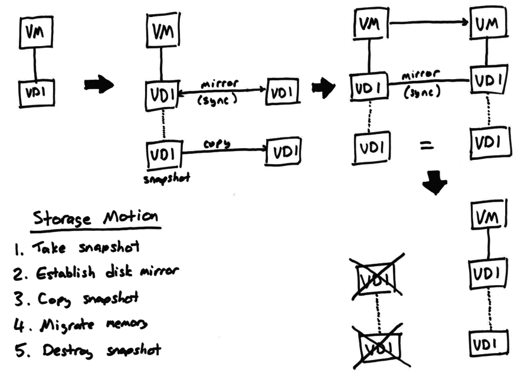

+++
title = "Xapi Storage Migration"
+++

The Xapi Storage Migration (XSM) also known as "Storage Motion" allows

- a running VM to be migrated within a pool, between different hosts
  and different storage simultaneously;
- a running VM to be migrated to another pool;
- a disk attached to a running VM to be moved to another SR.

The following diagram shows how XSM works at a high level:

The slowest part of a storage migration is migrating the storage, since virtual
disks can be very large. Xapi starts by taking a snapshot and copying that to
the destination as a background task. Before the datapath connecting the VM
to the disk is re-established, xapi tells `tapdisk` to start mirroring all
writes to a remote `tapdisk` over NBD. From this point on all VM disk writes
are written to both the old and the new disk.
When the background snapshot copy is complete, xapi can migrate the VM memory
across. Once the VM memory image has been received, the destination VM is
complete and the original can be safely destroyed.
