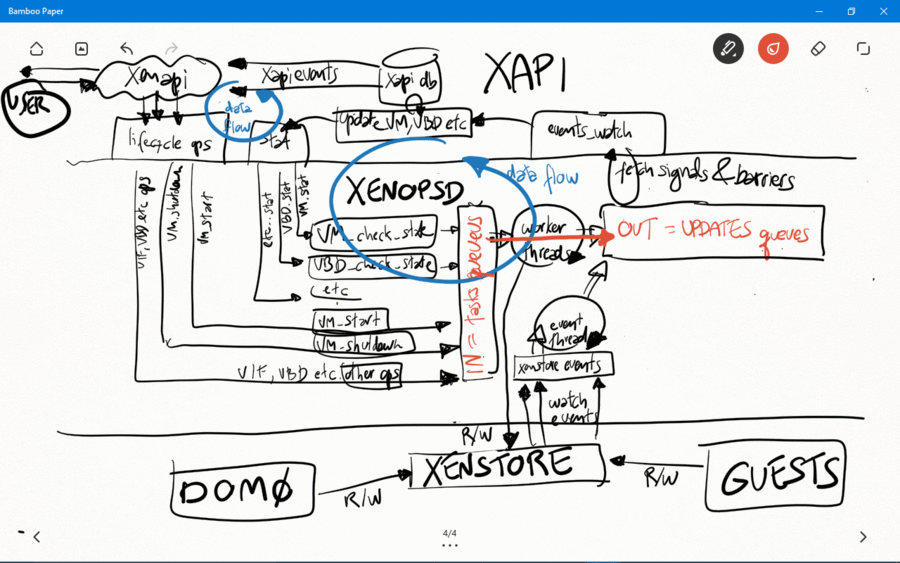
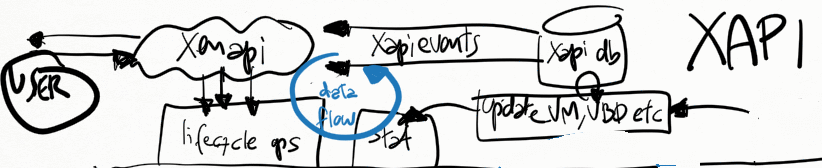
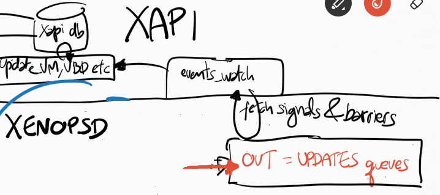
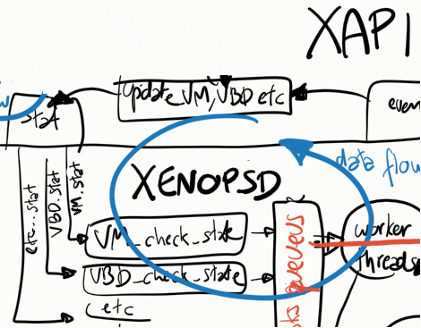
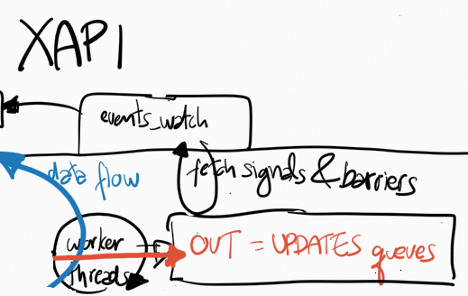
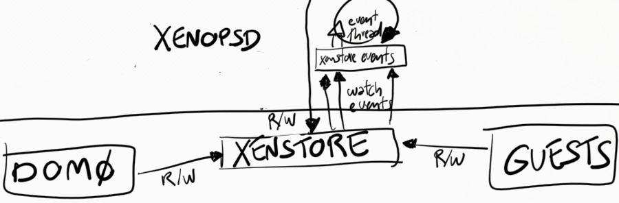

+++
title = "Event handling in the Control Plane - Xapi, Xenopsd and Xenstore"
linkTitle = "Event handling"
+++

Introduction
------------

Xapi, xenopsd and xenstore use a number of different events to obtain
indications that some state changed in dom0 or in the guests. The events
are used as an efficient alternative to polling all these states
periodically.

-   **xenstore** provides a very configurable approach in which each and
    any key can be watched individually by a xenstore client. Once the
    value of a watched key changes, xenstore will indicate to the client
    that the value for that key has changed. An ocaml xenstore client
    library provides a way for ocaml programs such as xenopsd,
    message-cli and rrdd to provide high-level ocaml callback functions
    to watch specific key. It's very common, for instance, for xenopsd
    to watch specific keys in the xenstore keyspace of a guest and then
    after receiving events for some or all of them, read other keys or
    subkeys in xenstored to update its internal state mirroring the
    state of guests and its devices (for instance, if the guest has pv
    drivers and specific frontend devices have established connections
    with the backend devices in dom0).
-   **xapi** also provides a very configurable event mechanism in which
    the xenapi can be used to provide events whenever a xapi object (for
    instance, a VM, a VBD etc) changes state. This event mechanism is
    very reliable and is extensively used by XenCenter to provide
    real-time update on the XenCenter GUI.
-   **xenopsd** provides a somewhat less configurable event mechanism,
    where it always provides signals for all objects (VBDs, VMs
    etc) whose state changed (so it's not possible to select a subset of
    objects to watch for as in xenstore or in xapi). It's up to the
    xenopsd client (eg. xapi) to receive these events and then filter
    out or act on each received signal by calling back xenopsd and
    asking it information for the specific signalled object.  The main
    use in xapi for the xenopsd signals is to update xapi's database of
    the current state of each object controlled by xenopsd (VBDs,
    VMs etc).

Given a choice between polling states and receiving events when the
state change, we should in general opt for receiving events in the code
in order to avoid adding bottlenecks in dom0 that will prevent the
scalability of XenServer to many VMs and virtual devices.



Xapi
----

### Sending events from the xenapi

A xenapi user client, such as XenCenter, the xe-cli or a python script,
can register to receive events from XAPI for specific objects in the
XAPI DB. XAPI will generate events for those registered clients whenever
the corresponding XAPI DB object changes.



This small python scripts shows how to register a simple event watch
loop for XAPI:

```python
import XenAPI
session = XenAPI.Session("http://xshost")
session.login_with_password("username","password")
session.xenapi.event.register(["VM","pool"]) # register for events in the pool and VM objects                                                
while True:
  try:
    events = session.xenapi.event.next() # block until a xapi event on a xapi DB object is available
    for event in events:
      print "received event op=%s class=%s ref=%s" % (event['operation'], event['class'], event['ref'])                                      
      if event['class'] == 'vm' and event['operatoin'] == 'mod':
        vm = event['snapshot']
        print "xapi-event on vm: vm_uuid=%s, power_state=%s, current_operation=%s" % (vm['uuid'],vm['name_label'],vm['power_state'],vm['current_operations'].values())
  except XenAPI.Failure, e:
    if len(e.details) > 0 and e.details[0] == 'EVENTS_LOST':
      session.xenapi.event.unregister(["VM","pool"])
      session.xenapi.event.register(["VM","pool"])
```

 

### Receiving events from xenopsd

Xapi receives all events from xenopsd via the function
xapi\_xenops.events\_watch() in its own independent thread. This is a
single-threaded function that is responsible for handling all of the
signals sent by xenopsd. In some situations with lots of VMs and virtual
devices such as VBDs, this loop may saturate a single dom0 vcpu, which
will slow down handling all of the xenopsd events and may cause the
xenopsd signals to accumulate unboundedly in the worst case in the
updates queue in xenopsd (see Figure 1).

The function xapi\_xenops.events\_watch() calls
xenops\_client.UPDATES.get() to obtain a list of (barrier, 
barrier\_events), and then it process each one of the barrier\_event,
which can be one of the following events:

-   **Vm id:** something changed in this VM,
    run xapi\_xenops.update\_vm() to query xenopsd about its state. The
    function update\_vm() will update power\_state, allowed\_operations,
    console and guest\_agent state in the xapi DB.
-   **Vbd id:** something changed in this VM,
    run xapi\_xenops.update\_vbd() to query xenopsd about its state. The
    function update\_vbd() will update currently\_attached and connected
    in the xapi DB.
-   **Vif id:** something changed in this VM,
    run xapi\_xenops.update\_vif() to query xenopsd about its state. The
    function update\_vif() will update activate and plugged state of in
    the xapi DB.
-   **Pci id:** something changed in this VM,
    run xapi\_xenops.update\_pci() to query xenopsd about its state.
-   **Vgpu id:** something changed in this VM,
    run xapi\_xenops.update\_vgpu() to query xenopsd about its state.
-   **Task id:** something changed in this VM,
    run xapi\_xenops.update\_task() to query xenopsd about its state.
    The function update\_task() will update the progress of the task in
    the xapi DB using the information of the task in xenopsd.



All the xapi\_xenops.update\_X() functions above will call
Xenopsd\_client.X.stat() functions to obtain the current state of X from
xenopsd:



There are a couple of optimisations while processing the events in
xapi\_xenops.events\_watch():

-   if an event X=(vm\_id,dev\_id) (eg. Vbd dev\_id) has already been
    processed in a barrier\_events, it's not processed again. A typical
    value for X is eg. "&lt;vm\_uuid&gt;.xvda" for a VBD.
-   if Events\_from\_xenopsd.are\_supressed X, then this event
    is ignored. Events are supressed if VM X.vm\_id is migrating away
    from the host

#### Barriers

When xapi needs to execute (and to wait for events indicating completion
of) a xapi operation (such as VM.start and VM.shutdown) containing many
xenopsd sub-operations (such as VM.start – to force xenopsd to change
the VM power\_state, and VM.stat, VBD.stat, VIF.stat etc – to force the
xapi DB to catch up with the xenopsd new state for these objects), xapi
sends to the xenopsd input queue a barrier, indicating that xapi will
then block and only continue execution of the barred operation when
xenopsd returns the barrier. The barrier should only be returned when
xenopsd has finished the execution of all the operations requested by
xapi (such as VBD.stat and VM.stat in order to update the state of the
VM in the xapi database after a VM.start has been issued to xenopsd). 

A recent problem has been detected in the xapi\_xenops.events\_watch() 
function: when it needs to process many VM\_check\_state events, this
may push for later the processing of barriers associated with a
VM.start, delaying xapi in reporting (via a xapi event) that the VM
state in the xapi DB has reached the running power\_state. This needs
further debugging, and is probably one of the reasons in CA-87377 why in
some conditions a xapi event reporting that the VM power\_state is
running (causing it to go from yellow to green state in XenCenter) is
taking so long to be returned, way after the VM is already running.

Xenopsd
-------

Xenopsd has a few queues that are used by xapi to store commands to be
executed (eg. VBD.stat) and update events to be picked up by xapi. The
main ones, easily seen at runtime by running the following command in
dom0, are:

```bash
# xenops-cli diagnostics --queue=org.xen.xapi.xenops.classic
{
   queues: [  # XENOPSD INPUT QUEUE
            ... stuff that still needs to be processed by xenopsd
            VM.stat
            VBD.stat
            VM.start
            VM.shutdown
            VIF.plug
            etc
           ]
   workers: [ # XENOPSD WORKER THREADS
            ... which stuff each worker thread is processing
   ]
   updates: {
     updates: [ # XENOPSD OUTPUT QUEUE
            ... signals from xenopsd that need to be picked up by xapi
               VM_check_state
               VBD_check_state
               etc
        ]
      } tasks: [ # XENOPSD TASKS
               ... state of each known task, before they are manually deleted after completion of the task
               ]
}
```

### Sending events to xapi

Whenever xenopsd changes the state of a XenServer object such as a VBD
or VM, or when it receives an event from xenstore indicating that the
states of these objects have changed (perhaps because either a guest or
the dom0 backend changed the state of a virtual device), it creates a
signal for the corresponding object (VM\_check\_state, VBD\_check\_state
etc) and send it up to xapi. Xapi will then process this event in its
xapi\_xenops.events\_watch() function.



These signals may need to wait a long time to be processed if the
single-threaded xapi\_xenops.events\_watch() function is having
difficulties (ie taking a long time) to process previous signals in the
UPDATES queue from xenopsd.  

### Receiving events from xenstore

Xenopsd watches a number of keys in xenstore, both in dom0 and in each
guest. Xenstore is responsible to send watch events to xenopsd whenever
the watched keys change state. Xenopsd uses a xenstore client library to
make it easier to create a callback function that is called whenever
xenstore sends these events.



Xenopsd also needs to complement sometimes these watch events with
polling of some values. An example is the @introduceDomain event in
xenstore (handled in xenopsd/xc/xenstore\_watch.ml), which indicates
that a new VM has been created. This event unfortunately does not
indicate the domid of the VM, and xenopsd needs to query Xen (via libxc)
which domains are now available in the host and compare with the
previous list of known domains, in order to figure out the domid of the
newly introduced domain.

 It is not good practice to poll xenstore for changes of values. This
will add a large overhead to both xenstore and xenopsd, and decrease the
scalability of XenServer in terms of number of VMs/host and virtual
devices per VM. A much better approach is to rely on the watch events of
xenstore to indicate when a specific value has changed in xenstore.

Xenstore
--------

### Sending events to xenstore clients

If a xenstore client has created watch events for a key, then xenstore
will send events to this client whenever this key changes state.

### Receiving events from xenstore clients

Xenstore clients indicate to xenstore that something state changed by
writing to some xenstore key. This may or may not cause xenstore to
create watch events for the corresponding key, depending on if other
xenstore clients have watches on this key.
