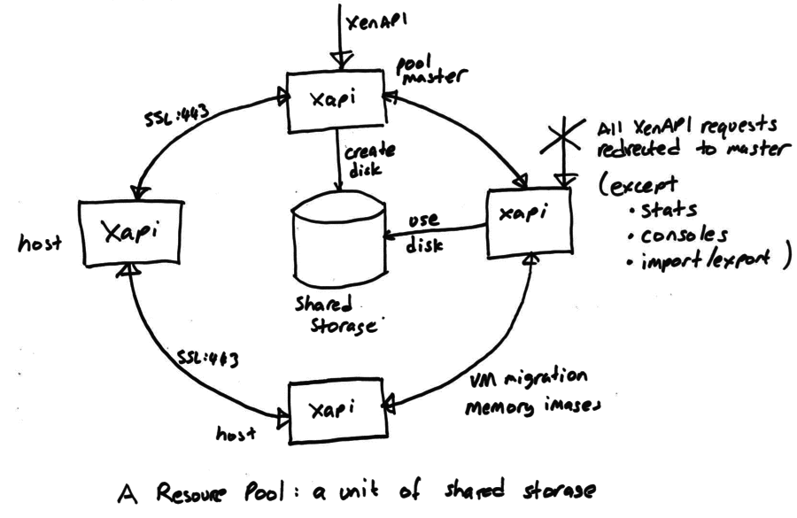
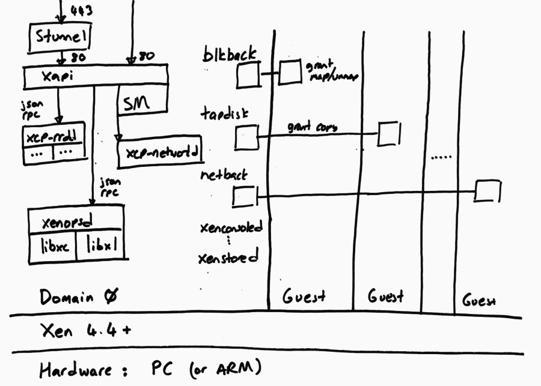

+++
title = "High-level architecture"
weight = 30
+++

The XAPI Toolstack manages a cluster of hosts, network switches and storage on
behalf of clients such as [XenCenter](https://github.com/xenserver/xenadmin)
and [Xen Orchestra](https://xen-orchestra.com).

The most fundamental concept is of a *Resource pool*: the whole cluster managed
as a single entity. The following diagram shows a cluster of hosts running
xapi, all sharing some storage:

At any time, at most one host is known as the *pool coordinator* (formerly
known as "master") and is responsible for coordination and locking resources
within the pool. When a pool is first created a coordinator host is chosen. The
coordinator role can be transferred

- on user request in an orderly fashion (`xe pool-designate-new-master`)
- on user request in an emergency (`xe pool-emergency-transition-to-master`)
- automatically if HA is enabled on the cluster.

All hosts expose an HTTP, XML-RPC and JSON-RPC interface running on port 80 and
with TLS on port 443, but control operations will only be processed on the
coordinator host. Attempts to send a control operation to another host will
result in a XenAPI redirect error message. For efficiency the following
operations are permitted on non-coordinator hosts:

- querying performance counters (and their history)
- connecting to VNC consoles
- import/export (particularly when disks are on local storage)

Since the coordinator host acts as coordinator and lock manager, the other
hosts will often talk to the coordinator. Non-coordinator hosts will also talk
to each other (over the same HTTP and RPC channels) to

- transfer VM memory images (*VM migration*)
- mirror disks (*storage migration*)

Note that some types of shared storage (in particular all those using vhd)
require coordination for disk GC and coalesce. This coordination is currently
done by xapi and hence it is not possible to share this kind of storage between
resource pools.

The following diagram shows the software running on a single host. Note that
all hosts run the same software (although not necessarily the same version, if
we are in the middle of a rolling update).

The XAPI Toolstack expects the host to be running Xen on x86. The Xen
hypervisor partitions the host into *Domains*, some of which can have
privileged hardware access, and the rest are unprivileged guests. The XAPI
Toolstack normally runs all of its components in the privileged initial domain,
Domain 0, also known as "the control domain". However there is experimental
code which supports "driver domains" allowing storage and networking drivers to
be isolated in their own domains.

{}
