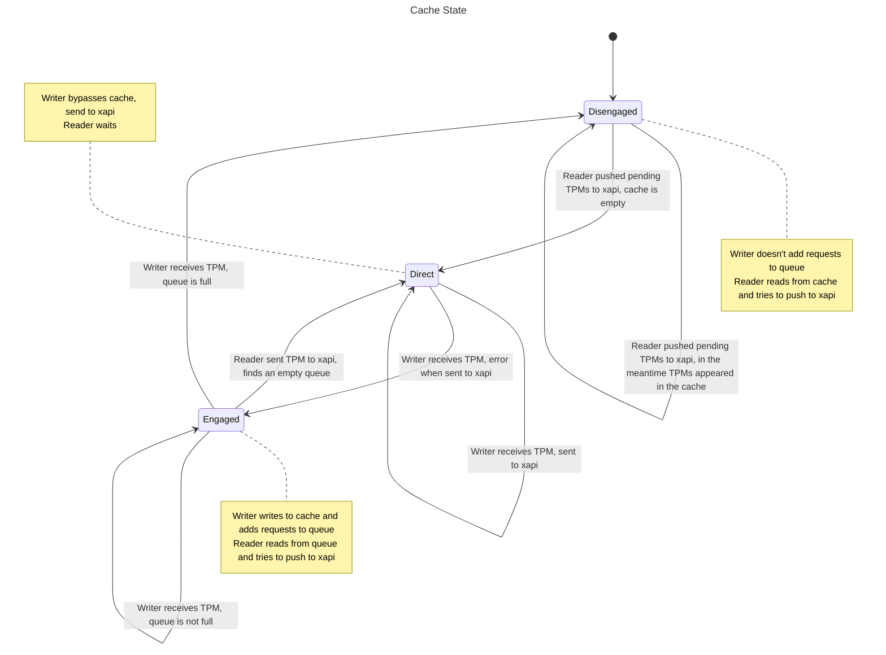

+++
title = "Xapi-guard"
weight = 50
+++

The `xapi-guard` daemon is the component in the xapi toolstack that is responsible for handling persistence requests from VMs (domains).
Currently these are UEFI vars and vTPM updates.

The code is in `ocaml/xapi-guard`.
When the daemon managed only with UEFI updates it was called `varstored-guard`.
Some files and package names still use the previous name.

Principles
----------
1. Calls from domains must be limited in privilege to do certain API calls, and
   to read and write from their corresponding VM in xapi's database only.
2. Xenopsd is able to control xapi-guard through message switch, this access is
   not limited.
3. Listening to domain socket is restored whenever the daemon restarts to minimize disruption of running domains.
4. Disruptions to requests when xapi is unavailable is minimized.
   The startup procedure is not blocked by the availability of xapi, and write requests from domains must not fail because xapi is unavailable.

Overview
--------

Xapi-guard forwards calls from domains to xapi to persist UEFI variables, and update vTPMs.
To do this, it listens to 1 socket per service (varstored, or swtpm) per domain.
To create these sockets before the domains are running, it listens to a message-switch socket.
This socket listens to calls from xenopsd, which orchestrates the domain creation.

To protect the domains from xapi being unavailable transiently, xapi-guard provides an on-disk cache for vTPM writes.
This cache acts as a buffer and stores the requests temporarily until xapi can be contacted again.
This situation usually happens when xapi is being restarted as part of an update.
SWTPM, the vTPM daemon, reads the contents of the TPM from xapi-guard on startup, suspend, and resume.
During normal operation SWTPM does not send read requests from xapi-guard.

Structure
---------

The cache module consists of two Lwt threads, one that writes to disk, and another one that reads from disk.
The writer is triggered when a VM writes to the vTPM.
It never blocks if xapi is unreachable, but responds as soon as the data has been stored either by xapi or on the local disk, such that the VM receives a timely response to the write request.
Both try to send the requests to xapi, depending on the state, to attempt write all the cached data back to xapi, and stop using the cache.
The threads communicate through a bounded queue, this is done to limit the amount of memory used.
This queue is a performance optimisation, where the writer informs the reader precisely which are the names of the cache files, such that the reader does not need to list the cache directory.
And a full queue does not mean data loss, just a loss of performance; vTPM writes are still cached.

This means that the cache operates in three modes:
- Direct: during normal operation the disk is not used at all
- Engaged: both threads use the queue to order events
- Disengaged: A thread dumps request to disk while the other reads the cache
  until it's empty

Startup
------

At startup, there's a dedicated routine to transform the existing contents of the cache.
This is currently done because the timestamp reference change on each boot.
This means that the existing contents might have timestamps considered more recent than timestamps of writes coming from running events, leading to missing content updates.
This must be avoided and instead the updates with offending timestamps are renamed to a timestamp taken from the current timestamp, ensuring a consistent
ordering.
The routine is also used to keep a minimal file tree: unrecognised files are deleted, temporary files created to ensure atomic writes are left untouched, and empty directories are deleted.
This mechanism can be changed in the future to migrate to other formats.
