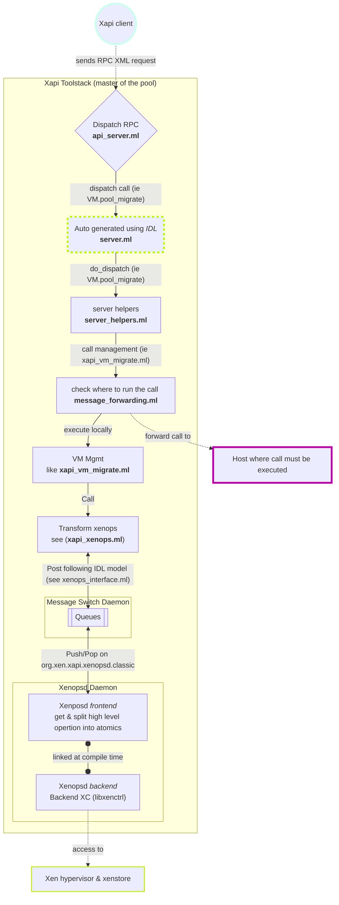

+++
title = "From RPC migration request to xapi internals"
linkTitle = "How XAPI handles migration request"
+++

## Overview

In this document we will use the `VM.pool_migrate` request to illustrate
the interaction between various components within the XAPI toolstack during
migration. However this schema can be applied to other requests as well.

Not all parts of the Xapi toolstack are shown here as not all are involved in
the migration process. For instance you won't see the ***squeezed***
nor ***mpathalert*** two daemons that belong to the toolstack but don't
participate in the migration of a VM.

## Anatomy of a VM migration

- Migration is initiated by a Xapi client that sends `VM.pool_migrate`, an RPC
XML request.
- The Xen API server handles this request and dispatches it to the server.
- The server is generated using `XAPI IDL` and requests are wrapped whithin a
context, either to be forwarded to a host or executed locally. Broadly, the
context follows RBAC rules. The executed function is related to the message of
the request (refer to [XenAPI Reference](https://xapi-project.github.io/xen-api/)).
- In the case of the migration you can refer to *ocaml/idl/datamodel_vm.ml*.
- The server will dispatch the operation to server helpers, executing the
operation synchronously or asynchronously and returning the RPC answer.
- *Message forwarding* decides if operation must be executed by another host
of the pool and then forward the call or if is executed locally.
- When executed locally the high-level migration operation is send to the
*Xenopsd daemon* by posting a message on a known queue on the *message switch*.
- *Xenopsd* will get the command and will split it into several *atomic*
operations that will be run by the *xenopsd backend*.
- *Xenopsd* with its *backend* can then access xenstore or execute hypercall to
interact with xen a server the micro operation.

## A diagram is worth a thousand words

