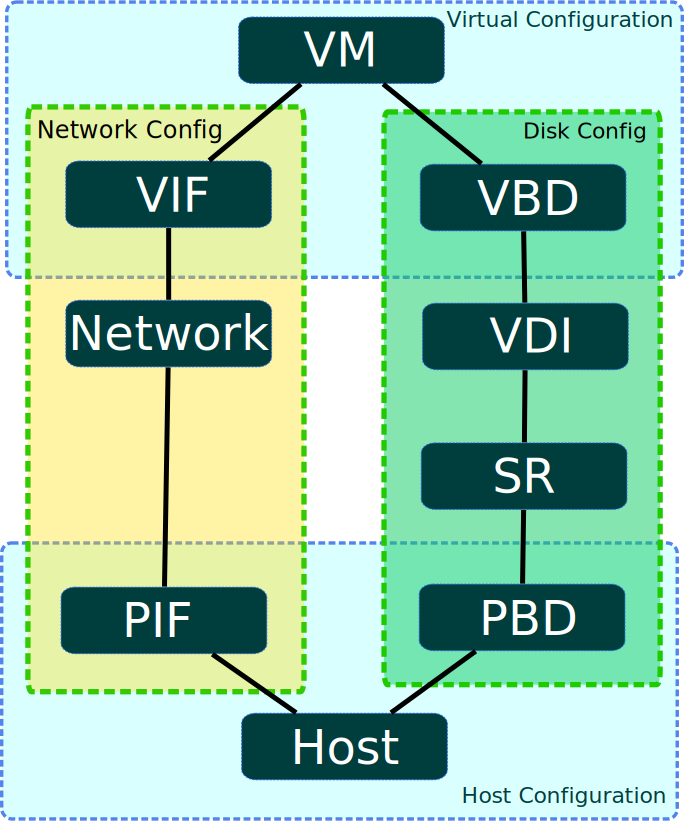
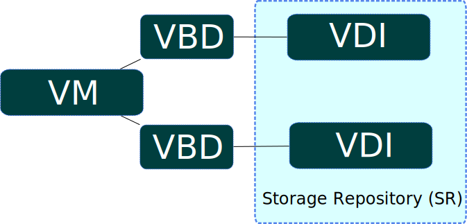

+++
title = "Overview of the XenAPI"
weight = 30
+++

This chapter introduces the XenAPI and its associated object model. The API has the following key features:

-   *Management of all aspects of the XenServer Host*.
     The API allows you to manage VMs, storage, networking, host configuration and pools. Performance and status metrics can also be queried from the API.

-   *Persistent Object Model*.
     The results of all side-effecting operations (e.g. object creation, deletion and parameter modifications) are persisted in a server-side database that is managed by the XenServer installation.

-   *An event mechanism*.
     Through the API, clients can register to be notified when persistent (server-side) objects are modified. This enables applications to keep track of datamodel modifications performed by concurrently executing clients.

-   *Synchronous and asynchronous invocation*.
     All API calls can be invoked synchronously (that is, block until completion); any API call that may be long-running can also be invoked *asynchronously*. Asynchronous calls return immediately with a reference to a *task* object. This task object can be queried (through the API) for progress and status information. When an asynchronously invoked operation completes, the result (or error code) is available from the task object.

-   *Remotable and Cross-Platform*.
     The client issuing the API calls does not have to be resident on the host being managed; nor does it have to be connected to the host over ssh in order to execute the API. API calls make use of the XML-RPC protocol to transmit requests and responses over the network.

-   *Secure and Authenticated Access*.
     The XML-RPC API server executing on the host accepts secure socket connections. This allows a client to execute the APIs over the https protocol. Further, all the API calls execute in the context of a login session generated through username and password validation at the server. This provides secure and authenticated access to the XenServer installation.

Getting Started with the API
----------------------------

We will start our tour of the API by describing the calls required to create a new VM on a XenServer installation, and take it through a start/suspend/resume/stop cycle. This is done without reference to code in any specific language; at this stage we just describe the informal sequence of RPC invocations that accomplish our "install and start" task.

### Authentication: acquiring a session reference

The first step is to call `Session.login_with_password(,                             ,                             ,                             )`. The API is session based, so before you can make other calls you will need to authenticate with the server. Assuming the username and password are authenticated correctly, the result of this call is a *session reference*. Subsequent API calls take the session reference as a parameter. In this way we ensure that only API users who are suitably authorized can perform operations on a XenServer installation. You can continue to use the same session for any number of API calls. When you have finished the session, Citrix recommends that you call `Session.logout(session)` to clean up: see later.

### Acquiring a list of templates to base a new VM installation on

The next step is to query the list of "templates" on the host. Templates are specially-marked VM objects that specify suitable default parameters for a variety of supported guest types. (If you want to see a quick enumeration of the templates on a XenServer installation for yourself then you can execute the `xe template-list` CLI command.) To get a list of templates from the API, we need to find the VM objects on the server that have their `is_a_template` field set to true. One way to do this by calling `VM.get_all_records(session)` where the session parameter is the reference we acquired from our `Session.login_with_password` call earlier. This call queries the server, returning a snapshot (taken at the time of the call) containing all the VM object references and their field values.

(Remember that at this stage we are not concerned about the particular mechanisms by which the returned object references and field values can be manipulated in any particular client language: that detail is dealt with by our language-specific API bindings and described concretely in the following chapter. For now it suffices just to assume the existence of an abstract mechanism for reading and manipulating objects and field values returned by API calls.)

Now that we have a snapshot of all the VM objects' field values in the memory of our client application we can simply iterate through them and find the ones that have their "`is_a_template`" set to true. At this stage let's assume that our example application further iterates through the template objects and remembers the reference corresponding to the one that has its "`name_label`" set to "Debian Etch 4.0" (one of the default Linux templates supplied with XenServer).

### Installing the VM based on a template

Continuing through our example, we must now install a new VM based on the template we selected. The installation process requires 4 API calls:

-   First we must now invoke the API call `VM.clone(session, t_ref, "my first VM")`. This tells the server to clone the VM object referenced by `t_ref` in order to make a new VM object. The return value of this call is the VM reference corresponding to the newly-created VM. Let's call this `new_vm_ref`.

-   Next, we need to specify the UUID of the Storage Repository where the VM's
    disks will be instantiated. We have to put this in the `sr` attribute in
    the disk provisioning XML stored under the "`disks`" key in the
    `other_config` map of the newly-created VM. This field can be updated by
    calling its getter (`other_config <- VM.get_other_config(session,
    new_vm_ref)`) and then its setter (`VM.set_other_config(session,
    new_vm_ref, other_config)`) with the modified `other_config` map.

-   At this stage the object referred to by `new_vm_ref` is still a template (just like the VM object referred to by `t_ref`, from which it was cloned). To make `new_vm_ref` into a VM object we need to call `VM.provision(session, new_vm_ref)`. When this call returns the `new_vm_ref` object will have had its `is_a_template` field set to false, indicating that `new_vm_ref` now refers to a regular VM ready for starting.

> **Note**
>
> The provision operation may take a few minutes, as it is as during this call that the template's disk images are created. In the case of the Debian template, the newly created disks are also at this stage populated with a Debian root filesystem.

### Taking the VM through a start/suspend/resume/stop cycle

Now we have an object reference representing our newly-installed VM, it is trivial to take it through a few lifecycle operations:

-   To start our VM we can just call `VM.start(session, new_vm_ref)`

-   After it's running, we can suspend it by calling `VM.suspend(session, new_vm_ref)`,

-   and then resume it by calling `VM.resume(session, new_vm_ref)`.

-   We can call `VM.shutdown(session, new_vm_ref)` to shutdown the VM cleanly.

### Logging out

Once an application is finished interacting with a XenServer Host it is good practice to call `Session.logout(session)`. This invalidates the session reference (so it cannot be used in subsequent API calls) and simultaneously deallocates server-side memory used to store the session object.

Although inactive sessions will eventually timeout, the server has a hardcoded limit of 500 concurrent sessions for each `username` or `originator`. Once this limit has been reached fresh logins will evict the session objects that have been used least recently, causing their associated session references to become invalid. For successful interoperability with other applications, concurrently accessing the server, the best policy is:

-   Choose a string that identifies your application and its version.

-   Create a single session at start-of-day, using that identifying string for the `originator` parameter to `Session.login_with_password`.

-   Use this session throughout the application (note that sessions can be used across multiple separate client-server *network connections*) and then explicitly logout when possible.

If a poorly written client leaks sessions or otherwise exceeds the limit, then as long as the client uses an appropriate `originator` argument, it will be easily identifiable from the XenServer logs and XenServer will destroy the longest-idle sessions of the rogue client only; this may cause problems for that client but not for other clients. If the misbehaving client did not specify an `originator`, it would be harder to identify and would cause the premature destruction of sessions of any clients that also did not specify an `originator`

### Install and start example: summary

We have seen how the API can be used to install a VM from a XenServer template and perform a number of lifecycle operations on it. You will note that the number of calls we had to make in order to affect these operations was small:

-   One call to acquire a session: `Session.login_with_password()`

-   One call to query the VM (and template) objects present on the XenServer installation: `VM.get_all_records()`. Recall that we used the information returned from this call to select a suitable template to install from.

-   Four calls to install a VM from our chosen template: `VM.clone()`, followed
    by the getter and setter of the `other_config` field to specify where to
    create the disk images of the template, and then `VM.provision()`.

-   One call to start the resultant VM: `VM.start()` (and similarly other single calls to suspend, resume and shutdown accordingly)

-   And then one call to logout `Session.logout()`

The take-home message here is that, although the API as a whole is complex and fully featured, common tasks (such as creating and performing lifecycle operations on VMs) are very straightforward to perform, requiring only a small number of simple API calls. Keep this in mind while you study the next section which may, on first reading, appear a little daunting!

Object Model Overview
---------------------

This section gives a high-level overview of the object model of the API. A more detailed description of the parameters and methods of each class outlined here can be found in the XenServer API Reference document.

We start by giving a brief outline of some of the core classes that make up the API. (Don't worry if these definitions seem somewhat abstract in their initial presentation; the textual description in subsequent sections, and the code-sample walk through in the next Chapter will help make these concepts concrete.)

| Class   | Description |
| ------- | ---------------------------------------------------------------------------------------------------------------------------------------------------------------------------------------------------------------------------------------------------------------------------------------------------------------------------------------------------------------------------------------------------------------------------------------------------------------------------------------------------------------------------------------------------------------------------------- |
| VM      | A VM object represents a particular virtual machine instance on a XenServer Host or Resource Pool. Example methods include `start`, `suspend`, `pool_migrate`; example parameters include `power_state`, `memory_static_max`, and `name_label`. (In the previous section we saw how the VM class is used to represent both templates and regular VMs)                                                                                                                                                                                                                              |
| Host    | A host object represents a physical host in a XenServer pool. Example methods include `reboot` and `shutdown`. Example parameters include `software_version`, `hostname`, and [IP] `address`.                                                                                                                                                                                                                                                                                                                                                                                      |
| VDI     | A VDI object represents a _Virtual Disk Image_. Virtual Disk Images can be attached to VMs, in which case a block device appears inside the VM through which the bits encapsulated by the Virtual Disk Image can be read and written. Example methods of the VDI class include "resize" and "clone". Example fields include "virtual_size" and "sharable". (When we called `VM.provision` on the VM template in our previous example, some VDI objects were automatically created to represent the newly created disks, and attached to the VM object.)                            |
| SR      | An SR (_Storage Repository_) aggregates a collection of VDIs and encapsulates the properties of physical storage on which the VDIs' bits reside. Example parameters include `type` (which determines the storage-specific driver a XenServer installation uses to read/write the SR's VDIs) and `physical_utilisation`; example methods include `scan` (which invokes the storage-specific driver to acquire a list of the VDIs contained with the SR and the properties of these VDIs) and `create` (which initializes a block of physical storage so it is ready to store VDIs). |
| Network | A network object represents a layer-2 network that exists in the environment in which the XenServer Host instance lives. Since XenServer does not manage networks directly this is a lightweight class that serves merely to model physical and virtual network topology. VM and Host objects that are _attached_ to a particular Network object (by virtue of VIF and PIF instances -- see below) can send network packets to each other.                                                                                                                                         |

At this point, readers who are finding this enumeration of classes rather terse may wish to skip to the code walk-throughs of the next chapter: there are plenty of useful applications that can be written using only a subset of the classes already described! For those who wish to continue this description of classes in the abstract, read on.

On top of the classes listed above, there are 4 more that act as *connectors*, specifying relationships between VMs and Hosts, and Storage and Networks. The first 2 of these classes that we will consider, *VBD* and *VIF*, determine how VMs are attached to virtual disks and network objects respectively:

| Class   | Description |
| ------- | ---------------------------------------------------------------------------------------------------------------------------------------------------------------------------------------------------------------------------------------------------------------------------------------------------------------------------------------------------------------------------------------------------------------------------------------------------------------------------------------------------------------------------------------------------------------------------------- |
| VBD | A VBD (_Virtual Block Device_) object represents an attachment between a VM and a VDI. When a VM is booted its VBD objects are queried to determine which disk images (VDIs) should be attached. Example methods of the VBD class include "plug" (which _hot plugs_ a disk device into a running VM, making the specified VDI accessible therein) and "unplug" (which _hot unplugs_ a disk device from a running guest); example fields include "device" (which determines the device name inside the guest under which the specified VDI will be made accessible). |
| VIF | A VIF (_Virtual network InterFace_) object represents an attachment between a VM and a Network object. When a VM is booted its VIF objects are queried to determine which network devices should be created. Example methods of the VIF class include "plug" (which _hot plugs_ a network device into a running VM) and "unplug" (which _hot unplugs_ a network device from a running guest).                                                                                                                                                                 |

The second set of "connector classes" that we will consider determine how Hosts are attached to Networks and Storage.

| Class   | Description |
| ------- | ---------------------------------------------------------------------------------------------------------------------------------------------------------------------------------------------------------------------------------------------------------------------------------------------------------------------------------------------------------------------------------------------------------------------------------------------------------------------------------------------------------------------------------------------------------------------------------- |
| PIF | A PIF (_Physical InterFace_) object represents an attachment between a Host and a Network object. If a host is connected to a Network (over a PIF) then packets from the specified host can be transmitted/received by the corresponding host. Example fields of the PIF class include "device" (which specifies the device name to which the PIF corresponds -- e.g. _eth0_) and "MAC" (which specifies the MAC address of the underlying NIC that a PIF represents). Note that PIFs abstract both physical interfaces and VLANs (the latter distinguished by the existence of a positive integer in the "VLAN" field). |
| PBD | A PBD (_Physical Block Device_) object represents an attachment between a Host and a SR (Storage Repository) object. Fields include "currently-attached" (which specifies whether the chunk of storage represented by the specified SR object) is currently available to the host; and "device_config" (which specifies storage-driver specific parameters that determines how the low-level storage devices are configured on the specified host -- e.g. in the case of an SR rendered on an NFS filer, device_config may specify the host-name of the filer and the path on the filer in which the SR files live.).    |

The figure above presents a graphical overview of the API classes involved in managing VMs, Hosts, Storage and Networking. From this diagram, the symmetry between storage and network configuration, and also the symmetry between virtual machine and host configuration is plain to see.

Working with VIFs and VBDs
--------------------------

In this section we walk through a few more complex scenarios, describing informally how various tasks involving virtual storage and network devices can be accomplished using the API.

### Creating disks and attaching them to VMs

Let's start by considering how to make a new blank disk image and attach it to a running VM. We will assume that we already have ourselves a running VM, and we know its corresponding API object reference (e.g. we may have created this VM using the procedure described in the previous section, and had the server return its reference to us.) We will also assume that we have authenticated with the XenServer installation and have a corresponding `session reference`. Indeed in the rest of this chapter, for the sake of brevity, we will stop mentioning sessions altogether.

#### Creating a new blank disk image

The first step is to instantiate the disk image on physical storage. We do this by calling `VDI.create()`. The `VDI.create` call takes a number of parameters, including:

-   `name_label` and `name_description`: a human-readable name/description for the disk (e.g. for convenient display in the UI etc.). These fields can be left blank if desired.

-   `SR`: the object reference of the Storage Repository representing the physical storage in which the VDI's bits will be placed.

-   `read_only`: setting this field to true indicates that the VDI can *only* be attached to VMs in a read-only fashion. (Attempting to attach a VDI with its `read_only` field set to true in a read/write fashion results in error.)

Invoking the `VDI.create` call causes the XenServer installation to create a blank disk image on physical storage, create an associated VDI object (the datamodel instance that refers to the disk image on physical storage) and return a reference to this newly created VDI object.

The way in which the disk image is represented on physical storage depends on the type of the SR in which the created VDI resides. For example, if the SR is of type "lvm" then the new disk image will be rendered as an LVM volume; if the SR is of type "nfs" then the new disk image will be a sparse VHD file created on an NFS filer. (You can query the SR type through the API using the `SR.get_type()` call.)

> **Note**
>
> Some SR types might round up the `virtual-size` value to make it divisible by a configured block size.

#### Attaching the disk image to a VM

So far we have a running VM (that we assumed the existence of at the start of this example) and a fresh VDI that we just created. Right now, these are both independent objects that exist on the XenServer Host, but there is nothing linking them together. So our next step is to create such a link, associating the VDI with our VM.

The attachment is formed by creating a new "connector" object called a VBD (*Virtual Block Device*). To create our VBD we invoke the `VBD.create()` call. The `VBD.create()` call takes a number of parameters including:

-   `VM` - the object reference of the VM to which the VDI is to be attached

-   `VDI` - the object reference of the VDI that is to be attached

-   `mode` - specifies whether the VDI is to be attached in a read-only or a read-write fashion

-   `userdevice` - specifies the block device inside the guest through which applications running inside the VM will be able to read/write the VDI's bits.

-   `type` - specifies whether the VDI should be presented inside the VM as a regular disk or as a CD. (Note that this particular field has more meaning for Windows VMs than it does for Linux VMs, but we will not explore this level of detail in this chapter.)

Invoking `VBD.create` makes a VBD object on the XenServer installation and returns its object reference. However, this call in itself does not have any side-effects on the running VM (that is, if you go and look inside the running VM you will see that the block device has not been created). The fact that the VBD object exists but that the block device in the guest is not active, is reflected by the fact that the VBD object's `currently_attached` field is set to false.

For expository purposes, the figure above presents a graphical example that shows the relationship between VMs, VBDs, VDIs and SRs. In this instance a VM object has 2 attached VDIs: there are 2 VBD objects that form the connections between the VM object and its VDIs; and the VDIs reside within the same SR.

#### Hotplugging the VBD

If we rebooted the VM at this stage then, after rebooting, the block device corresponding to the VBD would appear: on boot, XenServer queries all VBDs of a VM and actively attaches each of the corresponding VDIs.

Rebooting the VM is all very well, but recall that we wanted to attach a newly created blank disk to a *running* VM. This can be achieved by invoking the `plug` method on the newly created VBD object. When the `plug` call returns successfully, the block device to which the VBD relates will have appeared inside the running VM -- i.e. from the perspective of the running VM, the guest operating system is led to believe that a new disk device has just been *hot plugged*. Mirroring this fact in the managed world of the API, the `currently_attached` field of the VBD is set to true.

Unsurprisingly, the VBD `plug` method has a dual called "`unplug`". Invoking the `unplug` method on a VBD object causes the associated block device to be *hot unplugged* from a running VM, setting the `currently_attached` field of the VBD object to false accordingly.

### Creating and attaching Network Devices to VMs

The API calls involved in configuring virtual network interfaces in VMs are similar in many respects to the calls involved in configuring virtual disk devices. For this reason we will not run through a full example of how one can create network interfaces using the API object-model; instead we will use this section just to outline briefly the symmetry between virtual *networking device* and virtual *storage device* configuration.

The networking analogue of the VBD class is the VIF class. Just as a VBD is the API representation of a block device inside a VM, a VIF (*Virtual network InterFace*) is the API representation of a network device inside a VM. Whereas VBDs associate VM objects with VDI objects, VIFs associate VM objects with Network objects. Just like VBDs, VIFs have a `currently_attached` field that determines whether or not the network device (inside the guest) associated with the VIF is currently active or not. And as we saw with VBDs, at VM boot-time the VIFs of the VM are queried and a corresponding network device for each created inside the booting VM. Similarly, VIFs also have `plug` and `unplug` methods for hot plugging/unplugging network devices in/out of running VMs.

### Host configuration for networking and storage

We have seen that the VBD and VIF classes are used to manage configuration of block devices and network devices (respectively) inside VMs. To manage host configuration of storage and networking there are two analogous classes: PBD (*Physical Block Device*) and PIF (*Physical [network] InterFace*).

#### Host storage configuration: PBDs

Let us start by considering the PBD class. A `PBD_create()` call takes a number of parameters including:

| Parameter     | Description                                                                                                                                                                                                                                                                                                                                                                                                                                                                                           |
| ------------- | ----------------------------------------------------------------------------------------------------------------------------------------------------------------------------------------------------------------------------------------------------------------------------------------------------------------------------------------------------------------------------------------------------------------------------------------------------------------------------------------------------- |
| host          | physical machine on which the PBD is available                                                                                                                                                                                                                                                                                                                                                                                                                                                        |
| SR            | the Storage Repository that the PBD connects to                                                                                                                                                                                                                                                                                                                                                                                                                                                       |
| device_config | a string-to-string map that is provided to the host's SR-backend-driver, containing the low-level parameters required to configure the physical storage device(s) on which the SR is to be realized. The specific contents of the `device_config` field depend on the type of the SR to which the PBD is connected. (Executing `xe sm-list` will show a list of possible SR types; the _configuration_ field in this enumeration specifies the `device_config` parameters that each SR type expects.) |

For example, imagine we have an SR object *s* of type "nfs" (representing a directory on an NFS filer within which VDIs are stored as VHD files); and let's say that we want a host, *h*, to be able to access *s*. In this case we invoke `PBD.create()` specifying host *h*, SR *s*, and a value for the *device\_config* parameter that is the following map:

`("server", "my_nfs_server.example.com"), ("serverpath", "/scratch/mysrs/sr1")`

This tells the XenServer Host that SR *s* is accessible on host *h*, and further that to access SR *s*, the host needs to mount the directory `/scratch/mysrs/sr1` on the NFS server named `my_nfs_server.example.com`.

Like VBD objects, PBD objects also have a field called `currently_attached`. Storage repositories can be attached and detached from a given host by invoking `PBD.plug` and `PBD.unplug` methods respectively.

#### Host networking configuration: PIFs

Host network configuration is specified by virtue of PIF objects. If a PIF object connects a network object, *n*, to a host object *h*, then the network corresponding to *n* is bridged onto a physical interface (or a physical interface plus a VLAN tag) specified by the fields of the PIF object.

For example, imagine a PIF object exists connecting host *h* to a network *n*, and that `device` field of the PIF object is set to `eth0`. This means that all packets on network *n* are bridged to the NIC in the host corresponding to host network device `eth0`.

XML-RPC notes
-------------

### Datetimes

The API deviates from the XML-RPC specification in handling of datetimes. The API appends a "Z" to the end of datetime strings, which is meant to indicate that the time is expressed in UTC.
