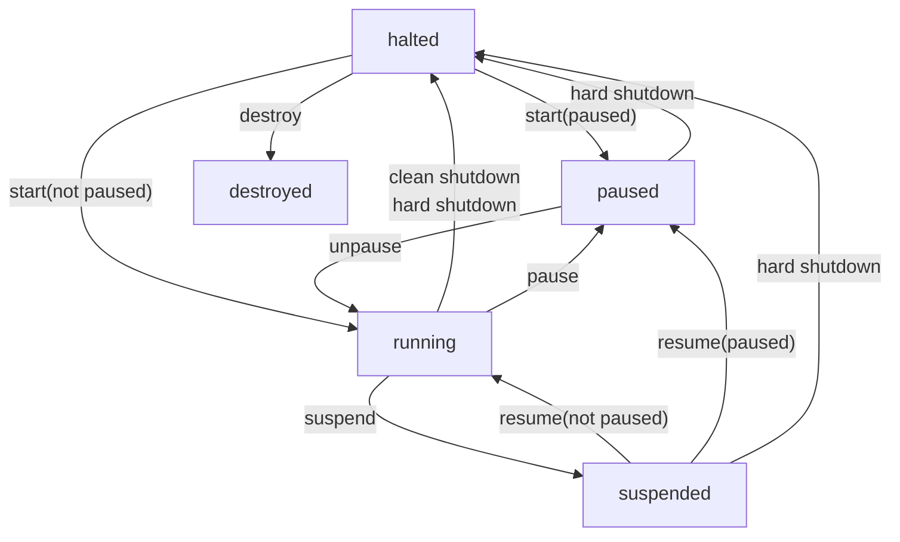

+++
title = "VM Lifecycle"
+++

```mermaid
graph
    halted-- start(paused) -->paused
    halted-- start(not paused) -->running
    running-- suspend -->suspended
    suspended-- resume(not paused) -->running
    suspended-- resume(paused) -->paused
    suspended-- hard shutdown -->halted
    paused-- unpause -->running
    paused-- hard shutdown -->halted
    running-- clean shutdown\n hard shutdown -->halted
    running-- pause -->paused
    halted-- destroy -->destroyed
```

The figure above shows the states that a VM can be in and the
API calls that can be used to move the VM between these states.

{}
