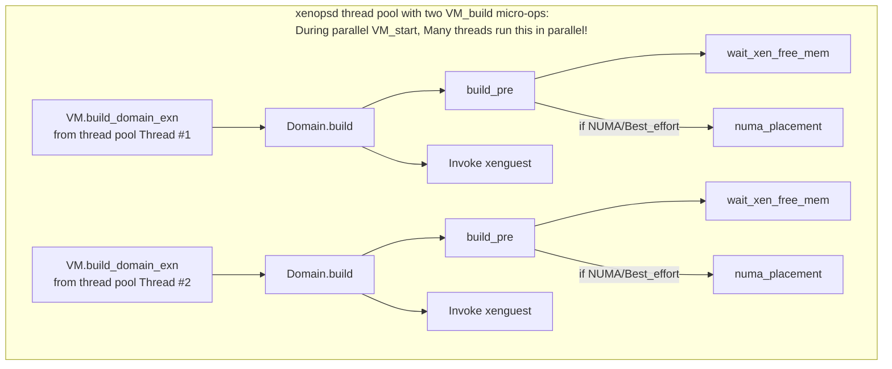

## Overview



[`VM.build_domain_exn`](https://github.com/xapi-project/xen-api/blob/master/ocaml/xenopsd/xc/xenops_server_xen.ml#L2024-L2248)
[calls](https://github.com/xapi-project/xen-api/blob/master/ocaml/xenopsd/xc/xenops_server_xen.ml#L2222-L2225)
[`Domain.build`](https://github.com/xapi-project/xen-api/blob/master/ocaml/xenopsd/xc/domain.ml#L1111-L1210)
to call:
- `build_pre` to prepare the build of a VM:
  - If the `xe` config `numa_placement` is set to `Best_effort`, invoke the NUMA placement algorithm.
  - Run `xenguest`
- `xenguest` to invoke the [xenguest](xenguest) program to setup the domain's system memory.

## build_pre: Prepare building the VM

[Domain.build](https://github.com/xapi-project/xen-api/blob/master/ocaml/xenopsd/xc/domain.ml#L1111-L1210)
[calls](https://github.com/xapi-project/xen-api/blob/master/ocaml/xenopsd/xc/domain.ml#L1137)
[build_pre](https://github.com/xapi-project/xen-api/blob/master/ocaml/xenopsd/xc/domain.ml#L899-L964)
(which is also used for VM restore) to:

1.  [Call](https://github.com/xapi-project/xen-api/blob/master/ocaml/xenopsd/xc/domain.ml#L902-L911)
    [wait_xen_free_mem](https://github.com/xapi-project/xen-api/blob/master/ocaml/xenopsd/xc/domain.ml#L236-L272)
    to wait (if necessary), for the Xen memory scrubber to catch up reclaiming memory.
    It
    1. calls `Xenctrl.physinfo` which returns:
       - `hostinfo.free_pages` - the free and already scrubbed pages (available)
       - `host.scrub_pages` - the not yet scrubbed pages (not yet available)
    2. repeats this until a timeout as long as `free_pages` is *lower*
       than the *required* pages
       - unless if `scrub_pages` is 0 (no scrubbing left to do)

    Note: `free_pages` is system-wide memory, not memory specific to a NUMA node.
    Because this is not NUMA-aware, in case of temporary node-specific memory shortage,
    this check is not sufficient to prevent the VM from being spread over all NUMA nodes.
    It is planned to resolve this issue by claiming NUMA node memory during NUMA placement.

2.  Call the hypercall to set the timer mode
3.  Call the hypercall to set the number of vCPUs
4.  Call the `numa_placement` function
    as described in the [NUMA feature description](/toolstack/features/NUMA)
    when the `xe` configuration option `numa_placement` is set to `Best_effort`
    (except when the VM has a hard CPU affinity).

    ```ml
    match !Xenops_server.numa_placement with
    | Any ->
        ()
    | Best_effort ->
        log_reraise (Printf.sprintf "NUMA placement") (fun () ->
            if has_hard_affinity then
              D.debug "VM has hard affinity set, skipping NUMA optimization"
            else
              numa_placement domid ~vcpus
                ~memory:(Int64.mul memory.xen_max_mib 1048576L)
        )
    ```

## NUMA placement

`build_pre` passes the `domid`, the number of `vCPUs` and `xen_max_mib` to the
[numa_placement](https://github.com/xapi-project/xen-api/blob/master/ocaml/xenopsd/xc/domain.ml#L862-L897)
function to run the algorithm to find the best NUMA placement.

When it returns a NUMA node to use, it calls the Xen hypercalls
to set the vCPU affinity to this NUMA node:

```ml
  let vm = NUMARequest.make ~memory ~vcpus in
  let nodea =
    match !numa_resources with
    | None ->
        Array.of_list nodes
    | Some a ->
        Array.map2 NUMAResource.min_memory (Array.of_list nodes) a
  in
  numa_resources := Some nodea ;
  Softaffinity.plan ~vm host nodea
```

By using the default `auto_node_affinity` feature of Xen,
setting the vCPU affinity causes the Xen hypervisor to activate
NUMA node affinity for memory allocations to be aligned with
the vCPU affinity of the domain.

Summary: This passes the information to the hypervisor that memory
allocation for this domain should preferably be done from this NUMA node.

## Invoke the xenguest program

With the preparation in `build_pre` completed, `Domain.build`
[calls](https://github.com/xapi-project/xen-api/blob/master/ocaml/xenopsd/xc/domain.ml#L1127-L1155)
the `xenguest` function to invoke the [xenguest](xenguest) program to build the domain.

## Notes on future design improvements

The Xen domain feature flag
[domain->auto_node_affinity](https://wiki.xenproject.org/wiki/NUMA_node_affinity_in_the_Xen_hypervisor)
can be disabled by calling
[xc_domain_node_setaffinity()](../../references/xc_domain_node_setaffinity.md)
to set a specific NUMA node affinity in special cases:

This can be used, for example, when there might not be enough memory on the preferred
NUMA node, and there are other NUMA nodes (in the same CPU package) to use
([reference](../../../lib/xenctrl/xc_domain_node_setaffinity.md)).
