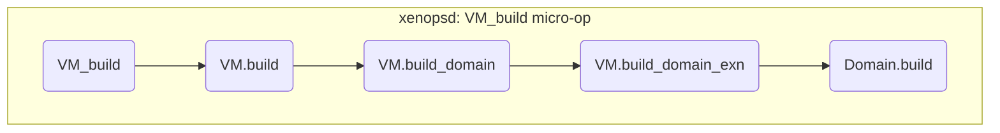

```mermaid
flowchart LR

subgraph xenopsd: VM_build micro-op
    direction LR

    VM_build(VM_build)
        --> VM.build(VM.build)
            --> VM.build_domain(VM.build_domain)
                --> VM.build_domain_exn(VM.build_domain_exn)
                    --> Domain.build(Domain.build)
end

click VM_build "
https://github.com/xapi-project/xen-api/blob/83555067/ocaml/xenopsd/lib/xenops_server.ml#L2255-L2271" _blank
click VM.build "
https://github.com/xapi-project/xen-api/blob/83555067/ocaml/xenopsd/xc/xenops_server_xen.ml#L2290-L2291" _blank
click VM.build_domain "
https://github.com/xapi-project/xen-api/blob/83555067/ocaml/xenopsd/xc/xenops_server_xen.ml#L2250-L2288" _blank
click VM.build_domain_exn "
https://github.com/xapi-project/xen-api/blob/83555067/ocaml/xenopsd/xc/xenops_server_xen.ml#L2024-L2248" _blank
click Domain.build "
https://github.com/xapi-project/xen-api/blob/83555067/ocaml/xenopsd/xc/domain.ml#L1111-L1210" _blank
```
