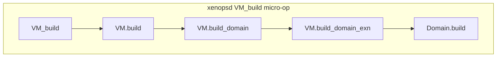

Walk-through documents for the `VM_build` phase:

```mermaid
flowchart
subgraph xenopsd VM_build[xenopsd&nbsp;VM_build&nbsp;micro#8209;op]
direction LR
VM_build --> VM.build
VM.build --> VM.build_domain
VM.build_domain --> VM.build_domain_exn
VM.build_domain_exn --> Domain.build
click VM_build "https://github.com/xapi-project/xen-api/blob/master/ocaml/xenopsd/lib/xenops_server.ml#L2255-L2271" _blank
click VM.build "https://github.com/xapi-project/xen-api/blob/master/ocaml/xenopsd/xc/xenops_server_xen.ml#L2290-L2291" _blank
click VM.build_domain "https://github.com/xapi-project/xen-api/blob/master/ocaml/xenopsd/xc/xenops_server_xen.ml#L2250-L2288" _blank
click VM.build_domain_exn "https://github.com/xapi-project/xen-api/blob/master/ocaml/xenopsd/xc/xenops_server_xen.ml#L2024-L2248" _blank
end
```

{}
