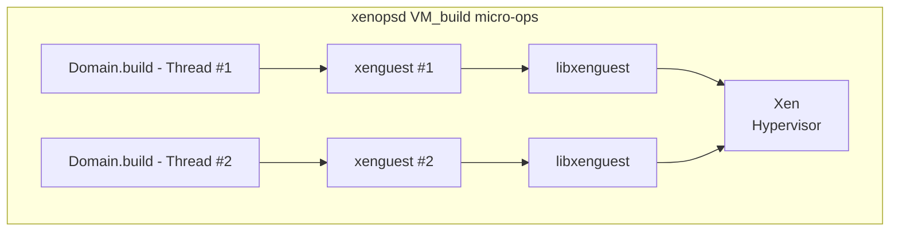
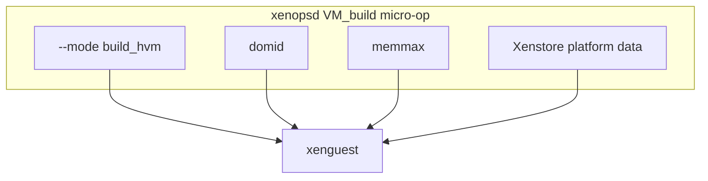
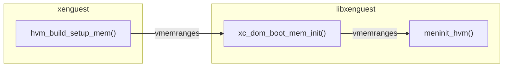

As part of starting a new domain in VM_build, `xenopsd` calls `xenguest`.
When multiple domain build threads run in parallel,
also multiple instances of `xenguest` also run in parallel:



## About xenguest

`xenguest` is called by the xenopsd [Domain.build](Domain.build) function
to perform the build phase for new VMs, which is part of the `xenopsd`
[VM.start operation](VM.start).

[xenguest](https://github.com/xenserver/xen.pg/blob/XS-8/patches/xenguest.patch)
was created as a separate program due to issues with
`libxenguest`:

- It wasn't threadsafe: fixed, but it still uses a per-call global struct
- It had an incompatible licence, but now licensed under the LGPL.

Those were fixed, but we still shell out to `xenguest`, which is currently
carried in the patch queue for the Xen hypervisor packages, but could become
an individual package once planned changes to the Xen hypercalls are stabilised.

Over time, `xenguest` has evolved to build more of the initial domain state.

## Interface to xenguest



`xenopsd` must pass this information to `xenguest` to build a VM:

- The domain type to build for (HVM, PHV or PV).
  - It is passed using the command line option `--mode hvm_build`.
- The `domid` of the created empty domain,
- The amount of system memory of the domain,
- A number of other parameters that are domain-specific.

`xenopsd` uses the Xenstore to provide platform data:

- the vCPU affinity
- the vCPU credit2 weight/cap parameters
- whether the NX bit is exposed
- whether the viridian CPUID leaf is exposed
- whether the system has PAE or not
- whether the system has ACPI or not
- whether the system has nested HVM or not
- whether the system has an HPET or not

When called to build a domain, `xenguest` reads those and builds the VM accordingly.

## Walk-through of the xenguest build mode

{}

The domain build functions
[stub_xc_hvm_build()](https://github.com/xenserver/xen.pg/blob/65c0438b/patches/xenguest.patch#L2329-L2436)
and stub_xc_pv_build() call these functions:

1. `get_flags()` to get the platform data from the Xenstore
    for filling out the fields of `struct flags` and `struct xc_dom_image`.
2. `configure_vcpus()` which uses the platform data from the Xenstore to configure:
    - If `platform/vcpu/<vcpu-num>/affinity` is set, the vCPU affinity.

      By default, this sets the domain's `node_affinity` mask (NUMA nodes) as well.
      This configures
      [`get_free_buddy()`](https://github.com/xen-project/xen/blob/e16acd80/xen/common/page_alloc.c#L855-L958)
      to prefer memory allocations from this NUMA node_affinity mask.
    - If `platform/vcpu/weight` is set, the domain's scheduling weight
    - If `platform/vcpu/cap` is set, the domain's scheduling cap (%cpu time)
3.  The `<domain_type>_build_setup_mem` function for the given domain type.

Call graph of `do_hvm_build()` with emphasis on information flow:

{}

## The function hvm_build_setup_mem()

For HVM domains, `hvm_build_setup_mem()` is responsible for deriving the memory
layout of the new domain, allocating the required memory and populating for the
new domain. It must:

1.  Derive the `e820` memory layout of the system memory of the domain
    including memory holes depending on PCI passthrough and vGPU flags.
2.  Load the BIOS/UEFI firmware images
3.  Store the final MMIO hole parameters in the Xenstore
4.  Call the `libxenguest` function `xc_dom_boot_mem_init()` (see below)
5.  Call `construct_cpuid_policy()` to apply the CPUID `featureset` policy

It starts this by:
- Getting `struct xc_dom_image`, `max_mem_mib`, and `max_start_mib`.
- Calculating start and size of lower ranges of the domain's memory maps
  - taking memory holes for I/O into account, e.g. `mmio_size` and `mmio_start`.
- Calculating `lowmem_end` and `highmem_end`.

It then calls `xc_dom_boot_mem_init()`:

## The function xc_dom_boot_mem_init()

`hvm_build_setup_mem()` calls
[xc_dom_boot_mem_init()](https://github.com/xen-project/xen/blob/39c45c/tools/libs/guest/xg_dom_boot.c#L110-L126)
to allocate and populate the domain's system memory:



Except error handling and tracing, it only is a wrapper to call the
architecture-specific `meminit()` hook for the domain type:

```c
rc = dom->arch_hooks->meminit(dom);
```

For HVM domains, it calls
[meminit_hvm()](https://github.com/xen-project/xen/blob/39c45c/tools/libs/guest/xg_dom_x86.c#L1348-L1648)
to loop over the `vmemranges` of the domain for mapping the system RAM
of the guest from the Xen hypervisor heap. Its goals are:

- Attempt to allocate 1GB superpages when possible
- Fall back to 2MB pages when 1GB allocation failed
- Fall back to 4k pages when both failed

It uses [xc_domain_populate_physmap()](../../../lib/xenctrl/xc_domain_populate_physmap.md)
to perform memory allocation and to map the allocated memory
to the system RAM ranges of the domain.

## Overview of `XENMEM_populate_physmap`:

It:

1.  Uses
    [construct_memop_from_reservation](https://github.com/xen-project/xen/blob/39c45c/xen/common/memory.c#L1022-L1071)
    to convert the arguments for allocating a page from
    [struct xen_memory_reservation](https://github.com/xen-project/xen/blob/master/xen/include/public/memory.h#L46-L80)
    to `struct memop_args`.
2.  Passes the `struct domain` and the given `memflags` to `get_free_buddy()`.
3.  This allocates the requested page at the most suitable place
    - depending on passed flags, allocate on a specific NUMA node
    - else, if the domain has node affinity, on the affine nodes
    - also in the most suitable memory zone within the NUMA node
4.  Falls back to less desirable places if this fails
    - or fail for "exact" allocation requests
5.  When no pages of the requested size are free,
    it splits larger superpages into pages of the requested size.

For a more detailed walk-through of the inner workings of this hypercall,
see the reference on
[xc_domain_populate_physmap()](../../../lib/xenctrl/xc_domain_populate_physmap.md).

For more details on the VM build step involving `xenguest` and Xen side see:
https://wiki.xenproject.org/wiki/Walkthrough:_VM_build_using_xenguest
