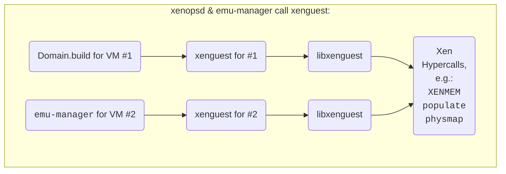

## Introduction

`xenguest` is called by the xenopsd [Domain.build](../Domain.build) function
to perform the build phase for new VMs, which is part of the `xenopsd`
[VM.build](../../VM.build) micro-op:

{}

[Domain.build](../Domain.build) calls `xenguest` (during boot storms,
many run in parallel to accelerate boot storm completion), and during
[migration](../../VM.migrate.md), `emu-manager` also calls `xenguest`:

## Historical heritage

[xenguest](https://github.com/xenserver/xen.pg/blob/XS-8/patches/xenguest.patch)
was created as a separate program due to issues with
`libxenguest`:

- It wasn't threadsafe: fixed, but it still uses a per-call global struct
- It had an incompatible licence, but now licensed under the LGPL.

Those were fixed, but we still shell out to `xenguest`, which is currently
carried in the patch queue for the Xen hypervisor packages, but could become
an individual package once planned changes to the Xen hypercalls are stabilised.

Over time, `xenguest` evolved to build more of the initial domain state.

## Details

The details the the invocation of xenguest, the build modes
and the VM memory setup are described in these child pages:

{}