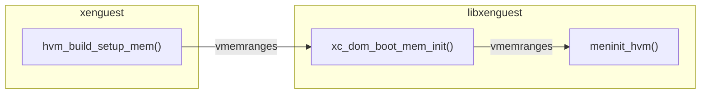

## Invocation of the HVM build mode

{}

## Walk-through of the HVM build mode

The domain build functions
[stub_xc_hvm_build()](https://github.com/xenserver/xen.pg/blob/65c0438b/patches/xenguest.patch#L2329-L2436)
and stub_xc_pv_build() call these functions:

- [get_flags()](https://github.com/xenserver/xen.pg/blob/65c0438b/patches/xenguest.patch#L1164-L1288)
  to get the platform data from the Xenstore
  for filling out the fields of `struct flags` and `struct xc_dom_image`.
- [configure_vcpus()](https://github.com/xenserver/xen.pg/blob/65c0438b/patches/xenguest.patch#L1297)
  which uses the platform data from the Xenstore:
  - When `platform/vcpu/<vcpu-num>/affinity` is set: set the vCPU affinity.
    By default, this sets the domain's `node_affinity` mask (NUMA nodes) as well.
    This configures
    [`get_free_buddy()`](https://github.com/xen-project/xen/blob/e16acd80/xen/common/page_alloc.c#L855-L958)
    to prefer memory allocations from this NUMA node_affinity mask.
  - If `platform/vcpu/weight` is set, the domain's scheduling weight
  - If `platform/vcpu/cap` is set, the domain's scheduling cap (%cpu time)
- [xc_dom_boot_mem_init()](https://github.com/xen-project/xen/blob/39c45c/tools/libs/guest/xg_dom_boot.c#L110-L126)
  to call `<domain_type>_build_setup_mem()`,

Call graph of
[do_hvm_build()](https://github.com/xenserver/xen.pg/blob/65c0438b/patches/xenguest.patch#L596-L615)
with emphasis on information flow:

{}

## The function hvm_build_setup_mem()

For HVM domains, `hvm_build_setup_mem()` is responsible for deriving the memory
layout of the new domain, allocating the required memory and populating for the
new domain. It must:

1.  Derive the `e820` memory layout of the system memory of the domain
    including memory holes depending on PCI passthrough and vGPU flags.
2.  Load the BIOS/UEFI firmware images
3.  Store the final MMIO hole parameters in the Xenstore
4.  Call the `libxenguest` function `xc_dom_boot_mem_init()` (see below)
5.  Call `construct_cpuid_policy()` to apply the CPUID `featureset` policy

It starts this by:
- Getting `struct xc_dom_image`, `max_mem_mib`, and `max_start_mib`.
- Calculating start and size of lower ranges of the domain's memory maps
  - taking memory holes for I/O into account, e.g. `mmio_size` and `mmio_start`.
- Calculating `lowmem_end` and `highmem_end`.

It then calls `xc_dom_boot_mem_init()`:

## The function xc_dom_boot_mem_init()

`hvm_build_setup_mem()` calls
[xc_dom_boot_mem_init()](https://github.com/xen-project/xen/blob/39c45c/tools/libs/guest/xg_dom_boot.c#L110-L126)
to allocate and populate the domain's system memory:



Except error handling and tracing, it only is a wrapper to call the
architecture-specific `meminit()` hook for the domain type:

```c
rc = dom->arch_hooks->meminit(dom);
```

For HVM domains, it calls
[meminit_hvm()](https://github.com/xen-project/xen/blob/39c45c/tools/libs/guest/xg_dom_x86.c#L1348-L1648)
to loop over the `vmemranges` of the domain for mapping the system RAM
of the guest from the Xen hypervisor heap. Its goals are:

- Attempt to allocate 1GB superpages when possible
- Fall back to 2MB pages when 1GB allocation failed
- Fall back to 4k pages when both failed

It uses
[xc_domain_populate_physmap()](../../../../../lib/xenctrl/xc_domain_populate_physmap.md)
to perform memory allocation and to map the allocated memory
to the system RAM ranges of the domain.

For more details on the VM build step involving `xenguest` and Xen side see:
https://wiki.xenproject.org/wiki/Walkthrough:_VM_build_using_xenguest
