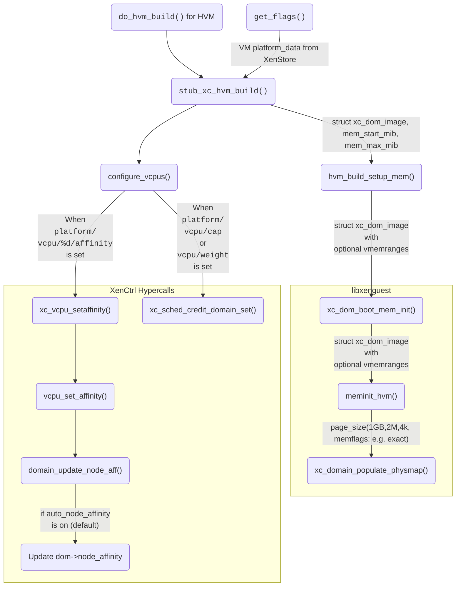

```mermaid
flowchart TD
do_hvm_build("<tt>do_hvm_build()</tt> for HVM")
--> stub_xc_hvm_build
get_flags("<tt>get_flags()</tt>") --"VM platform_data from XenStore"
--> stub_xc_hvm_build("<tt>stub_xc_hvm_build()</tt>")
stub_xc_hvm_build --> configure_vcpus(configure_vcpus#40;#41;)
configure_vcpus --"When<br><tt>platform/
                   vcpu/%d/affinity</tt><br>is set"--> xc_vcpu_setaffinity
configure_vcpus --"When<br><tt>platform/
                   vcpu/cap</tt><br>or<tt>
                   vcpu/weight</tt><br>is set"--> xc_sched_credit_domain_set
stub_xc_hvm_build --"struct xc_dom_image, mem_start_mib, mem_max_mib"
--> hvm_build_setup_mem("hvm_build_setup_mem()")
--"struct xc_dom_image
   with
   optional vmemranges"-->  xc_dom_boot_mem_init
    subgraph libxenguest
    xc_dom_boot_mem_init("xc_dom_boot_mem_init()")
    -- "struct xc_dom_image
        with
        optional vmemranges" -->
        meminit_hvm("meminit_hvm()") -- page_size(1GB,2M,4k, memflags: e.g. exact) -->
            xc_domain_populate_physmap("xc_domain_populate_physmap()")
    end
subgraph set_affinity[XenCtrl Hypercalls]
direction TB
    xc_sched_credit_domain_set("xc_sched_credit_domain_set()")
    xc_vcpu_setaffinity("xc_vcpu_setaffinity()")
    --> vcpu_set_affinity("vcpu_set_affinity()")
        --> domain_update_node_aff("domain_update_node_aff()")
            -- "if auto_node_affinity
                is on (default)"--> auto_node_affinity(Update dom->node_affinity)
end
click vcpu_set_affinity
"https://github.com/xen-project/xen/blob/e16acd806/xen/common/sched/core.c#L1353-L1393" _blank
click domain_update_node_aff
"https://github.com/xen-project/xen/blob/e16acd806/xen/common/sched/core.c#L1809-L1876" _blank
click stub_xc_hvm_build
"https://github.com/xenserver/xen.pg/blob/65c0438b/patches/xenguest.patch#L2329-L2436" _blank
click hvm_build_setup_mem
"https://github.com/xenserver/xen.pg/blob/65c0438b/patches/xenguest.patch#L2002-L2219" _blank
click get_flags
"https://github.com/xenserver/xen.pg/blob/65c0438b/patches/xenguest.patch#L1164-L1288" _blank
click configure_vcpus
"https://github.com/xenserver/xen.pg/blob/65c0438b/patches/xenguest.patch#L1297" _blank
click xc_dom_boot_mem_init
"https://github.com/xen-project/xen/blob/e16acd806/tools/libs/guest/xg_dom_boot.c#L110-L125"
click meminit_hvm
"https://github.com/xen-project/xen/blob/e16acd806/tools/libs/guest/xg_dom_x86.c#L1348-L1648"
click xc_domain_populate_physmap
"../../../../lib/xenctrl/xc_domain_populate_physmap/index.html" _blank
```
