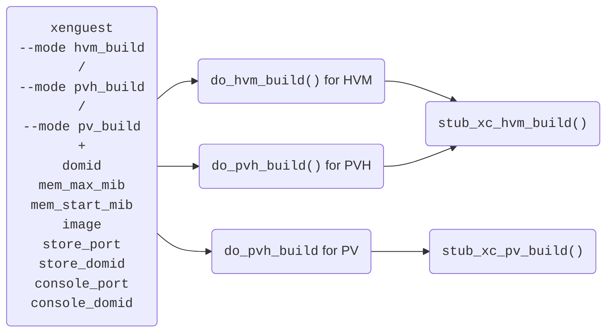

```mermaid
flowchart LR

xenguest_main("
    <tt>xenguest
    --mode hvm_build
    /
    --mode pvh_build
    /
    --mode pv_build
</tt>+<tt>
domid
mem_max_mib
mem_start_mib
image
store_port
store_domid
console_port
console_domid")
    -->  do_hvm_build("<tt>do_hvm_build()</tt> for HVM
    ") & do_pvh_build("<tt>do_pvh_build()</tt> for PVH")
         --> stub_xc_hvm_build("<tt>stub_xc_hvm_build()")

xenguest_main --> do_pv_build(<tt>do_pvh_build</tt> for PV) -->
    stub_xc_pv_build("<tt>stub_xc_pv_build()")

click do_pv_build
"https://github.com/xenserver/xen.pg/blob/65c0438b/patches/xenguest.patch#L575-L594" _blank
click do_hvm_build
"https://github.com/xenserver/xen.pg/blob/65c0438b/patches/xenguest.patch#L596-L615" _blank
click do_pvh_build
"https://github.com/xenserver/xen.pg/blob/65c0438b/patches/xenguest.patch#L617-L640" _blank
click stub_xc_hvm_build
"https://github.com/xenserver/xen.pg/blob/65c0438b/patches/xenguest.patch#L2329-L2436" _blank
```
